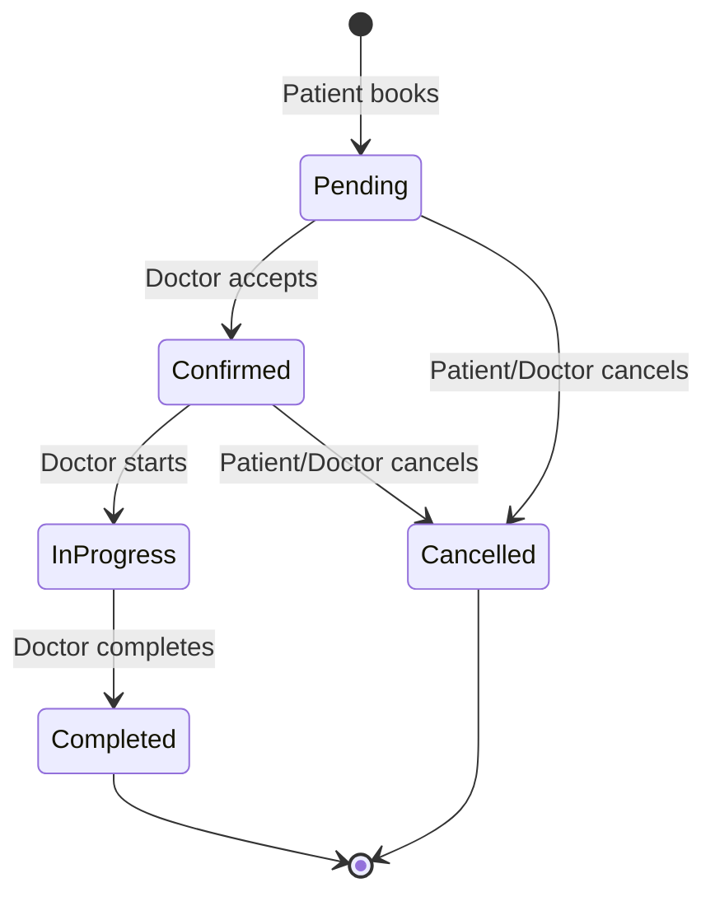

# 📏 Business Rules — MedicHp Platform

> **Document Type:** Business Rules (Authoritative)
> **Version:** 2.0
> **Last Revised:** 2026-08-06
> **Status:** Active
> **Audience:** Development team, AI coding assistants, product stakeholders
> **Scope:** Phase 1 — with Phase 2–4 expansion notes

---

## Table of Contents

- [1. Document Purpose](#1-document-purpose)
- [2. Rule Classification](#2-rule-classification)
- [3. Authentication Rules](#3-authentication-rules)
- [4. Registration Rules](#4-registration-rules)
- [5. Patient Rules](#5-patient-rules)
- [6. Doctor Rules](#6-doctor-rules)
- [7. Appointment Rules](#7-appointment-rules)
- [8. Consultation Rules](#8-consultation-rules)
- [9. Prescription Rules](#9-prescription-rules)
- [10. Chat Rules](#10-chat-rules)
- [11. Notification Rules](#11-notification-rules)
- [12. Super Admin Rules](#12-super-admin-rules)
- [13. Data & Security Rules](#13-data--security-rules)
- [14. Future Expansion Rules](#14-future-expansion-rules)
- [15. Rule Index](#15-rule-index)
- [16. Version History](#16-version-history)

---

## 1. Document Purpose

This document defines the **authoritative business rules** that govern MedicHp's platform behavior. Every rule listed here is a binding constraint that must be enforced in code. If a requirement in the codebase contradicts a rule in this document, this document takes precedence until a formal revision is made.

### How to Read This Document

- **Rule IDs** are prefixed by domain (e.g., `AUTH-R01`, `APT-R05`) for traceability.
- **Enforcement** indicates where the rule is implemented: `Backend`, `Frontend`, `Database`, or `All`.
- **Configurable** rules have values that can be changed via platform settings (Super Admin). Non-configurable rules are hardcoded constraints.
- **Phase** indicates when the rule becomes active.

### Relationship to Other Documents

| Document                        | Relationship                                                            |
|---------------------------------|-------------------------------------------------------------------------|
| `PROJECT_SPECIFICATION.md`      | Defines the architecture that enforces these rules                      |
| `PRODUCT_REQUIREMENTS.md`       | Defines what features exist; this document defines how they behave      |
| `API_SPECIFICATION.md`          | API contracts implement these rules at the endpoint level               |
| `DATABASE_ARCHITECTURE.md`      | Schema design reflects the data constraints defined here                |
| `SECURITY_GUIDELINES.md`        | Security rules in this document align with and reference security policies |

---

## 2. Rule Classification

| Classification   | Symbol | Meaning                                                              |
|------------------|--------|----------------------------------------------------------------------|
| **Mandatory**    | 🔴     | Must be enforced. Violation is a defect.                             |
| **Configurable** | 🟡     | Default value provided. Can be changed by Super Admin.               |
| **Advisory**     | 🟢     | Recommended behavior. May be overridden with justification.          |
| **Future**       | 🔵     | Not enforced in current phase. Documented for forward compatibility. |

---

## 3. Authentication Rules

| ID       | Rule                                                                                          | Classification | Enforcement | Phase |
|----------|-----------------------------------------------------------------------------------------------|----------------|-------------|-------|
| AUTH-R01 | Users must provide a valid email and password to log in.                                       | 🔴 Mandatory   | Backend     | 1     |
| AUTH-R02 | Passwords must be a minimum of 8 characters, containing at least 1 uppercase letter, 1 number, and 1 special character. | 🔴 Mandatory | Backend + Frontend | 1 |
| AUTH-R03 | Passwords are never stored in plain text. The system uses bcrypt (or equivalent) hashing with a cost factor ≥ 12. | 🔴 Mandatory | Backend | 1 |
| AUTH-R04 | A JWT access token is issued upon successful login with a default expiry of 15 minutes.        | 🟡 Configurable | Backend    | 1     |
| AUTH-R05 | Refresh tokens are single-use. Each token refresh issues a new refresh token and invalidates the old one. | 🔴 Mandatory | Backend | 1 |
| AUTH-R06 | Refresh tokens are stored server-side in the database with user ID, device identifier, and expiry timestamp. | 🔴 Mandatory | Backend | 1 |
| AUTH-R07 | An account is locked after 5 consecutive failed login attempts.                                | 🟡 Configurable | Backend    | 1     |
| AUTH-R08 | A locked account automatically unlocks after 15 minutes.                                       | 🟡 Configurable | Backend    | 1     |
| AUTH-R09 | Users must verify their email address before accessing any protected platform feature.          | 🔴 Mandatory   | Backend     | 1     |
| AUTH-R10 | Email verification uses a one-time password (OTP) sent to the registered email address.         | 🔴 Mandatory   | Backend     | 1     |
| AUTH-R11 | Password reset is initiated via email. The reset link/token expires after 1 hour.               | 🟡 Configurable | Backend    | 1     |
| AUTH-R12 | Logout invalidates the user's refresh token. The JWT continues to work until natural expiry.    | 🔴 Mandatory   | Backend     | 1     |
| AUTH-R13 | Each user device maintains an independent session. Logging out on one device does not affect others. | 🔴 Mandatory | Backend | 1 |
| AUTH-R14 | Multi-Factor Authentication (MFA) is required for Super Admin accounts.                        | 🔵 Future      | Backend     | 2     |

> **Reference:** [ADR-003: Authentication Strategy](../Decisions/ADR-003-Authentication.md)

---

## 4. Registration Rules

### 4.1 General Registration Rules

| ID       | Rule                                                                                          | Classification | Enforcement | Phase |
|----------|-----------------------------------------------------------------------------------------------|----------------|-------------|-------|
| REG-R01  | Every user must register with a unique email address. Duplicate emails are rejected.           | 🔴 Mandatory   | Backend + DB | 1    |
| REG-R02  | Every user must register with a unique phone number. Duplicate phone numbers are rejected.     | 🔴 Mandatory   | Backend + DB | 1    |
| REG-R03  | Registration requires acceptance of the Terms of Service and Privacy Policy.                   | 🔴 Mandatory   | Frontend + Backend | 1 |
| REG-R04  | Registration timestamps are recorded for every account (`CreatedAt` in UTC).                   | 🔴 Mandatory   | Backend + DB | 1    |
| REG-R05  | Role assignment occurs at registration time. Users cannot change their own role.                | 🔴 Mandatory   | Backend     | 1     |

### 4.2 Patient Registration Rules

> **Reference:** [ADR-004: Patient Registration](../Decisions/ADR-004-PatientRegistration.md)

| ID       | Rule                                                                                          | Classification | Enforcement | Phase |
|----------|-----------------------------------------------------------------------------------------------|----------------|-------------|-------|
| REG-R10  | Patients may self-register through the public website or mobile application.                   | 🔴 Mandatory   | Frontend    | 1     |
| REG-R11  | Patient registration follows a multi-step progressive flow: Stage 1 (account) → Stage 2 (health profile) → Stage 3 (medical history). | 🔴 Mandatory | Frontend + Backend | 1 |
| REG-R12  | Stage 1 is mandatory and must be completed during registration: full name, email, phone, password. | 🔴 Mandatory | Backend | 1 |
| REG-R13  | Stage 2 (health profile: date of birth, gender, blood type, emergency contact) is prompted after first login but is not blocking. | 🟢 Advisory | Frontend | 1 |
| REG-R14  | Stage 3 (medical history: allergies, chronic conditions, medications) is optional and prompted contextually. | 🟢 Advisory | Frontend | 1 |
| REG-R15  | Patients with incomplete profiles (Stage 2/3 pending) can still book appointments and use core features. | 🔴 Mandatory | Backend | 1 |
| REG-R16  | The patient dashboard displays profile completion percentage and prompts to complete missing stages. | 🟢 Advisory | Frontend | 1 |
| REG-R17  | Patients must be at least 18 years old to self-register. Minors require a guardian account (implementation deferred to Phase 2). | 🔴 Mandatory | Backend | 1 |

### 4.3 Doctor Registration Rules

> **Reference:** [ADR-005: Doctor Registration](../Decisions/ADR-005-DoctorRegistration.md)

| ID       | Rule                                                                                          | Classification | Enforcement | Phase |
|----------|-----------------------------------------------------------------------------------------------|----------------|-------------|-------|
| REG-R20  | Doctors may self-register through the public website.                                          | 🔴 Mandatory   | Frontend    | 1     |
| REG-R21  | Doctor registration collects: full name, email, phone, password, specialization(s), years of experience, and consultation fee. | 🔴 Mandatory | Backend | 1 |
| REG-R22  | Doctor registration collects medical license number and issuing authority.                      | 🔴 Mandatory   | Backend     | 1     |
| REG-R23  | In Phase 1, doctor credentials (license information) are **stored but not verified**. License data is collected for future verification workflow. | 🔴 Mandatory | Backend | 1 |
| REG-R24  | In Phase 1, doctors are immediately active upon email verification. No admin approval gate is enforced until Phase 2. | 🔴 Mandatory | Backend | 1 |
| REG-R25  | Doctors may optionally upload a profile photo and license document at registration.             | 🟢 Advisory   | Frontend    | 1     |
| REG-R26  | After registration, doctors are prompted to configure their availability schedule and complete their profile. | 🟢 Advisory | Frontend | 1 |
| REG-R27  | In Phase 2, doctor registration will include an admin verification gate with status workflow: `Pending → Approved / Rejected / More Info Required`. | 🔵 Future | Backend | 2 |

---

## 5. Patient Rules

### 5.1 Patient Profile

| ID       | Rule                                                                                          | Classification | Enforcement | Phase |
|----------|-----------------------------------------------------------------------------------------------|----------------|-------------|-------|
| PAT-R01  | Patients complete a health profile after registration. Profile completion is encouraged but not enforced. | 🟢 Advisory | Frontend | 1 |
| PAT-R02  | Patients may update their personal and medical information at any time.                         | 🔴 Mandatory   | Backend     | 1     |
| PAT-R03  | Patients can only view and modify their own data. Cross-patient data access is forbidden.       | 🔴 Mandatory   | Backend + DB | 1    |
| PAT-R04  | Patient profile fields include: name, email, phone, date of birth, gender, blood type, emergency contact, allergies, chronic conditions, current medications. | 🔴 Mandatory | Backend | 1 |
| PAT-R05  | Patients can revoke data sharing consent at any time. Revoking consent hides their medical records from all doctors. | 🔴 Mandatory | Backend | 1 |

### 5.2 Patient Search & Discovery

| ID       | Rule                                                                                          | Classification | Enforcement | Phase |
|----------|-----------------------------------------------------------------------------------------------|----------------|-------------|-------|
| PAT-R10  | Patients search for doctors by entering symptoms, health concerns, or medical specializations.  | 🔴 Mandatory   | Backend + Frontend | 1 |
| PAT-R11  | The platform maps patient input (symptoms, health concerns) to the most relevant medical specialties and displays matching doctors. The system does **not** search by disease name directly. | 🔴 Mandatory | Backend | 1 |
| PAT-R12  | Patients can filter search results by: specialization, experience (years), consultation fee range, city, and availability. | 🔴 Mandatory | Backend | 1 |
| PAT-R13  | Patients can sort results by: relevance, fee (ascending/descending), experience, and rating.    | 🔴 Mandatory   | Backend     | 1     |
| PAT-R14  | Doctor search is publicly accessible and does not require authentication.                       | 🔴 Mandatory   | Backend     | 1     |
| PAT-R15  | Search results display: doctor name, photo, specialization, experience, fee, rating, and next available slot. | 🔴 Mandatory | Frontend | 1 |

---

## 6. Doctor Rules

### 6.1 Doctor Profile & Practice

| ID       | Rule                                                                                          | Classification | Enforcement | Phase |
|----------|-----------------------------------------------------------------------------------------------|----------------|-------------|-------|
| DOC-R01  | Doctors may edit all fields of their professional profile at any time: bio, specializations, fee, photo. | 🔴 Mandatory | Backend | 1 |
| DOC-R02  | Doctors must configure at least one availability slot before they appear in search results.     | 🔴 Mandatory   | Backend     | 1     |
| DOC-R03  | Doctors can set their consultation fee. The fee is displayed to patients in search results and on the profile page. | 🔴 Mandatory | Backend + Frontend | 1 |
| DOC-R04  | Doctors can view a list of all patients who have had at least one appointment with them.        | 🔴 Mandatory   | Backend     | 1     |
| DOC-R05  | Doctors can only access medical records and consultation history of patients who have consented to data sharing. | 🔴 Mandatory | Backend + DB | 1 |

### 6.2 Doctor-Initiated Patient Creation

| ID       | Rule                                                                                          | Classification | Enforcement | Phase |
|----------|-----------------------------------------------------------------------------------------------|----------------|-------------|-------|
| DOC-R10  | Doctors may add new patients to the platform (e.g., walk-in patients without existing accounts). | 🔴 Mandatory | Backend | 1 |
| DOC-R11  | When a doctor adds a patient, the system creates a provisional account with the patient's name, email, and phone number. | 🔴 Mandatory | Backend | 1 |
| DOC-R12  | The system sends an invitation email to the newly added patient with a link to activate their account and set a password. | 🔴 Mandatory | Backend | 1 |
| DOC-R13  | Until the patient activates their account, the doctor can record consultations and prescriptions under the provisional account. | 🔴 Mandatory | Backend | 1 |
| DOC-R14  | Once the patient activates their account, they gain full access to their consultation and prescription history. | 🔴 Mandatory | Backend | 1 |

---

## 7. Appointment Rules

### 7.1 Booking Rules

| ID       | Rule                                                                                          | Classification | Enforcement | Phase |
|----------|-----------------------------------------------------------------------------------------------|----------------|-------------|-------|
| APT-R01  | Patients can book appointments by selecting an available time slot from a doctor's schedule.    | 🔴 Mandatory   | Backend     | 1     |
| APT-R02  | Appointments must be booked at least **1 hour** in advance of the desired time.                 | 🟡 Configurable | Backend    | 1     |
| APT-R03  | A patient may have at most **1 active** (non-completed, non-cancelled) appointment per doctor at any time. | 🔴 Mandatory | Backend | 1 |
| APT-R04  | A doctor cannot have overlapping appointments. The system must prevent time slot conflicts.      | 🔴 Mandatory   | Backend + DB | 1    |
| APT-R05  | Maximum appointment duration is **60 minutes**.                                                  | 🟡 Configurable | Backend    | 1     |
| APT-R06  | When booking, the patient may optionally provide a reason or note (free text, max 500 characters). | 🟢 Advisory | Backend | 1 |

### 7.2 Cancellation & Rescheduling Rules

| ID       | Rule                                                                                          | Classification | Enforcement | Phase |
|----------|-----------------------------------------------------------------------------------------------|----------------|-------------|-------|
| APT-R10  | Patients can cancel an appointment at least **4 hours** before the scheduled time.              | 🟡 Configurable | Backend    | 1     |
| APT-R11  | Cancellation requests made less than 4 hours before the appointment time are rejected.          | 🔴 Mandatory   | Backend     | 1     |
| APT-R12  | Doctors can cancel an appointment at any time with a mandatory reason.                          | 🔴 Mandatory   | Backend     | 1     |
| APT-R13  | Patients can reschedule an appointment to a different available slot, subject to the advance booking policy (APT-R02). | 🔴 Mandatory | Backend | 1 |
| APT-R14  | Rescheduling preserves the original appointment's booking note/reason.                          | 🟢 Advisory    | Backend     | 1     |

### 7.3 Status Workflow

| ID       | Rule                                                                                          | Classification | Enforcement | Phase |
|----------|-----------------------------------------------------------------------------------------------|----------------|-------------|-------|
| APT-R20  | Every appointment follows this status workflow: `Pending → Confirmed → In Progress → Completed` or `Pending → Cancelled` or `Confirmed → Cancelled`. | 🔴 Mandatory | Backend | 1 |
| APT-R21  | New appointments are created with status **Pending**.                                           | 🔴 Mandatory   | Backend     | 1     |
| APT-R22  | Only the assigned doctor can transition an appointment from `Pending` to `Confirmed`.           | 🔴 Mandatory   | Backend     | 1     |
| APT-R23  | Only the assigned doctor can transition an appointment from `Confirmed` to `In Progress`.       | 🔴 Mandatory   | Backend     | 1     |
| APT-R24  | Only the assigned doctor can transition an appointment from `In Progress` to `Completed`.       | 🔴 Mandatory   | Backend     | 1     |
| APT-R25  | Completed appointments cannot be modified or reverted to a previous status.                     | 🔴 Mandatory   | Backend     | 1     |
| APT-R26  | Cancelled appointments cannot be reactivated. A new appointment must be booked.                 | 🔴 Mandatory   | Backend     | 1     |

### 7.4 Availability Management

| ID       | Rule                                                                                          | Classification | Enforcement | Phase |
|----------|-----------------------------------------------------------------------------------------------|----------------|-------------|-------|
| APT-R30  | Doctors manage their availability by defining recurring weekly time slots (e.g., Monday 09:00–12:00). | 🔴 Mandatory | Backend | 1 |
| APT-R31  | Doctors can mark specific dates as unavailable (holidays, leave) to override recurring slots.   | 🔴 Mandatory   | Backend     | 1     |
| APT-R32  | The system auto-generates bookable appointment slots from the doctor's availability schedule.    | 🔴 Mandatory   | Backend     | 1     |
| APT-R33  | Slot duration is configurable per doctor (default: 30 minutes).                                 | 🟡 Configurable | Backend    | 1     |
| APT-R34  | Booked slots are removed from the available slots display in real time (or near-real-time).     | 🔴 Mandatory   | Backend + Frontend | 1 |

---

## 8. Consultation Rules

| ID       | Rule                                                                                          | Classification | Enforcement | Phase |
|----------|-----------------------------------------------------------------------------------------------|----------------|-------------|-------|
| CON-R01  | A consultation record can only be created for an appointment with status `Completed`.           | 🔴 Mandatory   | Backend     | 1     |
| CON-R02  | Only the assigned doctor can create a consultation record for a given appointment.               | 🔴 Mandatory   | Backend     | 1     |
| CON-R03  | Each completed appointment may have at most one consultation record.                            | 🔴 Mandatory   | Backend + DB | 1    |
| CON-R04  | Consultation records include: chief complaint, symptoms, diagnosis, treatment plan, and clinical notes. All fields except clinical notes are mandatory. | 🔴 Mandatory | Backend | 1 |
| CON-R05  | Doctors can update a consultation record until it is explicitly finalized.                       | 🔴 Mandatory   | Backend     | 1     |
| CON-R06  | Once finalized, a consultation record becomes **immutable**. No edits or deletions are permitted. | 🔴 Mandatory | Backend + DB | 1   |
| CON-R07  | If a correction is needed after finalization, the doctor must create an addendum (a new append-only entry linked to the original consultation). | 🔴 Mandatory | Backend | 1 |
| CON-R08  | Patients can view their own consultation records but cannot modify them.                        | 🔴 Mandatory   | Backend     | 1     |
| CON-R09  | All access to consultation records (read and write) is logged in the audit trail.               | 🔴 Mandatory   | Backend     | 1     |
| CON-R10  | Consultation records include optional vital signs: blood pressure, temperature, weight, heart rate. | 🟢 Advisory | Backend | 1 |

---

## 9. Prescription Rules

| ID       | Rule                                                                                          | Classification | Enforcement | Phase |
|----------|-----------------------------------------------------------------------------------------------|----------------|-------------|-------|
| RX-R01   | Prescriptions are created by the doctor during or after a consultation.                        | 🔴 Mandatory   | Backend     | 1     |
| RX-R02   | Every prescription must be linked to a consultation record.                                    | 🔴 Mandatory   | Backend + DB | 1    |
| RX-R03   | A prescription must contain at least one medication entry.                                     | 🔴 Mandatory   | Backend     | 1     |
| RX-R04   | Each medication entry includes: drug name, dosage, frequency, duration, and special instructions. | 🔴 Mandatory | Backend | 1 |
| RX-R05   | Prescriptions are **immutable** once issued. A doctor cannot edit or delete an issued prescription. | 🔴 Mandatory | Backend + DB | 1 |
| RX-R06   | If a correction is needed, the doctor issues a new prescription (linked to the same consultation) and marks the previous one as superseded. | 🔴 Mandatory | Backend | 1 |
| RX-R07   | Patients can view all prescriptions issued to them, in reverse chronological order.             | 🔴 Mandatory   | Backend     | 1     |
| RX-R08   | Patients can download/export a prescription as a formatted PDF document.                       | 🟢 Advisory    | Frontend + Backend | 1 |
| RX-R09   | The PDF includes: patient name, doctor name, doctor specialization, consultation date, medication list, doctor's digital signature (text-based in Phase 1). | 🟢 Advisory | Backend | 1 |
| RX-R10   | Doctors can view all prescriptions they have issued, filterable by patient and date.            | 🔴 Mandatory   | Backend     | 1     |

---

## 10. Chat Rules

| ID       | Rule                                                                                          | Classification | Enforcement | Phase |
|----------|-----------------------------------------------------------------------------------------------|----------------|-------------|-------|
| CHT-R01  | Text messaging is available between a patient and a doctor only if they have an existing appointment relationship (at least one past or active appointment). | 🔴 Mandatory | Backend | 1 |
| CHT-R02  | Chat messages are text-only in Phase 1. File sharing is reserved for Phase 2.                  | 🔴 Mandatory   | Backend     | 1     |
| CHT-R03  | Video calling within chat is reserved for Phase 3 (telemedicine module).                       | 🔵 Future      | —           | 3     |
| CHT-R04  | Chat history is persistent and available to both parties indefinitely.                          | 🔴 Mandatory   | Backend + DB | 1    |
| CHT-R05  | Messages are stored with timestamps and sender identification.                                 | 🔴 Mandatory   | Backend + DB | 1    |
| CHT-R06  | A new incoming message triggers an in-app notification for the recipient.                      | 🔴 Mandatory   | Backend     | 1     |
| CHT-R07  | The unread message count is displayed on the chat icon in the dashboard.                        | 🔴 Mandatory   | Frontend    | 1     |
| CHT-R08  | Messages cannot be edited or deleted after sending (immutable once sent).                       | 🔴 Mandatory   | Backend     | 1     |
| CHT-R09  | Chat between a patient and doctor is private. No other user (including Super Admin) can view chat content unless required for a formal investigation. | 🔴 Mandatory | Backend + DB | 1 |

---

## 11. Notification Rules

| ID       | Rule                                                                                          | Classification | Enforcement | Phase |
|----------|-----------------------------------------------------------------------------------------------|----------------|-------------|-------|
| NTF-R01  | The platform sends in-app notifications for all significant events: appointment status changes, new messages, new prescriptions, account actions. | 🔴 Mandatory | Backend | 1 |
| NTF-R02  | The platform sends email notifications for: registration confirmation, email verification OTP, appointment confirmation, appointment cancellation, password reset. | 🔴 Mandatory | Backend | 1 |
| NTF-R03  | SMS notifications are **not** available in Phase 1. SMS delivery will be introduced in Phase 2. | 🔵 Future | — | 2 |
| NTF-R04  | Push notifications (mobile) are **not** available in Phase 1. Push notifications will be introduced in Phase 2. | 🔵 Future | — | 2 |
| NTF-R05  | Users can view all their notifications in a notification center, sorted by most recent.        | 🔴 Mandatory   | Frontend + Backend | 1 |
| NTF-R06  | Users can mark notifications as read or dismiss them.                                          | 🔴 Mandatory   | Frontend + Backend | 1 |
| NTF-R07  | Unread notification count is displayed as a badge on the notification icon.                     | 🔴 Mandatory   | Frontend    | 1     |
| NTF-R08  | Appointment reminder notifications are sent 24 hours and 1 hour before the scheduled time.     | 🟡 Configurable | Backend    | 1     |
| NTF-R09  | Notification content must never include PHI/PII in email subjects or push notification previews. Only generic references (e.g., "Your appointment is confirmed") are permitted. | 🔴 Mandatory | Backend | 1 |

---

## 12. Super Admin Rules

### 12.1 Access & Authority

| ID       | Rule                                                                                          | Classification | Enforcement | Phase |
|----------|-----------------------------------------------------------------------------------------------|----------------|-------------|-------|
| ADM-R01  | The Super Admin role has unrestricted access to all platform management features.               | 🔴 Mandatory   | Backend     | 1     |
| ADM-R02  | At least one Super Admin account must exist at all times. The system prevents deletion of the last Super Admin. | 🔴 Mandatory | Backend | 1 |
| ADM-R03  | Super Admins can create additional Super Admin accounts.                                        | 🔴 Mandatory   | Backend     | 1     |
| ADM-R04  | The initial Super Admin account is created via a database seed script during system setup.      | 🔴 Mandatory   | Database    | 1     |

### 12.2 User Management

| ID       | Rule                                                                                          | Classification | Enforcement | Phase |
|----------|-----------------------------------------------------------------------------------------------|----------------|-------------|-------|
| ADM-R10  | Super Admin can view all registered users (patients, doctors, admins) with search and filter capabilities. | 🔴 Mandatory | Backend | 1 |
| ADM-R11  | Super Admin can view detailed profiles of any user.                                             | 🔴 Mandatory   | Backend     | 1     |
| ADM-R12  | Super Admin can suspend a user account. Suspended users cannot log in and receive a 401 response with a suspension notice. | 🔴 Mandatory | Backend | 1 |
| ADM-R13  | Super Admin can reactivate a previously suspended account, restoring full access.                | 🔴 Mandatory   | Backend     | 1     |
| ADM-R14  | Super Admin cannot delete user accounts. Accounts can only be suspended (soft-disabled).        | 🔴 Mandatory   | Backend     | 1     |
| ADM-R15  | Suspension and reactivation actions require a mandatory reason (free text).                     | 🔴 Mandatory   | Backend     | 1     |

### 12.3 Platform Analytics & Audit

| ID       | Rule                                                                                          | Classification | Enforcement | Phase |
|----------|-----------------------------------------------------------------------------------------------|----------------|-------------|-------|
| ADM-R20  | Super Admin has access to platform-wide analytics: total users, new registrations (daily/weekly/monthly), total appointments, appointment completion rate. | 🔴 Mandatory | Backend | 1 |
| ADM-R21  | Super Admin can view the audit log with filters: date range, user, action type, resource type.  | 🔴 Mandatory   | Backend     | 1     |
| ADM-R22  | The audit log is append-only and immutable. Admin users cannot modify or delete audit entries.  | 🔴 Mandatory   | Backend + DB | 1    |
| ADM-R23  | All Super Admin actions (user suspension, reactivation, configuration changes) are automatically logged to the audit trail. | 🔴 Mandatory | Backend | 1 |

### 12.4 Platform Configuration

| ID       | Rule                                                                                          | Classification | Enforcement | Phase |
|----------|-----------------------------------------------------------------------------------------------|----------------|-------------|-------|
| ADM-R30  | Super Admin can configure platform-wide default values for: advance booking time, cancellation window, appointment slot duration, account lockout threshold, and lockout cooldown. | 🟡 Configurable | Backend + DB | 1 |
| ADM-R31  | Configuration changes take effect immediately for new actions but do not retroactively modify existing appointments. | 🔴 Mandatory | Backend | 1 |
| ADM-R32  | All configuration changes are logged in the audit trail with previous and new values.           | 🔴 Mandatory   | Backend     | 1     |

---

## 13. Data & Security Rules

### 13.1 Data Storage

| ID       | Rule                                                                                          | Classification | Enforcement | Phase |
|----------|-----------------------------------------------------------------------------------------------|----------------|-------------|-------|
| DAT-R01  | All timestamps are stored and transmitted in **UTC**. Local time conversion occurs only in the frontend. | 🔴 Mandatory | All | 1 |
| DAT-R02  | All database records use **soft deletes** (`IsDeleted` flag). No records are ever physically deleted. | 🔴 Mandatory | Backend + DB | 1 |
| DAT-R03  | All database tables include audit columns: `CreatedAt`, `UpdatedAt`, `CreatedBy`, `UpdatedBy`. | 🔴 Mandatory | Backend + DB | 1 |
| DAT-R04  | All primary keys are **UUIDs** (v4). Auto-increment integer IDs are not used.                  | 🔴 Mandatory   | Database    | 1     |
| DAT-R05  | Medical records (consultations, prescriptions) are **append-only** once finalized. Updates are forbidden; corrections are appended as new entries. | 🔴 Mandatory | Backend + DB | 1 |

### 13.2 Data Access

| ID       | Rule                                                                                          | Classification | Enforcement | Phase |
|----------|-----------------------------------------------------------------------------------------------|----------------|-------------|-------|
| DAT-R10  | Patients can only access their own data. Cross-patient data access is a critical security violation. | 🔴 Mandatory | Backend + DB | 1 |
| DAT-R11  | Doctors can only access data of patients who have: (a) an appointment relationship AND (b) have not revoked consent. | 🔴 Mandatory | Backend + DB | 1 |
| DAT-R12  | Super Admins can access user profiles and platform analytics but **cannot** access medical records (consultations, prescriptions, chat) without a formal investigation trigger. | 🔴 Mandatory | Backend | 1 |
| DAT-R13  | All access to PHI/PII (read or write) is logged to the immutable audit trail.                  | 🔴 Mandatory   | Backend     | 1     |

### 13.3 Data Security

| ID       | Rule                                                                                          | Classification | Enforcement | Phase |
|----------|-----------------------------------------------------------------------------------------------|----------------|-------------|-------|
| DAT-R20  | Patient data is encrypted at rest using AES-256 encryption.                                    | 🔴 Mandatory   | Infrastructure | 1  |
| DAT-R21  | All data in transit is encrypted via TLS 1.3.                                                  | 🔴 Mandatory   | Infrastructure | 1  |
| DAT-R22  | No PHI/PII is ever written to application logs. Logs may contain anonymized identifiers only.   | 🔴 Mandatory   | Backend     | 1     |
| DAT-R23  | Secrets, API keys, and connection strings are stored exclusively in environment variables. They must never appear in source code, configuration files, or logs. | 🔴 Mandatory | All | 1 |
| DAT-R24  | Rate limiting is enforced on all public API endpoints. Authentication endpoints have stricter rate limits. | 🔴 Mandatory | Backend | 1 |

---

## 14. Future Expansion Rules

These rules define the boundaries for future phases. They are not implemented in Phase 1 but are documented here to ensure architectural decisions made now do not conflict with planned expansion.

### 14.1 Phase 2 — Clinics & Hospitals

| ID       | Rule                                                                                          | Classification | Phase |
|----------|-----------------------------------------------------------------------------------------------|----------------|-------|
| FUT-R01  | Hospitals and clinics are introduced in Phase 2. No hospital-related entities, roles, or logic should exist in Phase 1 code. | 🔵 Future | 2 |
| FUT-R02  | Doctor credential verification (automated license checks with issuing authorities) is introduced in Phase 2. Phase 1 stores license data only. | 🔵 Future | 2 |
| FUT-R03  | The Hospital Admin role is introduced in Phase 2, with authority scoped to their organization.  | 🔵 Future      | 2     |
| FUT-R04  | Multi-branch clinic support (a clinic with multiple locations) is a Phase 2 feature.           | 🔵 Future      | 2     |
| FUT-R05  | SMS and push notifications are introduced in Phase 2.                                          | 🔵 Future      | 2     |
| FUT-R06  | File sharing in chat is introduced in Phase 2 with secure upload to encrypted object storage.   | 🔵 Future      | 2     |

### 14.2 Phase 3 — Enterprise Healthcare

| ID       | Rule                                                                                          | Classification | Phase |
|----------|-----------------------------------------------------------------------------------------------|----------------|-------|
| FUT-R10  | Payment processing is excluded from Phase 1. No payment, billing, or invoicing logic should exist in Phase 1 code. | 🔵 Future | 3 |
| FUT-R11  | Telemedicine (video consultations) is a Phase 3 feature. Phase 1 supports text chat only.      | 🔵 Future      | 3     |
| FUT-R12  | Insurance claim processing and coverage verification are Phase 3 features.                     | 🔵 Future      | 3     |
| FUT-R13  | Laboratory integration (digital lab result delivery) is a Phase 3 feature.                     | 🔵 Future      | 3     |
| FUT-R14  | Pharmacy integration (e-prescription fulfillment) is a Phase 3 feature.                        | 🔵 Future      | 3     |
| FUT-R15  | Multi-language support (i18n/l10n) is a Phase 3 feature.                                       | 🔵 Future      | 3     |

### 14.3 Phase 4 — AI Ecosystem

| ID       | Rule                                                                                          | Classification | Phase |
|----------|-----------------------------------------------------------------------------------------------|----------------|-------|
| FUT-R20  | AI-assisted healthcare features (symptom checker, diagnostic support, predictive analytics) belong to Phase 4. No ML model integration should exist in Phase 1 code. | 🔵 Future | 4 |
| FUT-R21  | The AI symptom checker will be advisory only — it will never replace professional medical diagnosis. This must be clearly communicated to users. | 🔵 Future | 4 |
| FUT-R22  | Wearable device integration (Apple Health, Google Fit) is a Phase 4 feature.                   | 🔵 Future      | 4     |
| FUT-R23  | Health chatbot for patient inquiries is a Phase 4 feature.                                     | 🔵 Future      | 4     |

---

## 15. Rule Index

A comprehensive index of all rules organized by domain, for quick reference.

| Domain          | Rule ID Range    | Total Rules |
|-----------------|------------------|-------------|
| Authentication  | AUTH-R01 – R14   | 14          |
| Registration    | REG-R01 – R27    | 18          |
| Patient         | PAT-R01 – R15    | 11          |
| Doctor          | DOC-R01 – R14    | 10          |
| Appointment     | APT-R01 – R34    | 22          |
| Consultation    | CON-R01 – R10    | 10          |
| Prescription    | RX-R01 – R10     | 10          |
| Chat            | CHT-R01 – R09    | 9           |
| Notification    | NTF-R01 – R09    | 9           |
| Super Admin     | ADM-R01 – R32    | 18          |
| Data & Security | DAT-R01 – R24    | 14          |
| Future          | FUT-R01 – R23    | 17          |
| **Total**       |                  | **162**     |

### Configurable Rules Summary

The following rules have values that Super Admin can modify through the platform configuration panel:

| Rule ID  | Default Value          | Setting Name                      |
|----------|------------------------|-----------------------------------|
| AUTH-R04 | 15 minutes             | JWT access token expiry           |
| AUTH-R07 | 5 attempts             | Account lockout threshold         |
| AUTH-R08 | 15 minutes             | Account lockout cooldown          |
| AUTH-R11 | 1 hour                 | Password reset link expiry        |
| APT-R02 | 1 hour                 | Minimum advance booking time      |
| APT-R05 | 60 minutes             | Maximum appointment duration      |
| APT-R10 | 4 hours                | Minimum advance cancellation time |
| APT-R33 | 30 minutes             | Default appointment slot duration |
| NTF-R08 | 24 hours + 1 hour      | Appointment reminder timing       |

---

## 16. Version History

| Version | Date       | Author                   | Changes                                                              |
|---------|------------|--------------------------|----------------------------------------------------------------------|
| 1.0     | 2026-08-04 | MedicHp Architecture Team | Initial placeholder business rules                                  |
| 2.0     | 2026-08-06 | MedicHp Architecture Team | Complete business rules: 162 rules across 12 domains with classification, traceability, and configurable values |

### Key Changes in Version 2.0

- **Doctor search redefined:** Patients search by symptoms, health concerns, or medical specialties. The platform maps these inputs to the most relevant specialties. Direct disease-name search is not supported (see PAT-R11).
- **Doctor verification deferred:** In Phase 1, doctor credentials are stored but not verified. Doctors are active upon email verification without admin gate (see REG-R23, REG-R24).
- **Rule classification system added:** All rules now carry mandatory/configurable/advisory/future classification.
- **Rule IDs added:** Every rule has a unique traceable ID for cross-referencing in code comments and test cases.

### Future Revisions

| Planned Revision                                | Trigger                                           |
|-------------------------------------------------|---------------------------------------------------|
| Add Phase 2 rules (hospitals, clinics, verification) | Phase 1 feature freeze                        |
| Add payment and billing rules                   | Phase 3 planning begins                           |
| Add AI feature rules and ethical guidelines      | Phase 4 planning begins                           |
| Refine configurable rule ranges and validation   | Admin configuration panel implementation          |
| Add data retention and purging rules             | Compliance review completion                      |

---

> **Cross-References:**
> - Technical architecture and philosophy → [PROJECT_SPECIFICATION.md](PROJECT_SPECIFICATION.md)
> - Feature requirements and user stories → [PRODUCT_REQUIREMENTS.md](PRODUCT_REQUIREMENTS.md)
> - API contracts and response formats → [API_SPECIFICATION.md](API_SPECIFICATION.md)
> - Database schema and entities → [DATABASE_ARCHITECTURE.md](DATABASE_ARCHITECTURE.md)
> - Security policies and compliance → [SECURITY_GUIDELINES.md](SECURITY_GUIDELINES.md)
> - AI development guide → [README_FOR_AI.md](../README_FOR_AI.md)
