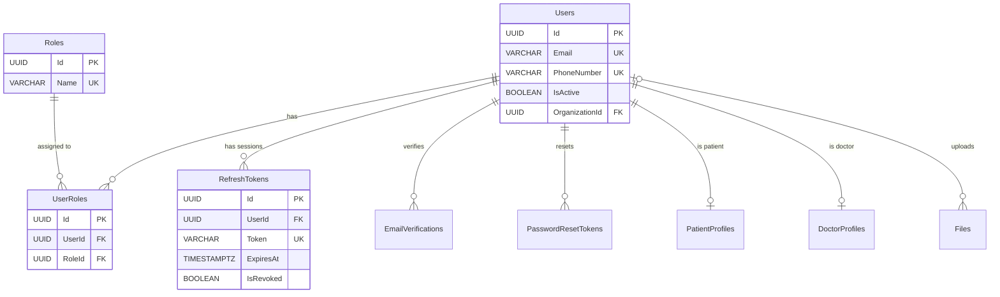
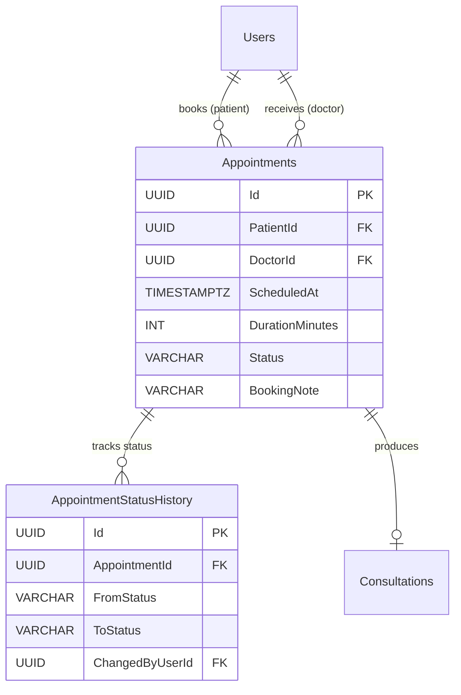
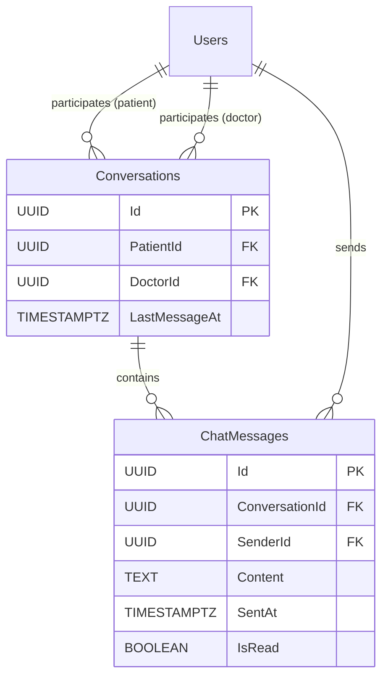
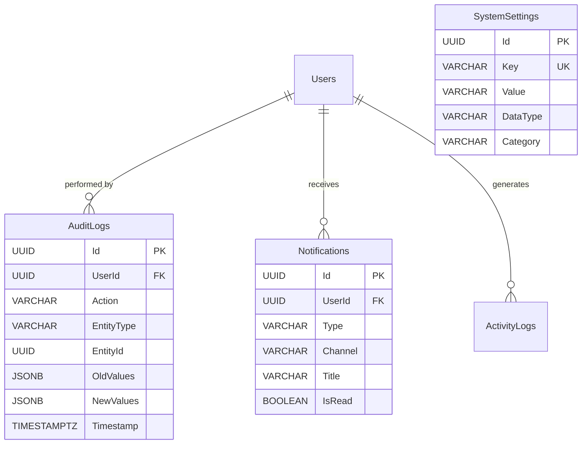

# 🗃️ Database Architecture — MedCore Digital Healthcare Ecosystem

> **Document Type:** Database Architecture (Authoritative)
> **Version:** 2.0
> **Last Revised:** 2026-08-06
> **Status:** Active
> **Audience:** Backend engineers, database administrators, AI coding assistants
> **Database Engine:** PostgreSQL 16+
> **ORM:** Entity Framework Core (Code-First)

---

## Table of Contents

- [1. Database Design Philosophy](#1-database-design-philosophy)
- [2. Database Naming Conventions](#2-database-naming-conventions)
- [3. Entity Relationship Overview](#3-entity-relationship-overview)
- [4. Complete Entity List](#4-complete-entity-list)
- [5. Detailed Table Specifications](#5-detailed-table-specifications)
- [6. Relationship Diagrams](#6-relationship-diagrams)
- [7. Index Strategy](#7-index-strategy)
- [8. Future Expansion Strategy](#8-future-expansion-strategy)
- [9. Migration Strategy](#9-migration-strategy)
- [10. Performance Considerations](#10-performance-considerations)
- [11. Security Considerations](#11-security-considerations)
- [12. Version History](#12-version-history)

---

## 1. Database Design Philosophy

### 1.1 Normalization

MedCore's database is normalized to **Third Normal Form (3NF)** for all transactional tables. This eliminates data redundancy, prevents update anomalies, and ensures data integrity across the healthcare domain where accuracy is non-negotiable.

**Controlled denormalization** is permitted only in the following cases, and only with an accompanying ADR:

- Read-heavy reporting views (materialized views, not base tables).
- Caching layers (Redis, not PostgreSQL).
- Search-optimized read models (future CQRS projections).

> **Rule:** No denormalization in base tables without a documented, approved Architecture Decision Record.

### 1.2 Scalability

The schema is designed to serve **millions of users** and **tens of millions of records** with the following strategies:

| Strategy                       | Implementation                                                              |
|--------------------------------|-----------------------------------------------------------------------------|
| UUID primary keys              | No integer sequence bottlenecks; safe for distributed systems               |
| Timestamp-based partitioning   | Large tables (AuditLogs, Notifications, ChatMessages) partitioned by month  |
| Index-first design             | Every query path has a supporting index                                     |
| Soft deletes                   | No physical row removal; filtered indexes exclude soft-deleted rows         |
| Connection pooling             | PgBouncer or built-in Npgsql pooling for connection management              |
| Read replicas (future)         | Schema supports read replica routing with no writes to replica              |

### 1.3 Security

Healthcare data demands the highest security standards. The database layer enforces security through:

| Mechanism                      | Purpose                                                                     |
|--------------------------------|-----------------------------------------------------------------------------|
| Row-Level Security (RLS)       | PostgreSQL-native multi-tenant data isolation (future Phase 2)              |
| Column-level encryption        | AES-256 for PHI/PII columns (SSN, medical records)                          |
| Audit columns on every table   | `CreatedAt`, `UpdatedAt`, `CreatedBy`, `UpdatedBy` for full traceability    |
| Immutable audit log            | Append-only `AuditLogs` table with no UPDATE or DELETE permissions           |
| Soft deletes everywhere        | `IsDeleted` flag — data is never physically removed                         |
| Parameterized queries          | EF Core prevents SQL injection by default                                   |

### 1.4 Performance

| Design Decision                | Rationale                                                                   |
|--------------------------------|-----------------------------------------------------------------------------|
| UUID v7 (time-ordered)         | Maintains B-tree index locality while providing UUID uniqueness             |
| Covering indexes               | Frequently-read columns included in indexes to avoid table lookups          |
| Composite indexes              | Multi-column indexes aligned with common query patterns                      |
| GIN indexes for JSONB          | Full-text and semi-structured data search without schema changes            |
| Materialized views             | Pre-computed aggregates for dashboard statistics                             |
| Pagination via keyset          | Cursor-based pagination instead of OFFSET for large result sets             |

### 1.5 Future Expansion

The schema is designed so that **Phase 2–4 features integrate additively** — new tables and optional FKs are added; existing tables are never restructured.

| Future Capability   | Schema Support                                                                  |
|---------------------|---------------------------------------------------------------------------------|
| Hospitals (Phase 2) | `OrganizationId` nullable FK on `Users` table; new `Organizations` table        |
| Payments (Phase 3)  | New `Payments`, `Invoices` tables; FK to `Appointments`                         |
| Telemedicine (P3)   | New `VideoSessions` table; FK to `Appointments`                                 |
| AI Models (Phase 4) | New `AiAnalyses` table; FK to `Consultations`                                   |
| Wearables (Phase 4) | New `HealthMetrics` table; FK to `Patients`                                     |
| Insurance (Phase 3) | New `InsurancePolicies`, `Claims` tables; FK to `Patients`, `Appointments`      |
| Lab Results (P3)    | New `LabOrders`, `LabResults` tables; FK to `Consultations`                     |

### 1.6 Healthcare Considerations

| Consideration                  | Implementation                                                              |
|--------------------------------|-----------------------------------------------------------------------------|
| Medical record immutability    | Finalized `Consultations` and `Prescriptions` have `IsFinalized` flag; application layer prevents UPDATE after finalization |
| Append-only corrections        | `ConsultationAddenda` table for post-finalization corrections                |
| Patient consent tracking       | `DataSharingConsent` boolean on `PatientProfiles` controls doctor access     |
| HIPAA audit trail              | Every PHI/PII access logged to `AuditLogs` with user, action, and timestamp |
| Data retention                 | Soft deletes with configurable retention period for compliance               |
| Emergency contact access       | Separate `EmergencyContacts` table with quick-access index                   |

> **Cross-Reference:** Business rules DAT-R01 through DAT-R24 in [BUSINESS_RULES.md](BUSINESS_RULES.md) define the data constraints enforced by this schema.

---

## 2. Database Naming Conventions

### 2.1 General Rules

| Element            | Convention                | Example                           | Rationale                           |
|--------------------|---------------------------|-----------------------------------|-------------------------------------|
| Tables             | `PascalCase`, **plural**  | `Patients`, `Appointments`        | EF Core convention; represents collection |
| Columns            | `PascalCase`              | `FirstName`, `CreatedAt`          | .NET property naming alignment       |
| Primary Keys       | `Id`                      | `Id` (UUID)                       | Simple, consistent across all tables |
| Foreign Keys       | `{Entity}Id`              | `PatientId`, `DoctorId`           | Clear relationship identification    |
| Junction Tables    | `{Entity1}{Entity2}`      | `DoctorSpecializations`           | Alphabetical order of entities       |
| Indexes            | `IX_{Table}_{Columns}`    | `IX_Appointments_DoctorId_ScheduledAt` | Predictable, discoverable       |
| Unique Constraints | `UQ_{Table}_{Columns}`    | `UQ_Users_Email`                  | Clear constraint identification      |
| Check Constraints  | `CK_{Table}_{Column}`     | `CK_Appointments_Duration`        | Clear validation identification      |
| Default Constraints| `DF_{Table}_{Column}`     | `DF_Users_IsDeleted`              | Identifies default value source      |
| Schemas            | `lowercase`               | `core`, `clinical`, `admin`       | PostgreSQL convention                |

### 2.2 Schema Organization

| Schema       | Purpose                                              | Tables                                                |
|--------------|------------------------------------------------------|-------------------------------------------------------|
| `core`       | Shared platform entities                             | Users, Roles, RefreshTokens, Files, Cities             |
| `clinical`   | Patient care and medical data                        | Patients, Doctors, Appointments, Consultations, etc.   |
| `messaging`  | Communication features                               | Conversations, ChatMessages                            |
| `admin`      | Platform management                                  | AuditLogs, SystemSettings, ActivityLogs                |
| `lookup`     | Reference data and mappings                          | Specializations, Symptoms, SymptomSpecializations      |

### 2.3 Audit Columns (Present on Every Table)

Every table in the MedCore database includes these columns:

| Column       | Type                      | Nullable | Default              | Purpose                             |
|--------------|---------------------------|----------|----------------------|-------------------------------------|
| `CreatedAt`  | `TIMESTAMPTZ`             | No       | `NOW()`              | Record creation timestamp (UTC)     |
| `UpdatedAt`  | `TIMESTAMPTZ`             | Yes      | `NULL`               | Last modification timestamp (UTC)   |
| `CreatedBy`  | `UUID`                    | Yes      | `NULL`               | User who created the record         |
| `UpdatedBy`  | `UUID`                    | Yes      | `NULL`               | User who last modified the record   |
| `IsDeleted`  | `BOOLEAN`                 | No       | `FALSE`              | Soft delete flag                    |

> **Rule (DAT-R02, DAT-R03):** These columns are mandatory. No table may omit them. `CreatedBy`/`UpdatedBy` are nullable only for system-generated records (e.g., seed data, automated jobs).

---

## 3. Entity Relationship Overview

### 3.1 Core Domain Entities

| Entity                    | Description                                                                    | Primary Relationships                                |
|---------------------------|--------------------------------------------------------------------------------|------------------------------------------------------|
| `Users`                   | Base account for all platform users (patients, doctors, admins)                | 1:1 with `PatientProfiles` or `DoctorProfiles`        |
| `Roles`                   | System-defined roles (SuperAdmin, Doctor, Patient)                             | M:N with `Users` via `UserRoles`                      |
| `UserRoles`               | Junction table linking users to roles                                          | N:1 to `Users`, N:1 to `Roles`                        |
| `RefreshTokens`           | Server-side refresh token storage for JWT auth                                 | N:1 to `Users`                                        |
| `EmailVerifications`      | OTP records for email verification                                             | N:1 to `Users`                                        |
| `PasswordResetTokens`     | Time-limited tokens for password reset flow                                    | N:1 to `Users`                                        |

### 3.2 Patient Domain Entities

| Entity                    | Description                                                                    | Primary Relationships                                |
|---------------------------|--------------------------------------------------------------------------------|------------------------------------------------------|
| `PatientProfiles`         | Extended patient information (demographics, health data)                       | 1:1 with `Users`                                      |
| `EmergencyContacts`       | Patient's emergency contact information                                        | N:1 to `PatientProfiles`                              |
| `PatientAllergies`        | Patient's known allergies                                                      | N:1 to `PatientProfiles`                              |
| `PatientChronicConditions`| Patient's chronic medical conditions                                           | N:1 to `PatientProfiles`                              |
| `PatientMedications`      | Patient's current medications                                                  | N:1 to `PatientProfiles`                              |

### 3.3 Doctor Domain Entities

| Entity                    | Description                                                                    | Primary Relationships                                |
|---------------------------|--------------------------------------------------------------------------------|------------------------------------------------------|
| `DoctorProfiles`          | Extended doctor information (bio, fee, experience, license)                    | 1:1 with `Users`                                      |
| `DoctorSpecializations`   | Junction: doctors and their specializations                                    | N:1 to `DoctorProfiles`, N:1 to `Specializations`    |
| `DoctorAvailabilities`    | Recurring weekly schedule slots                                                | N:1 to `DoctorProfiles`                               |
| `DoctorUnavailabilities`  | Date-specific overrides (holidays, leave)                                      | N:1 to `DoctorProfiles`                               |

### 3.4 Appointment Domain Entities

| Entity                    | Description                                                                    | Primary Relationships                                |
|---------------------------|--------------------------------------------------------------------------------|------------------------------------------------------|
| `Appointments`            | Booking record between patient and doctor                                      | N:1 to `Users` (patient), N:1 to `Users` (doctor)    |
| `AppointmentStatusHistory`| Audit trail of status transitions                                              | N:1 to `Appointments`                                 |

### 3.5 Clinical Domain Entities

| Entity                    | Description                                                                    | Primary Relationships                                |
|---------------------------|--------------------------------------------------------------------------------|------------------------------------------------------|
| `Consultations`           | Clinical encounter record linked to appointment                                | 1:1 with `Appointments`                               |
| `ConsultationAddenda`     | Post-finalization corrections (append-only)                                    | N:1 to `Consultations`                                |
| `ConsultationVitals`      | Vital signs recorded during consultation                                       | 1:1 with `Consultations`                              |
| `Prescriptions`           | Doctor-issued prescription linked to consultation                              | N:1 to `Consultations`                                |
| `PrescriptionItems`       | Individual medication entries within a prescription                             | N:1 to `Prescriptions`                                |

### 3.6 Messaging Domain Entities

| Entity                    | Description                                                                    | Primary Relationships                                |
|---------------------------|--------------------------------------------------------------------------------|------------------------------------------------------|
| `Conversations`           | Chat thread between a patient and doctor                                       | N:1 to `Users` (patient), N:1 to `Users` (doctor)    |
| `ChatMessages`            | Individual text messages within a conversation                                 | N:1 to `Conversations`, N:1 to `Users` (sender)      |

### 3.7 Notification & Admin Entities

| Entity                    | Description                                                                    | Primary Relationships                                |
|---------------------------|--------------------------------------------------------------------------------|------------------------------------------------------|
| `Notifications`           | In-app and email notification records                                          | N:1 to `Users`                                        |
| `AuditLogs`               | Immutable trail of all significant system actions                              | N:1 to `Users` (actor)                                |
| `SystemSettings`          | Platform-wide configurable settings (key-value)                                | Standalone                                            |
| `ActivityLogs`            | General platform activity tracking                                             | N:1 to `Users`                                        |

### 3.8 Lookup / Reference Entities

| Entity                        | Description                                                                | Primary Relationships                            |
|-------------------------------|----------------------------------------------------------------------------|--------------------------------------------------|
| `Specializations`             | Medical specializations (Dermatology, Cardiology, etc.)                    | M:N with `DoctorProfiles`                         |
| `Symptoms`                    | Common symptoms patients might search by                                   | M:N with `Specializations`                        |
| `SymptomSpecializations`      | Mapping of symptoms to relevant specializations                            | N:1 to `Symptoms`, N:1 to `Specializations`       |
| `Cities`                      | City/location reference data                                               | Referenced by `DoctorProfiles`, `PatientProfiles` |
| `Files`                       | Metadata for uploaded files (photos, documents)                            | N:1 to `Users`                                    |

### 3.9 Cardinality Summary

| Relationship                                   | Type    | Rationale                                           |
|------------------------------------------------|---------|-----------------------------------------------------|
| `Users` → `PatientProfiles`                    | 1:1     | Each patient has exactly one profile                 |
| `Users` → `DoctorProfiles`                     | 1:1     | Each doctor has exactly one profile                  |
| `Users` → `Roles` (via `UserRoles`)            | M:N     | A user can have multiple roles (future expansion)    |
| `Users` → `RefreshTokens`                      | 1:N     | Multiple devices = multiple tokens                   |
| `DoctorProfiles` → `Specializations`           | M:N     | A doctor can have multiple specialties               |
| `Symptoms` → `Specializations`                 | M:N     | A symptom maps to multiple specialties               |
| `PatientProfiles` → `EmergencyContacts`        | 1:N     | Multiple emergency contacts per patient              |
| `PatientProfiles` → `PatientAllergies`         | 1:N     | Multiple allergies per patient                       |
| `Users (patient)` → `Appointments`             | 1:N     | A patient has many appointments                      |
| `Users (doctor)` → `Appointments`              | 1:N     | A doctor has many appointments                       |
| `Appointments` → `Consultations`               | 1:1     | One consultation per completed appointment           |
| `Consultations` → `Prescriptions`              | 1:N     | Multiple prescriptions (corrections/addenda)         |
| `Prescriptions` → `PrescriptionItems`          | 1:N     | Multiple medications per prescription                |
| `Conversations` → `ChatMessages`               | 1:N     | Many messages per conversation                       |
| `Users` → `Notifications`                      | 1:N     | Many notifications per user                          |

---

## 4. Complete Entity List

### 4.1 Phase 1 Entities (Fully Designed)

| #  | Schema      | Entity                      | Domain          | Status    |
|----|-------------|-----------------------------|-----------------| ----------|
| 1  | `core`      | `Users`                     | Authentication  | Phase 1   |
| 2  | `core`      | `Roles`                     | Authentication  | Phase 1   |
| 3  | `core`      | `UserRoles`                 | Authentication  | Phase 1   |
| 4  | `core`      | `RefreshTokens`             | Authentication  | Phase 1   |
| 5  | `core`      | `EmailVerifications`        | Authentication  | Phase 1   |
| 6  | `core`      | `PasswordResetTokens`       | Authentication  | Phase 1   |
| 7  | `core`      | `Files`                     | Platform        | Phase 1   |
| 8  | `lookup`    | `Cities`                    | Reference       | Phase 1   |
| 9  | `lookup`    | `Specializations`           | Reference       | Phase 1   |
| 10 | `lookup`    | `Symptoms`                  | Reference       | Phase 1   |
| 11 | `lookup`    | `SymptomSpecializations`    | Reference       | Phase 1   |
| 12 | `clinical`  | `PatientProfiles`           | Patient         | Phase 1   |
| 13 | `clinical`  | `EmergencyContacts`         | Patient         | Phase 1   |
| 14 | `clinical`  | `PatientAllergies`          | Patient         | Phase 1   |
| 15 | `clinical`  | `PatientChronicConditions`  | Patient         | Phase 1   |
| 16 | `clinical`  | `PatientMedications`        | Patient         | Phase 1   |
| 17 | `clinical`  | `DoctorProfiles`            | Doctor          | Phase 1   |
| 18 | `clinical`  | `DoctorSpecializations`     | Doctor          | Phase 1   |
| 19 | `clinical`  | `DoctorAvailabilities`      | Doctor          | Phase 1   |
| 20 | `clinical`  | `DoctorUnavailabilities`    | Doctor          | Phase 1   |
| 21 | `clinical`  | `Appointments`              | Appointment     | Phase 1   |
| 22 | `clinical`  | `AppointmentStatusHistory`  | Appointment     | Phase 1   |
| 23 | `clinical`  | `Consultations`             | Clinical        | Phase 1   |
| 24 | `clinical`  | `ConsultationAddenda`       | Clinical        | Phase 1   |
| 25 | `clinical`  | `ConsultationVitals`        | Clinical        | Phase 1   |
| 26 | `clinical`  | `Prescriptions`             | Clinical        | Phase 1   |
| 27 | `clinical`  | `PrescriptionItems`         | Clinical        | Phase 1   |
| 28 | `messaging` | `Conversations`             | Chat            | Phase 1   |
| 29 | `messaging` | `ChatMessages`              | Chat            | Phase 1   |
| 30 | `core`      | `Notifications`             | Notification    | Phase 1   |
| 31 | `admin`     | `AuditLogs`                 | Admin           | Phase 1   |
| 32 | `admin`     | `SystemSettings`            | Admin           | Phase 1   |
| 33 | `admin`     | `ActivityLogs`              | Admin           | Phase 1   |

### 4.2 Phase 2 Entities (Reserved — Forward Compatibility)

These entities are identified for Phase 2. They are **not created** in Phase 1 migrations, but the Phase 1 schema is designed to accept them without restructuring.

| #  | Schema      | Entity                      | Domain          | Integration Point              |
|----|-------------|-----------------------------|-----------------|---------------------------------|
| 34 | `core`      | `Organizations`             | Hospital        | Nullable `OrganizationId` FK on `Users` |
| 35 | `core`      | `OrganizationBranches`      | Hospital        | FK to `Organizations`           |
| 36 | `core`      | `Departments`               | Hospital        | FK to `OrganizationBranches`    |
| 37 | `clinical`  | `DoctorOrganizations`       | Hospital        | Junction: Doctor ↔ Organization |
| 38 | `core`      | `StaffProfiles`             | Hospital        | Nurses, Receptionists, etc.     |
| 39 | `clinical`  | `LabOrders`                 | Laboratory      | FK to `Consultations`           |
| 40 | `clinical`  | `LabResults`                | Laboratory      | FK to `LabOrders`               |
| 41 | `clinical`  | `PharmacyOrders`            | Pharmacy        | FK to `Prescriptions`           |
| 42 | `core`      | `DoctorVerifications`       | Verification    | FK to `DoctorProfiles`          |

### 4.3 Phase 3–4 Entities (Identified — Not Designed)

| #  | Entity                      | Phase | Integration Point              |
|----|-----------------------------| ------|--------------------------------|
| 43 | `Payments`                  | 3     | FK to `Appointments`           |
| 44 | `Invoices`                  | 3     | FK to `Payments`               |
| 45 | `VideoSessions`             | 3     | FK to `Appointments`           |
| 46 | `InsurancePolicies`         | 3     | FK to `PatientProfiles`        |
| 47 | `InsuranceClaims`           | 3     | FK to `Appointments`, `InsurancePolicies` |
| 48 | `AiAnalyses`               | 4     | FK to `Consultations`          |
| 49 | `HealthMetrics`             | 4     | FK to `PatientProfiles`        |
| 50 | `WearableDevices`           | 4     | FK to `PatientProfiles`        |

---

## 5. Detailed Table Specifications

### 5.1 Authentication & User Management

---

#### `core.Users`

**Purpose:** Central user account table for all platform roles. Every person on the platform has exactly one row in this table, regardless of their role.

| Column                | Type            | Nullable | Default       | Constraints                        |
|-----------------------|-----------------|----------|---------------|------------------------------------|
| `Id`                  | `UUID`          | No       | `gen_random_uuid()` | PK                           |
| `FirstName`           | `VARCHAR(100)`  | No       | —             | —                                  |
| `LastName`            | `VARCHAR(100)`  | No       | —             | —                                  |
| `Email`               | `VARCHAR(255)`  | No       | —             | UQ; lowercase enforced             |
| `NormalizedEmail`     | `VARCHAR(255)`  | No       | —             | UQ; uppercase for case-insensitive lookup |
| `EmailConfirmed`      | `BOOLEAN`       | No       | `FALSE`       | —                                  |
| `PhoneNumber`         | `VARCHAR(20)`   | No       | —             | UQ                                 |
| `PhoneNumberConfirmed`| `BOOLEAN`       | No       | `FALSE`       | —                                  |
| `PasswordHash`        | `VARCHAR(500)`  | No       | —             | bcrypt hash                        |
| `ProfilePhotoFileId`  | `UUID`          | Yes      | `NULL`        | FK → `Files.Id`                    |
| `IsActive`            | `BOOLEAN`       | No       | `TRUE`        | `FALSE` = suspended                |
| `SuspensionReason`    | `VARCHAR(500)`  | Yes      | `NULL`        | Required when `IsActive = FALSE`   |
| `FailedLoginAttempts` | `INT`           | No       | `0`           | Resets on successful login          |
| `LockoutEnd`          | `TIMESTAMPTZ`   | Yes      | `NULL`        | Account locked until this time     |
| `LastLoginAt`         | `TIMESTAMPTZ`   | Yes      | `NULL`        | Last successful login              |
| `InvitedByUserId`     | `UUID`          | Yes      | `NULL`        | FK → `Users.Id` (doctor-created patients) |
| `InvitationToken`     | `VARCHAR(500)`  | Yes      | `NULL`        | Activation token for invited patients |
| `InvitationAcceptedAt`| `TIMESTAMPTZ`   | Yes      | `NULL`        | When the invitation was accepted    |
| `TermsAcceptedAt`     | `TIMESTAMPTZ`   | Yes      | `NULL`        | When TOS was accepted               |
| `OrganizationId`      | `UUID`          | Yes      | `NULL`        | **Reserved Phase 2:** FK → `Organizations.Id` |
| `CreatedAt`           | `TIMESTAMPTZ`   | No       | `NOW()`       | Audit                              |
| `UpdatedAt`           | `TIMESTAMPTZ`   | Yes      | `NULL`        | Audit                              |
| `CreatedBy`           | `UUID`          | Yes      | `NULL`        | Audit                              |
| `UpdatedBy`           | `UUID`          | Yes      | `NULL`        | Audit                              |
| `IsDeleted`           | `BOOLEAN`       | No       | `FALSE`       | Soft delete                        |

**Indexes:**
- `IX_Users_Email` — Unique on `NormalizedEmail` WHERE `IsDeleted = FALSE`
- `IX_Users_PhoneNumber` — Unique on `PhoneNumber` WHERE `IsDeleted = FALSE`
- `IX_Users_IsActive` — Filtered on `IsActive` for admin queries
- `IX_Users_OrganizationId` — For Phase 2 hospital queries
- `IX_Users_InvitedByUserId` — For doctor-created patient lookups

**Business Notes:**
- Implements REG-R01 (unique email), REG-R02 (unique phone), AUTH-R07/R08 (lockout).
- `InvitedByUserId` supports DOC-R10–R14 (doctor-initiated patient creation).
- `OrganizationId` is nullable and unused in Phase 1 — reserved for Phase 2 hospital association (FUT-R01).
- Unique constraints are partial (filtered on `IsDeleted = FALSE`) to allow re-registration with previously soft-deleted emails.

---

#### `core.Roles`

**Purpose:** System-defined roles. Seeded at deployment; not user-editable.

| Column       | Type            | Nullable | Default              | Constraints  |
|--------------|-----------------|----------|----------------------|--------------|
| `Id`         | `UUID`          | No       | `gen_random_uuid()`  | PK           |
| `Name`       | `VARCHAR(50)`   | No       | —                    | UQ           |
| `NormalizedName` | `VARCHAR(50)` | No     | —                    | UQ           |
| `Description`| `VARCHAR(255)`  | Yes      | `NULL`               | —            |
| `CreatedAt`  | `TIMESTAMPTZ`   | No       | `NOW()`              | Audit        |
| `UpdatedAt`  | `TIMESTAMPTZ`   | Yes      | `NULL`               | Audit        |
| `CreatedBy`  | `UUID`          | Yes      | `NULL`               | Audit        |
| `UpdatedBy`  | `UUID`          | Yes      | `NULL`               | Audit        |
| `IsDeleted`  | `BOOLEAN`       | No       | `FALSE`              | Soft delete  |

**Seed Data:**

| Name         | Description                        |
|--------------|------------------------------------|
| `SuperAdmin` | Full platform access               |
| `Doctor`     | Medical practitioner               |
| `Patient`    | Healthcare consumer                |

**Business Notes:**
- Phase 2 will add: `HospitalAdmin`, `Receptionist`, `Nurse`, `LabTechnician`, `Pharmacist`.
- Roles are additive — new roles never require schema changes.

---

#### `core.UserRoles`

**Purpose:** Junction table mapping users to roles. Supports multi-role assignment for future flexibility.

| Column       | Type            | Nullable | Default              | Constraints            |
|--------------|-----------------|----------|----------------------|------------------------|
| `Id`         | `UUID`          | No       | `gen_random_uuid()`  | PK                     |
| `UserId`     | `UUID`          | No       | —                    | FK → `Users.Id`        |
| `RoleId`     | `UUID`          | No       | —                    | FK → `Roles.Id`        |
| `AssignedAt` | `TIMESTAMPTZ`   | No       | `NOW()`              | —                      |
| `AssignedBy` | `UUID`          | Yes      | `NULL`               | FK → `Users.Id`        |
| `CreatedAt`  | `TIMESTAMPTZ`   | No       | `NOW()`              | Audit                  |
| `UpdatedAt`  | `TIMESTAMPTZ`   | Yes      | `NULL`               | Audit                  |
| `CreatedBy`  | `UUID`          | Yes      | `NULL`               | Audit                  |
| `UpdatedBy`  | `UUID`          | Yes      | `NULL`               | Audit                  |
| `IsDeleted`  | `BOOLEAN`       | No       | `FALSE`              | Soft delete            |

**Indexes:**
- `UQ_UserRoles_UserId_RoleId` — Unique composite WHERE `IsDeleted = FALSE`
- `IX_UserRoles_RoleId` — For role-based user queries

**Business Notes:**
- Implements REG-R05 (role assignment at registration).
- In Phase 1, each user has exactly one role. The M:N design accommodates future scenarios (e.g., a doctor who is also a hospital admin).

---

#### `core.RefreshTokens`

**Purpose:** Server-side storage for JWT refresh tokens. Supports multi-device sessions with single-use rotation.

| Column           | Type            | Nullable | Default              | Constraints        |
|------------------|-----------------|----------|----------------------|--------------------|
| `Id`             | `UUID`          | No       | `gen_random_uuid()`  | PK                 |
| `UserId`         | `UUID`          | No       | —                    | FK → `Users.Id`    |
| `Token`          | `VARCHAR(500)`  | No       | —                    | UQ                 |
| `DeviceInfo`     | `VARCHAR(500)`  | Yes      | `NULL`               | User-agent / device identifier |
| `IpAddress`      | `VARCHAR(45)`   | Yes      | `NULL`               | IPv4 or IPv6       |
| `ExpiresAt`      | `TIMESTAMPTZ`   | No       | —                    | —                  |
| `IsRevoked`      | `BOOLEAN`       | No       | `FALSE`              | —                  |
| `RevokedAt`      | `TIMESTAMPTZ`   | Yes      | `NULL`               | —                  |
| `ReplacedByToken`| `VARCHAR(500)`  | Yes      | `NULL`               | Token that replaced this one |
| `CreatedAt`      | `TIMESTAMPTZ`   | No       | `NOW()`              | Audit              |
| `UpdatedAt`      | `TIMESTAMPTZ`   | Yes      | `NULL`               | Audit              |
| `CreatedBy`      | `UUID`          | Yes      | `NULL`               | Audit              |
| `UpdatedBy`      | `UUID`          | Yes      | `NULL`               | Audit              |
| `IsDeleted`      | `BOOLEAN`       | No       | `FALSE`              | Soft delete        |

**Indexes:**
- `IX_RefreshTokens_Token` — Unique on `Token`
- `IX_RefreshTokens_UserId` — For user session lookup
- `IX_RefreshTokens_ExpiresAt` — For cleanup jobs

**Business Notes:**
- Implements AUTH-R05 (single-use rotation), AUTH-R06 (server-side storage), AUTH-R12 (logout invalidation), AUTH-R13 (per-device sessions).
- Old tokens are marked `IsRevoked = TRUE` with `ReplacedByToken` for the full rotation chain.

---

#### `core.EmailVerifications`

**Purpose:** OTP records for email verification during registration.

| Column       | Type            | Nullable | Default              | Constraints        |
|--------------|-----------------|----------|----------------------|--------------------|
| `Id`         | `UUID`          | No       | `gen_random_uuid()`  | PK                 |
| `UserId`     | `UUID`          | No       | —                    | FK → `Users.Id`    |
| `OtpCode`    | `VARCHAR(10)`   | No       | —                    | Hashed OTP         |
| `ExpiresAt`  | `TIMESTAMPTZ`   | No       | —                    | —                  |
| `IsUsed`     | `BOOLEAN`       | No       | `FALSE`              | —                  |
| `Attempts`   | `INT`           | No       | `0`                  | Max 3 attempts     |
| `CreatedAt`  | `TIMESTAMPTZ`   | No       | `NOW()`              | Audit              |
| `UpdatedAt`  | `TIMESTAMPTZ`   | Yes      | `NULL`               | Audit              |
| `CreatedBy`  | `UUID`          | Yes      | `NULL`               | Audit              |
| `UpdatedBy`  | `UUID`          | Yes      | `NULL`               | Audit              |
| `IsDeleted`  | `BOOLEAN`       | No       | `FALSE`              | Soft delete        |

**Business Notes:**
- Implements AUTH-R09, AUTH-R10 (email verification via OTP).

---

#### `core.PasswordResetTokens`

**Purpose:** Time-limited tokens for password reset flow.

| Column       | Type            | Nullable | Default              | Constraints        |
|--------------|-----------------|----------|----------------------|--------------------|
| `Id`         | `UUID`          | No       | `gen_random_uuid()`  | PK                 |
| `UserId`     | `UUID`          | No       | —                    | FK → `Users.Id`    |
| `Token`      | `VARCHAR(500)`  | No       | —                    | Hashed token       |
| `ExpiresAt`  | `TIMESTAMPTZ`   | No       | —                    | Default: +1 hour   |
| `IsUsed`     | `BOOLEAN`       | No       | `FALSE`              | —                  |
| `CreatedAt`  | `TIMESTAMPTZ`   | No       | `NOW()`              | Audit              |
| `UpdatedAt`  | `TIMESTAMPTZ`   | Yes      | `NULL`               | Audit              |
| `CreatedBy`  | `UUID`          | Yes      | `NULL`               | Audit              |
| `UpdatedBy`  | `UUID`          | Yes      | `NULL`               | Audit              |
| `IsDeleted`  | `BOOLEAN`       | No       | `FALSE`              | Soft delete        |

**Business Notes:**
- Implements AUTH-R11 (password reset token with configurable expiry).

---

### 5.2 Patient Domain

---

#### `clinical.PatientProfiles`

**Purpose:** Extended health and demographic data for patients. Separate from `Users` to maintain Single Responsibility and support the progressive registration flow (ADR-004).

| Column                | Type            | Nullable | Default              | Constraints            |
|-----------------------|-----------------|----------|----------------------|------------------------|
| `Id`                  | `UUID`          | No       | `gen_random_uuid()`  | PK                     |
| `UserId`              | `UUID`          | No       | —                    | FK → `Users.Id`; UQ    |
| `DateOfBirth`         | `DATE`          | Yes      | `NULL`               | Stage 2                |
| `Gender`              | `VARCHAR(20)`   | Yes      | `NULL`               | Stage 2                |
| `BloodType`           | `VARCHAR(5)`    | Yes      | `NULL`               | Stage 2 (e.g., `A+`)  |
| `CityId`              | `UUID`          | Yes      | `NULL`               | FK → `Cities.Id`       |
| `Address`             | `VARCHAR(500)`  | Yes      | `NULL`               | —                      |
| `DataSharingConsent`  | `BOOLEAN`       | No       | `TRUE`               | PAT-R05: revocable     |
| `ProfileCompletionPct`| `INT`           | No       | `0`                  | 0–100, calculated      |
| `CreatedAt`           | `TIMESTAMPTZ`   | No       | `NOW()`              | Audit                  |
| `UpdatedAt`           | `TIMESTAMPTZ`   | Yes      | `NULL`               | Audit                  |
| `CreatedBy`           | `UUID`          | Yes      | `NULL`               | Audit                  |
| `UpdatedBy`           | `UUID`          | Yes      | `NULL`               | Audit                  |
| `IsDeleted`           | `BOOLEAN`       | No       | `FALSE`              | Soft delete            |

**Indexes:**
- `UQ_PatientProfiles_UserId` — Unique on `UserId` WHERE `IsDeleted = FALSE`
- `IX_PatientProfiles_CityId` — For location-based queries

**Business Notes:**
- Most fields are nullable to support the progressive registration flow (REG-R11–R16). Stage 1 creates the row with minimal data; Stages 2–3 fill in the rest.
- `DataSharingConsent` implements PAT-R05. When `FALSE`, doctors cannot view this patient's medical records (enforced at application layer via DAT-R11).

---

#### `clinical.EmergencyContacts`

**Purpose:** Patient emergency contact information. One patient can have multiple emergency contacts.

| Column            | Type            | Nullable | Default              | Constraints               |
|-------------------|-----------------|----------|----------------------|---------------------------|
| `Id`              | `UUID`          | No       | `gen_random_uuid()`  | PK                        |
| `PatientProfileId`| `UUID`          | No       | —                    | FK → `PatientProfiles.Id` |
| `FullName`        | `VARCHAR(200)`  | No       | —                    | —                         |
| `Relationship`    | `VARCHAR(50)`   | No       | —                    | e.g., Spouse, Parent      |
| `PhoneNumber`     | `VARCHAR(20)`   | No       | —                    | —                         |
| `Email`           | `VARCHAR(255)`  | Yes      | `NULL`               | —                         |
| `IsPrimary`       | `BOOLEAN`       | No       | `FALSE`              | Only one primary per patient |
| `CreatedAt`       | `TIMESTAMPTZ`   | No       | `NOW()`              | Audit                     |
| `UpdatedAt`       | `TIMESTAMPTZ`   | Yes      | `NULL`               | Audit                     |
| `CreatedBy`       | `UUID`          | Yes      | `NULL`               | Audit                     |
| `UpdatedBy`       | `UUID`          | Yes      | `NULL`               | Audit                     |
| `IsDeleted`       | `BOOLEAN`       | No       | `FALSE`              | Soft delete               |

---

#### `clinical.PatientAllergies`

**Purpose:** Patient's known allergies. Normalized from profile to support multiple entries.

| Column            | Type            | Nullable | Default              | Constraints               |
|-------------------|-----------------|----------|----------------------|---------------------------|
| `Id`              | `UUID`          | No       | `gen_random_uuid()`  | PK                        |
| `PatientProfileId`| `UUID`          | No       | —                    | FK → `PatientProfiles.Id` |
| `AllergyName`     | `VARCHAR(200)`  | No       | —                    | —                         |
| `Severity`        | `VARCHAR(20)`   | Yes      | `NULL`               | Mild, Moderate, Severe    |
| `Notes`           | `VARCHAR(500)`  | Yes      | `NULL`               | —                         |
| `CreatedAt`       | `TIMESTAMPTZ`   | No       | `NOW()`              | Audit                     |
| `UpdatedAt`       | `TIMESTAMPTZ`   | Yes      | `NULL`               | Audit                     |
| `CreatedBy`       | `UUID`          | Yes      | `NULL`               | Audit                     |
| `UpdatedBy`       | `UUID`          | Yes      | `NULL`               | Audit                     |
| `IsDeleted`       | `BOOLEAN`       | No       | `FALSE`              | Soft delete               |

---

#### `clinical.PatientChronicConditions`

**Purpose:** Patient's chronic medical conditions.

| Column            | Type            | Nullable | Default              | Constraints               |
|-------------------|-----------------|----------|----------------------|---------------------------|
| `Id`              | `UUID`          | No       | `gen_random_uuid()`  | PK                        |
| `PatientProfileId`| `UUID`          | No       | —                    | FK → `PatientProfiles.Id` |
| `ConditionName`   | `VARCHAR(200)`  | No       | —                    | —                         |
| `DiagnosedDate`   | `DATE`          | Yes      | `NULL`               | —                         |
| `Notes`           | `VARCHAR(500)`  | Yes      | `NULL`               | —                         |
| `CreatedAt`       | `TIMESTAMPTZ`   | No       | `NOW()`              | Audit                     |
| `UpdatedAt`       | `TIMESTAMPTZ`   | Yes      | `NULL`               | Audit                     |
| `CreatedBy`       | `UUID`          | Yes      | `NULL`               | Audit                     |
| `UpdatedBy`       | `UUID`          | Yes      | `NULL`               | Audit                     |
| `IsDeleted`       | `BOOLEAN`       | No       | `FALSE`              | Soft delete               |

---

#### `clinical.PatientMedications`

**Purpose:** Patient's current medications (self-reported).

| Column            | Type            | Nullable | Default              | Constraints               |
|-------------------|-----------------|----------|----------------------|---------------------------|
| `Id`              | `UUID`          | No       | `gen_random_uuid()`  | PK                        |
| `PatientProfileId`| `UUID`          | No       | —                    | FK → `PatientProfiles.Id` |
| `MedicationName`  | `VARCHAR(200)`  | No       | —                    | —                         |
| `Dosage`          | `VARCHAR(100)`  | Yes      | `NULL`               | —                         |
| `Frequency`       | `VARCHAR(100)`  | Yes      | `NULL`               | —                         |
| `StartDate`       | `DATE`          | Yes      | `NULL`               | —                         |
| `Notes`           | `VARCHAR(500)`  | Yes      | `NULL`               | —                         |
| `CreatedAt`       | `TIMESTAMPTZ`   | No       | `NOW()`              | Audit                     |
| `UpdatedAt`       | `TIMESTAMPTZ`   | Yes      | `NULL`               | Audit                     |
| `CreatedBy`       | `UUID`          | Yes      | `NULL`               | Audit                     |
| `UpdatedBy`       | `UUID`          | Yes      | `NULL`               | Audit                     |
| `IsDeleted`       | `BOOLEAN`       | No       | `FALSE`              | Soft delete               |

---

### 5.3 Doctor Domain

---

#### `clinical.DoctorProfiles`

**Purpose:** Extended professional information for doctors. Separate from `Users` to maintain SRP and support the doctor-specific registration flow.

| Column                | Type            | Nullable | Default              | Constraints            |
|-----------------------|-----------------|----------|----------------------|------------------------|
| `Id`                  | `UUID`          | No       | `gen_random_uuid()`  | PK                     |
| `UserId`              | `UUID`          | No       | —                    | FK → `Users.Id`; UQ    |
| `LicenseNumber`       | `VARCHAR(100)`  | No       | —                    | REG-R22                |
| `LicenseAuthority`    | `VARCHAR(200)`  | No       | —                    | REG-R22                |
| `LicenseDocumentFileId`| `UUID`         | Yes      | `NULL`               | FK → `Files.Id`        |
| `VerificationStatus`  | `VARCHAR(20)`   | No       | `'Unverified'`       | Unverified / Pending / Approved / Rejected |
| `YearsOfExperience`   | `INT`           | No       | —                    | REG-R21                |
| `ConsultationFee`     | `DECIMAL(10,2)` | No       | —                    | DOC-R03                |
| `FeeCurrency`         | `VARCHAR(3)`    | No       | `'PKR'`              | ISO 4217 currency code |
| `Bio`                 | `TEXT`          | Yes      | `NULL`               | Professional bio       |
| `CityId`              | `UUID`          | Yes      | `NULL`               | FK → `Cities.Id`       |
| `Address`             | `VARCHAR(500)`  | Yes      | `NULL`               | Clinic address         |
| `SlotDurationMinutes` | `INT`           | No       | `30`                 | APT-R33, per doctor    |
| `AverageRating`       | `DECIMAL(3,2)`  | No       | `0.00`               | Computed, 0.00–5.00    |
| `TotalReviews`        | `INT`           | No       | `0`                  | Computed count         |
| `CreatedAt`           | `TIMESTAMPTZ`   | No       | `NOW()`              | Audit                  |
| `UpdatedAt`           | `TIMESTAMPTZ`   | Yes      | `NULL`               | Audit                  |
| `CreatedBy`           | `UUID`          | Yes      | `NULL`               | Audit                  |
| `UpdatedBy`           | `UUID`          | Yes      | `NULL`               | Audit                  |
| `IsDeleted`           | `BOOLEAN`       | No       | `FALSE`              | Soft delete            |

**Indexes:**
- `UQ_DoctorProfiles_UserId` — Unique on `UserId` WHERE `IsDeleted = FALSE`
- `IX_DoctorProfiles_CityId` — For location search
- `IX_DoctorProfiles_ConsultationFee` — For fee-range filtering
- `IX_DoctorProfiles_YearsOfExperience` — For experience sorting
- `IX_DoctorProfiles_AverageRating` — For rating sorting
- `IX_DoctorProfiles_VerificationStatus` — For admin review queries

**Business Notes:**
- `VerificationStatus` is `'Unverified'` in Phase 1 for all doctors (REG-R23, REG-R24). Phase 2 activates the verification workflow.
- `SlotDurationMinutes` allows per-doctor slot customization (APT-R33).
- `AverageRating` and `TotalReviews` are denormalized counters updated by background jobs (reviews feature Phase 2). Present now for search result display compatibility.

---

#### `clinical.DoctorSpecializations`

**Purpose:** Junction table linking doctors to their medical specializations (M:N).

| Column             | Type            | Nullable | Default              | Constraints                    |
|--------------------|-----------------|----------|----------------------|--------------------------------|
| `Id`               | `UUID`          | No       | `gen_random_uuid()`  | PK                             |
| `DoctorProfileId`  | `UUID`          | No       | —                    | FK → `DoctorProfiles.Id`       |
| `SpecializationId` | `UUID`          | No       | —                    | FK → `Specializations.Id`      |
| `IsPrimary`        | `BOOLEAN`       | No       | `FALSE`              | One primary per doctor         |
| `CreatedAt`        | `TIMESTAMPTZ`   | No       | `NOW()`              | Audit                          |
| `UpdatedAt`        | `TIMESTAMPTZ`   | Yes      | `NULL`               | Audit                          |
| `CreatedBy`        | `UUID`          | Yes      | `NULL`               | Audit                          |
| `UpdatedBy`        | `UUID`          | Yes      | `NULL`               | Audit                          |
| `IsDeleted`        | `BOOLEAN`       | No       | `FALSE`              | Soft delete                    |

**Indexes:**
- `UQ_DoctorSpecializations_Doctor_Spec` — Unique on `(DoctorProfileId, SpecializationId)` WHERE `IsDeleted = FALSE`

---

#### `clinical.DoctorAvailabilities`

**Purpose:** Recurring weekly schedule slots. Defines when a doctor is generally available.

| Column             | Type            | Nullable | Default              | Constraints                    |
|--------------------|-----------------|----------|----------------------|--------------------------------|
| `Id`               | `UUID`          | No       | `gen_random_uuid()`  | PK                             |
| `DoctorProfileId`  | `UUID`          | No       | —                    | FK → `DoctorProfiles.Id`       |
| `DayOfWeek`        | `SMALLINT`      | No       | —                    | 0=Sunday, 6=Saturday           |
| `StartTime`        | `TIME`          | No       | —                    | e.g., `09:00:00`               |
| `EndTime`          | `TIME`          | No       | —                    | e.g., `17:00:00`               |
| `IsActive`         | `BOOLEAN`       | No       | `TRUE`               | Can disable without deleting   |
| `CreatedAt`        | `TIMESTAMPTZ`   | No       | `NOW()`              | Audit                          |
| `UpdatedAt`        | `TIMESTAMPTZ`   | Yes      | `NULL`               | Audit                          |
| `CreatedBy`        | `UUID`          | Yes      | `NULL`               | Audit                          |
| `UpdatedBy`        | `UUID`          | Yes      | `NULL`               | Audit                          |
| `IsDeleted`        | `BOOLEAN`       | No       | `FALSE`              | Soft delete                    |

**Indexes:**
- `IX_DoctorAvailabilities_DoctorProfileId_DayOfWeek` — Composite for schedule lookup

**Business Notes:**
- Implements APT-R30 (recurring weekly slots).
- The application layer generates concrete bookable slots from these recurring definitions.
- `CK_DoctorAvailabilities_TimeRange` — CHECK constraint: `StartTime < EndTime`.

---

#### `clinical.DoctorUnavailabilities`

**Purpose:** Date-specific unavailability overrides (holidays, vacation, sick leave).

| Column             | Type            | Nullable | Default              | Constraints                    |
|--------------------|-----------------|----------|----------------------|--------------------------------|
| `Id`               | `UUID`          | No       | `gen_random_uuid()`  | PK                             |
| `DoctorProfileId`  | `UUID`          | No       | —                    | FK → `DoctorProfiles.Id`       |
| `UnavailableDate`  | `DATE`          | No       | —                    | —                              |
| `Reason`           | `VARCHAR(200)`  | Yes      | `NULL`               | e.g., Holiday, Personal        |
| `IsFullDay`        | `BOOLEAN`       | No       | `TRUE`               | `FALSE` = partial day override |
| `StartTime`        | `TIME`          | Yes      | `NULL`               | Only if `IsFullDay = FALSE`    |
| `EndTime`          | `TIME`          | Yes      | `NULL`               | Only if `IsFullDay = FALSE`    |
| `CreatedAt`        | `TIMESTAMPTZ`   | No       | `NOW()`              | Audit                          |
| `UpdatedAt`        | `TIMESTAMPTZ`   | Yes      | `NULL`               | Audit                          |
| `CreatedBy`        | `UUID`          | Yes      | `NULL`               | Audit                          |
| `UpdatedBy`        | `UUID`          | Yes      | `NULL`               | Audit                          |
| `IsDeleted`        | `BOOLEAN`       | No       | `FALSE`              | Soft delete                    |

**Indexes:**
- `IX_DoctorUnavailabilities_DoctorProfileId_Date` — Composite for date lookup

**Business Notes:**
- Implements APT-R31 (date-specific overrides). Overrides take priority over recurring `DoctorAvailabilities`.

---

### 5.4 Appointment Domain

---

#### `clinical.Appointments`

**Purpose:** Central appointment booking record. Links a patient to a doctor for a specific date and time.

| Column              | Type            | Nullable | Default              | Constraints            |
|---------------------|-----------------|----------|----------------------|------------------------|
| `Id`                | `UUID`          | No       | `gen_random_uuid()`  | PK                     |
| `PatientId`         | `UUID`          | No       | —                    | FK → `Users.Id`        |
| `DoctorId`          | `UUID`          | No       | —                    | FK → `Users.Id`        |
| `ScheduledAt`       | `TIMESTAMPTZ`   | No       | —                    | Appointment start time |
| `DurationMinutes`   | `INT`           | No       | `30`                 | APT-R05: max 60        |
| `Status`            | `VARCHAR(20)`   | No       | `'Pending'`          | Pending / Confirmed / InProgress / Completed / Cancelled |
| `BookingNote`       | `VARCHAR(500)`  | Yes      | `NULL`               | Patient's reason/note  |
| `CancellationReason`| `VARCHAR(500)`  | Yes      | `NULL`               | Required on cancellation |
| `CancelledBy`       | `UUID`          | Yes      | `NULL`               | FK → `Users.Id`        |
| `CancelledAt`       | `TIMESTAMPTZ`   | Yes      | `NULL`               | —                      |
| `CompletedAt`       | `TIMESTAMPTZ`   | Yes      | `NULL`               | —                      |
| `RescheduleCount`   | `INT`           | No       | `0`                  | Tracks reschedules     |
| `OriginalAppointmentId` | `UUID`      | Yes      | `NULL`               | FK → `Appointments.Id` (if rescheduled) |
| `CreatedAt`         | `TIMESTAMPTZ`   | No       | `NOW()`              | Audit                  |
| `UpdatedAt`         | `TIMESTAMPTZ`   | Yes      | `NULL`               | Audit                  |
| `CreatedBy`         | `UUID`          | Yes      | `NULL`               | Audit                  |
| `UpdatedBy`         | `UUID`          | Yes      | `NULL`               | Audit                  |
| `IsDeleted`         | `BOOLEAN`       | No       | `FALSE`              | Soft delete            |

**Indexes:**
- `IX_Appointments_PatientId_Status` — For patient's appointment list
- `IX_Appointments_DoctorId_ScheduledAt` — For doctor's daily schedule + overlap prevention
- `IX_Appointments_DoctorId_Status` — For doctor's pending/confirmed appointments
- `IX_Appointments_ScheduledAt` — For date-range queries and reminders
- `UQ_Appointments_ActivePerDoctorPatient` — Unique partial index on `(PatientId, DoctorId)` WHERE `Status NOT IN ('Completed', 'Cancelled') AND IsDeleted = FALSE` (enforces APT-R03)

**Business Notes:**
- Implements APT-R01 through APT-R26.
- `CK_Appointments_Duration` — CHECK: `DurationMinutes > 0 AND DurationMinutes <= 60`.
- `CK_Appointments_Status` — CHECK: `Status IN ('Pending', 'Confirmed', 'InProgress', 'Completed', 'Cancelled')`.
- The overlap prevention (APT-R04) is enforced at the application layer using a query against `IX_Appointments_DoctorId_ScheduledAt` plus an EXCLUSION constraint on the time range.

---

#### `clinical.AppointmentStatusHistory`

**Purpose:** Immutable audit trail of every status transition for an appointment.

| Column           | Type            | Nullable | Default              | Constraints              |
|------------------|-----------------|----------|----------------------|--------------------------|
| `Id`             | `UUID`          | No       | `gen_random_uuid()`  | PK                       |
| `AppointmentId`  | `UUID`          | No       | —                    | FK → `Appointments.Id`   |
| `FromStatus`     | `VARCHAR(20)`   | Yes      | `NULL`               | NULL for initial creation|
| `ToStatus`       | `VARCHAR(20)`   | No       | —                    | —                        |
| `ChangedByUserId`| `UUID`          | No       | —                    | FK → `Users.Id`          |
| `Reason`         | `VARCHAR(500)`  | Yes      | `NULL`               | —                        |
| `CreatedAt`      | `TIMESTAMPTZ`   | No       | `NOW()`              | Audit (append-only)      |
| `UpdatedAt`      | `TIMESTAMPTZ`   | Yes      | `NULL`               | Audit                    |
| `CreatedBy`      | `UUID`          | Yes      | `NULL`               | Audit                    |
| `UpdatedBy`      | `UUID`          | Yes      | `NULL`               | Audit                    |
| `IsDeleted`      | `BOOLEAN`       | No       | `FALSE`              | Soft delete              |

**Indexes:**
- `IX_AppointmentStatusHistory_AppointmentId` — For appointment history lookup

**Business Notes:**
- This table is append-only. No UPDATE or DELETE operations in the application layer.

---

### 5.5 Clinical Domain

---

#### `clinical.Consultations`

**Purpose:** Clinical encounter record created by the doctor after completing an appointment.

| Column              | Type            | Nullable | Default              | Constraints              |
|---------------------|-----------------|----------|----------------------|--------------------------|
| `Id`                | `UUID`          | No       | `gen_random_uuid()`  | PK                       |
| `AppointmentId`     | `UUID`          | No       | —                    | FK → `Appointments.Id`; UQ |
| `DoctorId`          | `UUID`          | No       | —                    | FK → `Users.Id`          |
| `PatientId`         | `UUID`          | No       | —                    | FK → `Users.Id`          |
| `ChiefComplaint`    | `VARCHAR(500)`  | No       | —                    | CON-R04                  |
| `Symptoms`          | `TEXT`          | No       | —                    | CON-R04                  |
| `Diagnosis`         | `TEXT`          | No       | —                    | CON-R04                  |
| `TreatmentPlan`     | `TEXT`          | No       | —                    | CON-R04                  |
| `ClinicalNotes`     | `TEXT`          | Yes      | `NULL`               | Optional free-text       |
| `IsFinalized`       | `BOOLEAN`       | No       | `FALSE`              | CON-R05, CON-R06         |
| `FinalizedAt`       | `TIMESTAMPTZ`   | Yes      | `NULL`               | Set when finalized       |
| `CreatedAt`         | `TIMESTAMPTZ`   | No       | `NOW()`              | Audit                    |
| `UpdatedAt`         | `TIMESTAMPTZ`   | Yes      | `NULL`               | Audit                    |
| `CreatedBy`         | `UUID`          | Yes      | `NULL`               | Audit                    |
| `UpdatedBy`         | `UUID`          | Yes      | `NULL`               | Audit                    |
| `IsDeleted`         | `BOOLEAN`       | No       | `FALSE`              | Soft delete              |

**Indexes:**
- `UQ_Consultations_AppointmentId` — Unique WHERE `IsDeleted = FALSE` (CON-R03)
- `IX_Consultations_DoctorId` — For doctor's consultation history
- `IX_Consultations_PatientId` — For patient's medical history

**Business Notes:**
- Implements CON-R01 through CON-R09.
- Once `IsFinalized = TRUE`, the application layer must reject all UPDATE operations (CON-R06). Corrections go to `ConsultationAddenda` (CON-R07).

---

#### `clinical.ConsultationVitals`

**Purpose:** Vital signs recorded during a consultation. Optional data captured by the doctor.

| Column              | Type            | Nullable | Default              | Constraints              |
|---------------------|-----------------|----------|----------------------|--------------------------|
| `Id`                | `UUID`          | No       | `gen_random_uuid()`  | PK                       |
| `ConsultationId`    | `UUID`          | No       | —                    | FK → `Consultations.Id`; UQ |
| `BloodPressureSystolic` | `INT`       | Yes      | `NULL`               | mmHg                     |
| `BloodPressureDiastolic`| `INT`       | Yes      | `NULL`               | mmHg                     |
| `TemperatureCelsius`| `DECIMAL(4,1)`  | Yes      | `NULL`               | e.g., 37.5              |
| `WeightKg`          | `DECIMAL(5,1)`  | Yes      | `NULL`               | e.g., 72.5              |
| `HeartRateBpm`      | `INT`           | Yes      | `NULL`               | Beats per minute         |
| `Notes`             | `VARCHAR(500)`  | Yes      | `NULL`               | —                        |
| `CreatedAt`         | `TIMESTAMPTZ`   | No       | `NOW()`              | Audit                    |
| `UpdatedAt`         | `TIMESTAMPTZ`   | Yes      | `NULL`               | Audit                    |
| `CreatedBy`         | `UUID`          | Yes      | `NULL`               | Audit                    |
| `UpdatedBy`         | `UUID`          | Yes      | `NULL`               | Audit                    |
| `IsDeleted`         | `BOOLEAN`       | No       | `FALSE`              | Soft delete              |

---

#### `clinical.ConsultationAddenda`

**Purpose:** Post-finalization corrections or additions to a consultation record. Append-only.

| Column              | Type            | Nullable | Default              | Constraints              |
|---------------------|-----------------|----------|----------------------|--------------------------|
| `Id`                | `UUID`          | No       | `gen_random_uuid()`  | PK                       |
| `ConsultationId`    | `UUID`          | No       | —                    | FK → `Consultations.Id`  |
| `AddedByDoctorId`   | `UUID`          | No       | —                    | FK → `Users.Id`          |
| `Content`           | `TEXT`          | No       | —                    | Correction or addition   |
| `Reason`            | `VARCHAR(500)`  | No       | —                    | Why the addendum exists  |
| `CreatedAt`         | `TIMESTAMPTZ`   | No       | `NOW()`              | Audit (append-only)      |
| `UpdatedAt`         | `TIMESTAMPTZ`   | Yes      | `NULL`               | Audit                    |
| `CreatedBy`         | `UUID`          | Yes      | `NULL`               | Audit                    |
| `UpdatedBy`         | `UUID`          | Yes      | `NULL`               | Audit                    |
| `IsDeleted`         | `BOOLEAN`       | No       | `FALSE`              | Soft delete              |

**Business Notes:**
- Implements CON-R07 (append-only corrections). This table is INSERT-only in the application layer; no UPDATE or DELETE.

---

#### `clinical.Prescriptions`

**Purpose:** Doctor-issued digital prescription linked to a consultation.

| Column              | Type            | Nullable | Default              | Constraints              |
|---------------------|-----------------|----------|----------------------|--------------------------|
| `Id`                | `UUID`          | No       | `gen_random_uuid()`  | PK                       |
| `ConsultationId`    | `UUID`          | No       | —                    | FK → `Consultations.Id`  |
| `DoctorId`          | `UUID`          | No       | —                    | FK → `Users.Id`          |
| `PatientId`         | `UUID`          | No       | —                    | FK → `Users.Id`          |
| `IssuedAt`          | `TIMESTAMPTZ`   | No       | `NOW()`              | Timestamp of issuance    |
| `IsSuperseded`      | `BOOLEAN`       | No       | `FALSE`              | RX-R06: replaced by correction |
| `SupersededById`    | `UUID`          | Yes      | `NULL`               | FK → `Prescriptions.Id`  |
| `Notes`             | `TEXT`          | Yes      | `NULL`               | General notes            |
| `CreatedAt`         | `TIMESTAMPTZ`   | No       | `NOW()`              | Audit                    |
| `UpdatedAt`         | `TIMESTAMPTZ`   | Yes      | `NULL`               | Audit                    |
| `CreatedBy`         | `UUID`          | Yes      | `NULL`               | Audit                    |
| `UpdatedBy`         | `UUID`          | Yes      | `NULL`               | Audit                    |
| `IsDeleted`         | `BOOLEAN`       | No       | `FALSE`              | Soft delete              |

**Indexes:**
- `IX_Prescriptions_ConsultationId` — For consultation-linked lookup
- `IX_Prescriptions_PatientId_IssuedAt` — For patient's prescription history (RX-R07)
- `IX_Prescriptions_DoctorId` — For doctor's issued prescriptions

**Business Notes:**
- Implements RX-R01 through RX-R10.
- Prescriptions are immutable after creation (RX-R05). Corrections create a new row with `IsSuperseded = FALSE`, and the old row is marked `IsSuperseded = TRUE` with `SupersededById` pointing to the new one (RX-R06).

---

#### `clinical.PrescriptionItems`

**Purpose:** Individual medication entries within a prescription.

| Column              | Type            | Nullable | Default              | Constraints              |
|---------------------|-----------------|----------|----------------------|--------------------------|
| `Id`                | `UUID`          | No       | `gen_random_uuid()`  | PK                       |
| `PrescriptionId`    | `UUID`          | No       | —                    | FK → `Prescriptions.Id`  |
| `MedicationName`    | `VARCHAR(200)`  | No       | —                    | RX-R04                   |
| `Dosage`            | `VARCHAR(100)`  | No       | —                    | RX-R04                   |
| `Frequency`         | `VARCHAR(100)`  | No       | —                    | e.g., "3 times daily"    |
| `Duration`          | `VARCHAR(100)`  | No       | —                    | e.g., "7 days"           |
| `Instructions`      | `VARCHAR(500)`  | Yes      | `NULL`               | Special instructions     |
| `SortOrder`         | `INT`           | No       | `0`                  | Display ordering         |
| `CreatedAt`         | `TIMESTAMPTZ`   | No       | `NOW()`              | Audit                    |
| `UpdatedAt`         | `TIMESTAMPTZ`   | Yes      | `NULL`               | Audit                    |
| `CreatedBy`         | `UUID`          | Yes      | `NULL`               | Audit                    |
| `UpdatedBy`         | `UUID`          | Yes      | `NULL`               | Audit                    |
| `IsDeleted`         | `BOOLEAN`       | No       | `FALSE`              | Soft delete              |

**Business Notes:**
- A prescription must have at least one item (RX-R03). Enforced at the application layer, not database level, because CHECK constraints cannot reference other tables.

---

### 5.6 Messaging Domain

---

#### `messaging.Conversations`

**Purpose:** Represents a chat thread between a patient and a doctor. One conversation per unique patient-doctor pair.

| Column           | Type            | Nullable | Default              | Constraints            |
|------------------|-----------------|----------|----------------------|------------------------|
| `Id`             | `UUID`          | No       | `gen_random_uuid()`  | PK                     |
| `PatientId`      | `UUID`          | No       | —                    | FK → `Users.Id`        |
| `DoctorId`       | `UUID`          | No       | —                    | FK → `Users.Id`        |
| `LastMessageAt`  | `TIMESTAMPTZ`   | Yes      | `NULL`               | Denormalized for sorting |
| `CreatedAt`      | `TIMESTAMPTZ`   | No       | `NOW()`              | Audit                  |
| `UpdatedAt`      | `TIMESTAMPTZ`   | Yes      | `NULL`               | Audit                  |
| `CreatedBy`      | `UUID`          | Yes      | `NULL`               | Audit                  |
| `UpdatedBy`      | `UUID`          | Yes      | `NULL`               | Audit                  |
| `IsDeleted`      | `BOOLEAN`       | No       | `FALSE`              | Soft delete            |

**Indexes:**
- `UQ_Conversations_PatientId_DoctorId` — Unique WHERE `IsDeleted = FALSE`
- `IX_Conversations_PatientId_LastMessageAt` — For patient's conversation list
- `IX_Conversations_DoctorId_LastMessageAt` — For doctor's conversation list

**Business Notes:**
- Implements CHT-R01 (appointment relationship required). The application layer verifies that an appointment exists between the patient and doctor before creating or allowing messages in a conversation.
- `LastMessageAt` is a controlled denormalization to avoid a MAX query on `ChatMessages` for sorting conversation lists.

---

#### `messaging.ChatMessages`

**Purpose:** Individual text messages within a conversation.

| Column           | Type            | Nullable | Default              | Constraints              |
|------------------|-----------------|----------|----------------------|--------------------------|
| `Id`             | `UUID`          | No       | `gen_random_uuid()`  | PK                       |
| `ConversationId` | `UUID`          | No       | —                    | FK → `Conversations.Id`  |
| `SenderId`       | `UUID`          | No       | —                    | FK → `Users.Id`          |
| `Content`        | `TEXT`          | No       | —                    | Message text             |
| `SentAt`         | `TIMESTAMPTZ`   | No       | `NOW()`              | —                        |
| `IsRead`         | `BOOLEAN`       | No       | `FALSE`              | Read by recipient        |
| `ReadAt`         | `TIMESTAMPTZ`   | Yes      | `NULL`               | —                        |
| `CreatedAt`      | `TIMESTAMPTZ`   | No       | `NOW()`              | Audit                    |
| `UpdatedAt`      | `TIMESTAMPTZ`   | Yes      | `NULL`               | Audit                    |
| `CreatedBy`      | `UUID`          | Yes      | `NULL`               | Audit                    |
| `UpdatedBy`      | `UUID`          | Yes      | `NULL`               | Audit                    |
| `IsDeleted`      | `BOOLEAN`       | No       | `FALSE`              | Soft delete              |

**Indexes:**
- `IX_ChatMessages_ConversationId_SentAt` — For chronological message list
- `IX_ChatMessages_ConversationId_IsRead` — For unread count queries
- `IX_ChatMessages_SenderId` — For sender lookup

**Business Notes:**
- Messages are immutable (CHT-R08) — no UPDATE or DELETE at the application layer.
- Candidate for table partitioning by month if message volume exceeds 10M rows.

---

### 5.7 Notification & Administration Domain

---

#### `core.Notifications`

**Purpose:** In-app and email notification records for all users.

| Column           | Type            | Nullable | Default              | Constraints            |
|------------------|-----------------|----------|----------------------|------------------------|
| `Id`             | `UUID`          | No       | `gen_random_uuid()`  | PK                     |
| `UserId`         | `UUID`          | No       | —                    | FK → `Users.Id`        |
| `Type`           | `VARCHAR(50)`   | No       | —                    | e.g., `AppointmentConfirmed`, `NewMessage` |
| `Channel`        | `VARCHAR(20)`   | No       | `'InApp'`            | InApp / Email / SMS (future) / Push (future) |
| `Title`          | `VARCHAR(200)`  | No       | —                    | —                      |
| `Body`           | `TEXT`          | No       | —                    | No PHI/PII (NTF-R09)  |
| `ReferenceType`  | `VARCHAR(50)`   | Yes      | `NULL`               | e.g., `Appointment`, `Prescription` |
| `ReferenceId`    | `UUID`          | Yes      | `NULL`               | ID of the referenced entity |
| `IsRead`         | `BOOLEAN`       | No       | `FALSE`              | —                      |
| `ReadAt`         | `TIMESTAMPTZ`   | Yes      | `NULL`               | —                      |
| `IsDismissed`    | `BOOLEAN`       | No       | `FALSE`              | —                      |
| `SentAt`         | `TIMESTAMPTZ`   | No       | `NOW()`              | —                      |
| `CreatedAt`      | `TIMESTAMPTZ`   | No       | `NOW()`              | Audit                  |
| `UpdatedAt`      | `TIMESTAMPTZ`   | Yes      | `NULL`               | Audit                  |
| `CreatedBy`      | `UUID`          | Yes      | `NULL`               | Audit                  |
| `UpdatedBy`      | `UUID`          | Yes      | `NULL`               | Audit                  |
| `IsDeleted`      | `BOOLEAN`       | No       | `FALSE`              | Soft delete            |

**Indexes:**
- `IX_Notifications_UserId_IsRead_SentAt` — For unread notification list
- `IX_Notifications_UserId_SentAt` — For notification center (newest first)
- `IX_Notifications_SentAt` — For partition management

**Business Notes:**
- `ReferenceType` + `ReferenceId` is a polymorphic reference pattern, allowing notifications to link to any entity without FKs to every table.
- Candidate for monthly partitioning.

---

#### `admin.AuditLogs`

**Purpose:** Immutable, append-only audit trail for all significant system actions, especially PHI/PII access.

| Column           | Type            | Nullable | Default              | Constraints            |
|------------------|-----------------|----------|----------------------|------------------------|
| `Id`             | `UUID`          | No       | `gen_random_uuid()`  | PK                     |
| `UserId`         | `UUID`          | Yes      | `NULL`               | FK → `Users.Id` (NULL for system) |
| `Action`         | `VARCHAR(100)`  | No       | —                    | e.g., `Patient.View`, `Appointment.Create` |
| `EntityType`     | `VARCHAR(100)`  | No       | —                    | e.g., `Consultation`, `User` |
| `EntityId`       | `UUID`          | Yes      | `NULL`               | ID of the affected entity |
| `OldValues`      | `JSONB`         | Yes      | `NULL`               | Previous state (for updates) |
| `NewValues`      | `JSONB`         | Yes      | `NULL`               | New state (for creates/updates) |
| `IpAddress`      | `VARCHAR(45)`   | Yes      | `NULL`               | —                      |
| `UserAgent`      | `VARCHAR(500)`  | Yes      | `NULL`               | —                      |
| `Timestamp`      | `TIMESTAMPTZ`   | No       | `NOW()`              | Event time             |
| `CreatedAt`      | `TIMESTAMPTZ`   | No       | `NOW()`              | Audit                  |
| `UpdatedAt`      | `TIMESTAMPTZ`   | Yes      | `NULL`               | Audit                  |
| `CreatedBy`      | `UUID`          | Yes      | `NULL`               | Audit                  |
| `UpdatedBy`      | `UUID`          | Yes      | `NULL`               | Audit                  |
| `IsDeleted`      | `BOOLEAN`       | No       | `FALSE`              | Soft delete            |

**Indexes:**
- `IX_AuditLogs_UserId_Timestamp` — For user activity queries
- `IX_AuditLogs_EntityType_EntityId` — For entity history
- `IX_AuditLogs_Timestamp` — For date-range filtering and partitioning
- `IX_AuditLogs_Action` — For action-type filtering

**Business Notes:**
- This table is **INSERT-only** (ADM-R22). The application layer must never issue UPDATE or DELETE against this table.
- `OldValues` and `NewValues` use JSONB for flexibility across different entity types.
- **Must** be partitioned by month from day one to manage growth.

---

#### `admin.SystemSettings`

**Purpose:** Platform-wide configurable settings (key-value store) managed by Super Admin.

| Column           | Type            | Nullable | Default              | Constraints            |
|------------------|-----------------|----------|----------------------|------------------------|
| `Id`             | `UUID`          | No       | `gen_random_uuid()`  | PK                     |
| `Key`            | `VARCHAR(100)`  | No       | —                    | UQ                     |
| `Value`          | `VARCHAR(500)`  | No       | —                    | —                      |
| `DataType`       | `VARCHAR(20)`   | No       | `'String'`           | String / Int / Boolean / Decimal |
| `Description`    | `VARCHAR(500)`  | Yes      | `NULL`               | Human-readable description |
| `Category`       | `VARCHAR(50)`   | No       | `'General'`          | Grouping for admin UI  |
| `CreatedAt`      | `TIMESTAMPTZ`   | No       | `NOW()`              | Audit                  |
| `UpdatedAt`      | `TIMESTAMPTZ`   | Yes      | `NULL`               | Audit                  |
| `CreatedBy`      | `UUID`          | Yes      | `NULL`               | Audit                  |
| `UpdatedBy`      | `UUID`          | Yes      | `NULL`               | Audit                  |
| `IsDeleted`      | `BOOLEAN`       | No       | `FALSE`              | Soft delete            |

**Seed Data (from BUSINESS_RULES.md configurable rules):**

| Key                          | Default Value | Category       | Description                           |
|------------------------------|---------------|----------------|---------------------------------------|
| `Auth.JwtExpiryMinutes`      | `15`          | Authentication | JWT access token expiry (minutes)     |
| `Auth.LockoutThreshold`      | `5`           | Authentication | Failed login attempts before lockout  |
| `Auth.LockoutCooldownMinutes`| `15`          | Authentication | Account lockout duration (minutes)    |
| `Auth.PasswordResetExpiryMinutes` | `60`     | Authentication | Password reset link expiry (minutes)  |
| `Appointment.MinAdvanceBookingMinutes` | `60`| Appointment    | Minimum advance booking (minutes)     |
| `Appointment.MaxDurationMinutes` | `60`      | Appointment    | Maximum appointment duration (minutes)|
| `Appointment.MinCancellationMinutes` | `240` | Appointment    | Minimum advance cancellation (minutes)|
| `Appointment.DefaultSlotDurationMinutes` | `30` | Appointment | Default slot duration (minutes)    |
| `Notification.ReminderHoursBefore` | `24,1`  | Notification   | Reminder timing (comma-separated hours) |

---

#### `admin.ActivityLogs`

**Purpose:** General platform activity tracking for analytics and admin dashboard.

| Column           | Type            | Nullable | Default              | Constraints            |
|------------------|-----------------|----------|----------------------|------------------------|
| `Id`             | `UUID`          | No       | `gen_random_uuid()`  | PK                     |
| `UserId`         | `UUID`          | Yes      | `NULL`               | FK → `Users.Id`        |
| `ActivityType`   | `VARCHAR(100)`  | No       | —                    | e.g., `Login`, `Search`, `PageView` |
| `Description`    | `VARCHAR(500)`  | Yes      | `NULL`               | —                      |
| `Metadata`       | `JSONB`         | Yes      | `NULL`               | Flexible context data  |
| `IpAddress`      | `VARCHAR(45)`   | Yes      | `NULL`               | —                      |
| `Timestamp`      | `TIMESTAMPTZ`   | No       | `NOW()`              | —                      |
| `CreatedAt`      | `TIMESTAMPTZ`   | No       | `NOW()`              | Audit                  |
| `UpdatedAt`      | `TIMESTAMPTZ`   | Yes      | `NULL`               | Audit                  |
| `CreatedBy`      | `UUID`          | Yes      | `NULL`               | Audit                  |
| `UpdatedBy`      | `UUID`          | Yes      | `NULL`               | Audit                  |
| `IsDeleted`      | `BOOLEAN`       | No       | `FALSE`              | Soft delete            |

**Indexes:**
- `IX_ActivityLogs_UserId_Timestamp` — For user activity
- `IX_ActivityLogs_ActivityType_Timestamp` — For analytics queries

---

### 5.8 Lookup / Reference Domain

---

#### `lookup.Specializations`

**Purpose:** Reference table of medical specializations. Seeded and admin-managed.

| Column       | Type            | Nullable | Default              | Constraints  |
|--------------|-----------------|----------|----------------------|--------------|
| `Id`         | `UUID`          | No       | `gen_random_uuid()`  | PK           |
| `Name`       | `VARCHAR(100)`  | No       | —                    | UQ           |
| `Description`| `VARCHAR(500)`  | Yes      | `NULL`               | —            |
| `IconUrl`    | `VARCHAR(500)`  | Yes      | `NULL`               | For UI display |
| `IsActive`   | `BOOLEAN`       | No       | `TRUE`               | Can hide without deleting |
| `SortOrder`  | `INT`           | No       | `0`                  | Display ordering |
| `CreatedAt`  | `TIMESTAMPTZ`   | No       | `NOW()`              | Audit        |
| `UpdatedAt`  | `TIMESTAMPTZ`   | Yes      | `NULL`               | Audit        |
| `CreatedBy`  | `UUID`          | Yes      | `NULL`               | Audit        |
| `UpdatedBy`  | `UUID`          | Yes      | `NULL`               | Audit        |
| `IsDeleted`  | `BOOLEAN`       | No       | `FALSE`              | Soft delete  |

---

#### `lookup.Symptoms`

**Purpose:** Common symptoms patients search by. Mapped to specializations for intelligent doctor discovery.

| Column       | Type            | Nullable | Default              | Constraints  |
|--------------|-----------------|----------|----------------------|--------------|
| `Id`         | `UUID`          | No       | `gen_random_uuid()`  | PK           |
| `Name`       | `VARCHAR(200)`  | No       | —                    | UQ           |
| `Description`| `VARCHAR(500)`  | Yes      | `NULL`               | —            |
| `IsActive`   | `BOOLEAN`       | No       | `TRUE`               | —            |
| `CreatedAt`  | `TIMESTAMPTZ`   | No       | `NOW()`              | Audit        |
| `UpdatedAt`  | `TIMESTAMPTZ`   | Yes      | `NULL`               | Audit        |
| `CreatedBy`  | `UUID`          | Yes      | `NULL`               | Audit        |
| `UpdatedBy`  | `UUID`          | Yes      | `NULL`               | Audit        |
| `IsDeleted`  | `BOOLEAN`       | No       | `FALSE`              | Soft delete  |

---

#### `lookup.SymptomSpecializations`

**Purpose:** Maps symptoms to medical specializations. Powers the "search by symptoms" feature (PAT-R11).

| Column             | Type            | Nullable | Default              | Constraints                    |
|--------------------|-----------------|----------|----------------------|--------------------------------|
| `Id`               | `UUID`          | No       | `gen_random_uuid()`  | PK                             |
| `SymptomId`        | `UUID`          | No       | —                    | FK → `Symptoms.Id`             |
| `SpecializationId` | `UUID`          | No       | —                    | FK → `Specializations.Id`      |
| `RelevanceScore`   | `INT`           | No       | `1`                  | Higher = more relevant (1–10)  |
| `CreatedAt`        | `TIMESTAMPTZ`   | No       | `NOW()`              | Audit                          |
| `UpdatedAt`        | `TIMESTAMPTZ`   | Yes      | `NULL`               | Audit                          |
| `CreatedBy`        | `UUID`          | Yes      | `NULL`               | Audit                          |
| `UpdatedBy`        | `UUID`          | Yes      | `NULL`               | Audit                          |
| `IsDeleted`        | `BOOLEAN`       | No       | `FALSE`              | Soft delete                    |

**Indexes:**
- `UQ_SymptomSpecializations_Symptom_Spec` — Unique on `(SymptomId, SpecializationId)` WHERE `IsDeleted = FALSE`
- `IX_SymptomSpecializations_SpecializationId` — For reverse lookup

**Business Notes:**
- `RelevanceScore` enables ranking: when a patient searches for "headache", the system finds all specializations mapped to that symptom, ranked by relevance, then finds doctors in those specializations.

---

#### `lookup.Cities`

**Purpose:** City/location reference data for doctor and patient profiles.

| Column       | Type            | Nullable | Default              | Constraints  |
|--------------|-----------------|----------|----------------------|--------------|
| `Id`         | `UUID`          | No       | `gen_random_uuid()`  | PK           |
| `Name`       | `VARCHAR(100)`  | No       | —                    | —            |
| `StateOrProvince` | `VARCHAR(100)` | Yes   | `NULL`               | —            |
| `Country`    | `VARCHAR(100)`  | No       | —                    | —            |
| `IsActive`   | `BOOLEAN`       | No       | `TRUE`               | —            |
| `CreatedAt`  | `TIMESTAMPTZ`   | No       | `NOW()`              | Audit        |
| `UpdatedAt`  | `TIMESTAMPTZ`   | Yes      | `NULL`               | Audit        |
| `CreatedBy`  | `UUID`          | Yes      | `NULL`               | Audit        |
| `UpdatedBy`  | `UUID`          | Yes      | `NULL`               | Audit        |
| `IsDeleted`  | `BOOLEAN`       | No       | `FALSE`              | Soft delete  |

**Indexes:**
- `UQ_Cities_Name_StateOrProvince_Country` — Unique composite WHERE `IsDeleted = FALSE`

---

#### `core.Files`

**Purpose:** Metadata for uploaded files (profile photos, license documents). Actual file storage uses object storage (Azure Blob / S3); this table tracks references.

| Column           | Type            | Nullable | Default              | Constraints        |
|------------------|-----------------|----------|----------------------|--------------------|
| `Id`             | `UUID`          | No       | `gen_random_uuid()`  | PK                 |
| `UploadedByUserId`| `UUID`         | No       | —                    | FK → `Users.Id`    |
| `FileName`       | `VARCHAR(255)`  | No       | —                    | Original name      |
| `StoragePath`    | `VARCHAR(1000)` | No       | —                    | Object storage key |
| `ContentType`    | `VARCHAR(100)`  | No       | —                    | MIME type          |
| `FileSizeBytes`  | `BIGINT`        | No       | —                    | —                  |
| `Purpose`        | `VARCHAR(50)`   | No       | —                    | ProfilePhoto / LicenseDoc / Other |
| `CreatedAt`      | `TIMESTAMPTZ`   | No       | `NOW()`              | Audit              |
| `UpdatedAt`      | `TIMESTAMPTZ`   | Yes      | `NULL`               | Audit              |
| `CreatedBy`      | `UUID`          | Yes      | `NULL`               | Audit              |
| `UpdatedBy`      | `UUID`          | Yes      | `NULL`               | Audit              |
| `IsDeleted`      | `BOOLEAN`       | No       | `FALSE`              | Soft delete        |

---

## 6. Relationship Diagrams

### 6.1 Authentication & User Management



### 6.2 Patient Domain

```mermaid
erDiagram
    Users ||--|| PatientProfiles : "has profile"
    PatientProfiles ||--o{ EmergencyContacts : "has contacts"
    PatientProfiles ||--o{ PatientAllergies : "has allergies"
    PatientProfiles ||--o{ PatientChronicConditions : "has conditions"
    PatientProfiles ||--o{ PatientMedications : "takes medications"
    PatientProfiles }o--o| Cities : "located in"

    PatientProfiles {
        UUID Id PK
        UUID UserId FK_UK
        DATE DateOfBirth
        VARCHAR Gender
        VARCHAR BloodType
        BOOLEAN DataSharingConsent
    }

    EmergencyContacts {
        UUID Id PK
        UUID PatientProfileId FK
        VARCHAR FullName
        VARCHAR PhoneNumber
        BOOLEAN IsPrimary
    }

    PatientAllergies {
        UUID Id PK
        UUID PatientProfileId FK
        VARCHAR AllergyName
        VARCHAR Severity
    }
```

### 6.3 Doctor Domain

```mermaid
erDiagram
    Users ||--|| DoctorProfiles : "has profile"
    DoctorProfiles ||--o{ DoctorSpecializations : "specializes in"
    Specializations ||--o{ DoctorSpecializations : "practiced by"
    DoctorProfiles ||--o{ DoctorAvailabilities : "available on"
    DoctorProfiles ||--o{ DoctorUnavailabilities : "unavailable on"
    DoctorProfiles }o--o| Cities : "located in"

    DoctorProfiles {
        UUID Id PK
        UUID UserId FK_UK
        VARCHAR LicenseNumber
        DECIMAL ConsultationFee
        INT YearsOfExperience
        VARCHAR VerificationStatus
        INT SlotDurationMinutes
    }

    DoctorAvailabilities {
        UUID Id PK
        UUID DoctorProfileId FK
        SMALLINT DayOfWeek
        TIME StartTime
        TIME EndTime
    }
```

### 6.4 Appointment Domain



### 6.5 Consultation & Prescription

```mermaid
erDiagram
    Appointments ||--|| Consultations : "produces"
    Consultations ||--o| ConsultationVitals : "records vitals"
    Consultations ||--o{ ConsultationAddenda : "corrected by"
    Consultations ||--o{ Prescriptions : "results in"
    Prescriptions ||--o{ PrescriptionItems : "contains"

    Consultations {
        UUID Id PK
        UUID AppointmentId FK_UK
        VARCHAR ChiefComplaint
        TEXT Diagnosis
        TEXT TreatmentPlan
        BOOLEAN IsFinalized
    }

    Prescriptions {
        UUID Id PK
        UUID ConsultationId FK
        TIMESTAMPTZ IssuedAt
        BOOLEAN IsSuperseded
    }

    PrescriptionItems {
        UUID Id PK
        UUID PrescriptionId FK
        VARCHAR MedicationName
        VARCHAR Dosage
        VARCHAR Frequency
        VARCHAR Duration
    }
```

### 6.6 Chat / Messaging



### 6.7 Administration



---

## 7. Index Strategy

### 7.1 Primary Index Categories

| Category              | Purpose                                                   | Examples                                          |
|-----------------------|-----------------------------------------------------------|---------------------------------------------------|
| **Unique Indexes**    | Enforce uniqueness constraints                            | `UQ_Users_Email`, `UQ_Conversations_PatientId_DoctorId` |
| **Foreign Key Indexes**| Accelerate JOIN operations                               | `IX_Appointments_PatientId`, `IX_Appointments_DoctorId`   |
| **Composite Indexes** | Optimize multi-column WHERE clauses                      | `IX_Appointments_DoctorId_ScheduledAt`             |
| **Filtered Indexes**  | Partial indexes excluding soft-deleted rows               | `WHERE IsDeleted = FALSE`                          |
| **Covering Indexes**  | Include frequently-selected columns to avoid table lookups| Include `Status`, `ScheduledAt` in appointment indexes |
| **GIN Indexes**       | JSONB and full-text search acceleration                   | `IX_AuditLogs_OldValues_GIN`                       |

### 7.2 Critical Composite Indexes

| Table                  | Index                                            | Columns                                    | Purpose                          |
|------------------------|--------------------------------------------------|--------------------------------------------|----------------------------------|
| `Appointments`         | `IX_Appointments_DoctorId_ScheduledAt`            | `(DoctorId, ScheduledAt)`                  | Doctor's daily schedule + overlap detection |
| `Appointments`         | `IX_Appointments_PatientId_Status`                | `(PatientId, Status)`                      | Patient's active appointments    |
| `ChatMessages`         | `IX_ChatMessages_ConversationId_SentAt`           | `(ConversationId, SentAt)`                 | Message chronology               |
| `AuditLogs`            | `IX_AuditLogs_EntityType_EntityId`                | `(EntityType, EntityId)`                   | Entity audit history             |
| `Notifications`        | `IX_Notifications_UserId_IsRead_SentAt`           | `(UserId, IsRead, SentAt DESC)`            | Unread notification list         |
| `DoctorAvailabilities` | `IX_DoctorAvailabilities_DoctorProfileId_DayOfWeek` | `(DoctorProfileId, DayOfWeek)`          | Schedule lookup                  |
| `SymptomSpecializations`| `IX_SymptomSpecializations_SymptomId_RelevanceScore` | `(SymptomId, RelevanceScore DESC)`     | Symptom-to-specialty ranking     |

### 7.3 Full-Text Search Strategy

| Search Feature        | Table              | Implementation                                          |
|-----------------------|--------------------|---------------------------------------------------------|
| Doctor name search    | `Users`            | GIN index on `tsvector` of `FirstName || ' ' || LastName` |
| Symptom autocomplete  | `Symptoms`         | GIN trigram index (`pg_trgm`) on `Name`                  |
| Specialization search | `Specializations`  | GIN trigram index on `Name`                              |
| Audit log search      | `AuditLogs`        | GIN index on `OldValues` and `NewValues` JSONB columns   |

> **Implementation Note:** Enable the `pg_trgm` extension for trigram-based similarity searches, which provide "fuzzy" matching for autocomplete features.

---

## 8. Future Expansion Strategy

### 8.1 Phase 2 — Hospitals, Departments, Staff

Phase 2 integrates with the existing schema **additively** — no existing tables are modified, only new tables and optional columns are added.

**New Tables:**
- `core.Organizations` — Hospitals and clinics
- `core.OrganizationBranches` — Multi-location support (FUT-R04)
- `core.Departments` — Departments within branches
- `clinical.DoctorOrganizations` — Junction: doctors ↔ organizations (a doctor can belong to multiple)
- `core.StaffProfiles` — Nurses, receptionists, etc.
- `core.DoctorVerifications` — Credential verification workflow (FUT-R02)

**Schema Changes to Existing Tables:**
- `Users.OrganizationId` — Already present as nullable FK; activate with FK constraint to `Organizations.Id`
- `Roles` — Seed new roles: `HospitalAdmin`, `Receptionist`, `Nurse`

**Zero Breaking Changes:** Because `OrganizationId` is nullable and all new entities are in new tables, existing Phase 1 queries and APIs continue to work without modification.

### 8.2 Phase 3 — Payments, Telemedicine, Labs, Insurance

**New Tables:**
- `billing.Payments` — FK to `Appointments.Id`
- `billing.Invoices` — FK to `Payments.Id`
- `billing.Refunds` — FK to `Payments.Id`
- `clinical.VideoSessions` — FK to `Appointments.Id`
- `clinical.LabOrders` — FK to `Consultations.Id`
- `clinical.LabResults` — FK to `LabOrders.Id`
- `clinical.PharmacyOrders` — FK to `Prescriptions.Id`
- `insurance.InsurancePolicies` — FK to `PatientProfiles.Id`
- `insurance.InsuranceClaims` — FK to `Appointments.Id`, `InsurancePolicies.Id`

**No Breaking Changes:** All new modules connect to existing entities via FK to existing PKs. No existing columns change.

### 8.3 Phase 4 — AI & Wearables

**New Tables:**
- `ai.AiAnalyses` — FK to `Consultations.Id`; stores ML model results
- `ai.SymptomCheckerSessions` — Patient-facing symptom analysis sessions
- `health.HealthMetrics` — FK to `PatientProfiles.Id`; continuous data from wearables
- `health.WearableDevices` — FK to `PatientProfiles.Id`; registered devices

**High-Volume Considerations:** `HealthMetrics` will generate extremely high write volumes. Design with time-series partitioning (by week) and separate tablespace/disk from transactional data.

---

## 9. Migration Strategy

### 9.1 Migration Tool

EF Core Code-First Migrations are the exclusive mechanism for schema changes.

```
dotnet ef migrations add <MigrationName> --project MedCore.Infrastructure --startup-project MedCore.API
dotnet ef database update --project MedCore.Infrastructure --startup-project MedCore.API
```

### 9.2 Migration Naming Convention

```
YYYYMMDDHHMMSS_<DescriptiveName>

Examples:
  20260806120000_InitialSchema
  20260806130000_AddPatientProfiles
  20260806140000_AddDoctorAvailabilities
  20260820100000_AddIndexOnAppointmentsScheduledAt
```

### 9.3 Migration Rules

| Rule                                                | Rationale                                      |
|-----------------------------------------------------|------------------------------------------------|
| One migration per logical change                    | Easy to review, rollback, and understand        |
| Never modify a migration after it has been applied  | Breaks the migration chain on other environments|
| Include both `Up()` and `Down()` methods            | Enable clean rollbacks                          |
| Data migrations in separate files from schema changes| Separate concerns, reduce risk                 |
| Test migrations against a copy of production data   | Catch issues before they affect real users       |

### 9.4 Seed Strategy

| Seed Category    | Method                        | Data                                           |
|------------------|-------------------------------|-------------------------------------------------|
| Roles            | Migration `HasData()`         | SuperAdmin, Doctor, Patient                     |
| Initial Admin    | Seed script (`scripts/`)      | First SuperAdmin account                        |
| Specializations  | Migration `HasData()`         | ~40 medical specializations                     |
| Symptoms         | Migration `HasData()`         | ~200 common symptoms                            |
| SymptomMappings  | Migration `HasData()`         | Symptom → Specialization mappings               |
| Cities           | Seed script                   | City list for target markets                    |
| SystemSettings   | Migration `HasData()`         | Default configurable values (§5.7)              |
| Dev Test Data    | Seed script (dev only)        | Sample doctors, patients, appointments          |

### 9.5 Rollback Strategy

| Scenario                    | Approach                                                   |
|-----------------------------|------------------------------------------------------------|
| Failed migration (dev)      | `dotnet ef database update <PreviousMigration>`            |
| Failed migration (staging)  | Restore from backup, fix migration, re-apply               |
| Failed migration (prod)     | Immediate rollback to previous migration; incident review   |
| Data corruption              | Point-in-time recovery from automated backup                |

---

## 10. Performance Considerations

### 10.1 Table Partitioning

| Table            | Partition Key  | Partition Range | Rationale                               |
|------------------|----------------|-----------------|-----------------------------------------|
| `AuditLogs`      | `Timestamp`    | Monthly         | High-write, range-query workload         |
| `Notifications`  | `SentAt`       | Monthly         | High volume, time-series queries         |
| `ChatMessages`   | `SentAt`       | Monthly         | Growing conversation data                |
| `ActivityLogs`   | `Timestamp`    | Monthly         | Analytics workload                       |

### 10.2 Caching Strategy (Redis)

| Cached Data              | TTL         | Invalidation Trigger                      |
|--------------------------|-------------|-------------------------------------------|
| Doctor profile (public)  | 15 minutes  | Profile update                            |
| Doctor availability      | 5 minutes   | Availability or appointment change         |
| Specialization list      | 24 hours    | Admin modification                         |
| Symptom list             | 24 hours    | Admin modification                         |
| System settings          | 60 minutes  | Admin configuration change                 |
| User session data        | JWT expiry  | Logout or token refresh                    |

### 10.3 Pagination Strategy

| Method              | Use Case                    | Implementation                              |
|---------------------|-----------------------------|---------------------------------------------|
| **Keyset (cursor)** | Large result sets            | `WHERE Id > @lastId ORDER BY Id LIMIT @pageSize` |
| **Offset**          | Small result sets (<1000)    | `OFFSET @skip LIMIT @take` (simple, but slower for deep pages) |

> **Default:** Use keyset pagination for all list endpoints. Offset pagination is acceptable only for admin-facing dashboards with known small result sets.

### 10.4 Connection Pooling

| Setting                | Recommended Value | Rationale                                    |
|------------------------|-------------------|----------------------------------------------|
| Min pool size          | 5                 | Pre-warm connections                          |
| Max pool size          | 100               | Prevent connection exhaustion                 |
| Connection lifetime    | 300 seconds       | Rotate connections for load-balanced replicas |
| Idle timeout           | 60 seconds        | Release unused connections                    |

### 10.5 Query Optimization Guidelines

| Guideline                                          | Implementation                                    |
|----------------------------------------------------|---------------------------------------------------|
| Select only needed columns                         | Use DTOs; never `SELECT *` in production queries  |
| Avoid N+1 queries                                  | Use EF Core `.Include()` / `.ThenInclude()`       |
| Use `AsNoTracking()` for read-only queries         | Reduces memory allocation and GC pressure          |
| Batch write operations                             | Use `AddRange()` instead of individual `Add()` calls |
| Monitor slow queries                               | Enable `MinimumLogLevel` for EF Core query logging |

---

## 11. Security Considerations

### 11.1 Encryption

| Data Category        | At Rest                | In Transit        | Notes                                |
|----------------------|------------------------|-------------------|--------------------------------------|
| Passwords            | bcrypt (cost ≥ 12)     | TLS 1.3           | Never stored in plain text (AUTH-R03)|
| PHI/PII columns      | AES-256 (pgcrypto)     | TLS 1.3           | SSN, medical conditions, allergies    |
| Refresh tokens       | SHA-256 hash stored    | TLS 1.3           | Raw token never persisted            |
| OTP codes            | SHA-256 hash stored    | TLS 1.3           | —                                    |
| File contents        | Server-side encryption | TLS 1.3           | Azure Blob / S3 SSE                  |
| Database backups     | AES-256 encrypted      | Encrypted transfer| —                                    |

### 11.2 PHI/PII Column Identification

| Table                    | PHI/PII Columns                                          | Encryption Required |
|--------------------------|----------------------------------------------------------|---------------------|
| `Users`                  | `Email`, `PhoneNumber`, `PasswordHash`                   | Yes                 |
| `PatientProfiles`        | `DateOfBirth`, `BloodType`, `Address`                    | Yes                 |
| `PatientAllergies`       | `AllergyName`, `Notes`                                   | Yes                 |
| `PatientChronicConditions`| `ConditionName`, `Notes`                                | Yes                 |
| `PatientMedications`     | `MedicationName`, `Dosage`                               | Yes                 |
| `EmergencyContacts`      | `FullName`, `PhoneNumber`, `Email`                       | Yes                 |
| `Consultations`          | All clinical fields                                       | Yes                 |
| `PrescriptionItems`      | `MedicationName`, `Dosage`                               | Yes                 |
| `ChatMessages`           | `Content`                                                 | Yes                 |

### 11.3 Access Control at Database Level

| Mechanism               | Implementation                                             |
|-------------------------|------------------------------------------------------------|
| Application user        | Dedicated DB role with minimum required permissions         |
| Read-only replica user  | SELECT only, no INSERT/UPDATE/DELETE                        |
| Audit log protection    | `AuditLogs` table: REVOKE UPDATE, DELETE from app user      |
| Row-Level Security      | Phase 2: RLS policies on patient data tables                |
| Connection encryption   | `sslmode=require` in connection string                      |

### 11.4 Audit Logging Requirements

| Event                          | Logged Fields                                           |
|--------------------------------|---------------------------------------------------------|
| User login (success/failure)   | UserId, IP, UserAgent, Timestamp, Result                |
| PHI/PII access (read)          | UserId, EntityType, EntityId, Timestamp                 |
| PHI/PII modification (write)   | UserId, EntityType, EntityId, OldValues, NewValues      |
| Account suspension/reactivation| AdminUserId, TargetUserId, Reason, Timestamp            |
| Configuration change           | AdminUserId, Key, OldValue, NewValue, Timestamp         |

### 11.5 Backup & Disaster Recovery

| Strategy                 | Configuration                                            |
|--------------------------|----------------------------------------------------------|
| Automated daily backups  | Full database backup at 02:00 UTC daily                  |
| WAL archiving            | Continuous WAL archiving for point-in-time recovery       |
| Retention period         | 30 days for daily backups, 7 days for WAL                |
| Recovery Point Objective | < 15 minutes (via WAL replay)                            |
| Recovery Time Objective  | < 1 hour                                                 |
| Backup encryption        | AES-256 encryption for all backup files                   |
| Backup testing           | Monthly restoration test on staging environment           |
| Geographic redundancy    | Cross-region backup replication (production)              |

---

## 12. Version History

| Version | Date       | Author                       | Changes                                                        |
|---------|------------|------------------------------|----------------------------------------------------------------|
| 1.0     | 2026-08-04 | MedCore Architecture Team    | Initial placeholder — core entities listed                     |
| 2.0     | 2026-08-06 | MedCore Database Architecture Team | Complete database architecture: 33 Phase 1 tables, detailed specifications, ER diagrams, index strategy, migration strategy, security model, performance guidelines, and future expansion blueprint |

### Future Revisions

| Planned Revision                                     | Trigger                                           |
|------------------------------------------------------|---------------------------------------------------|
| Add Phase 2 table specifications (Organizations, Departments, Staff) | Phase 1 feature freeze                |
| Add PostgreSQL RLS policy definitions                | Multi-tenant implementation (Phase 2)              |
| Add billing/payment schema                           | Phase 3 planning begins                            |
| Add time-series schema for wearable data             | Phase 4 planning begins                            |
| Publish physical ER diagram (pgModeler or dbdiagram) | Database design review completion                  |
| Add estimated table size projections                 | Load testing data available                        |

---

> **Cross-References:**
> - Technical architecture and philosophy → [PROJECT_SPECIFICATION.md](PROJECT_SPECIFICATION.md)
> - Feature requirements and user stories → [PRODUCT_REQUIREMENTS.md](PRODUCT_REQUIREMENTS.md)
> - Domain-specific business rules → [BUSINESS_RULES.md](BUSINESS_RULES.md)
> - API contracts and response formats → [API_SPECIFICATION.md](API_SPECIFICATION.md)
> - Security policies and compliance → [SECURITY_GUIDELINES.md](SECURITY_GUIDELINES.md)
> - AI development guide → [README_FOR_AI.md](../README_FOR_AI.md)
