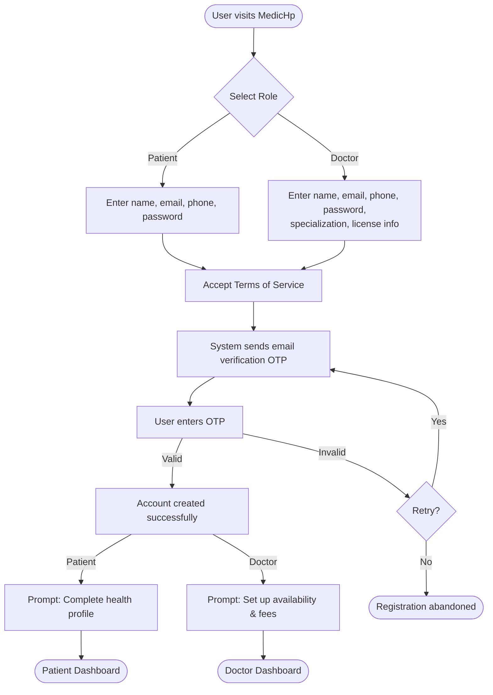
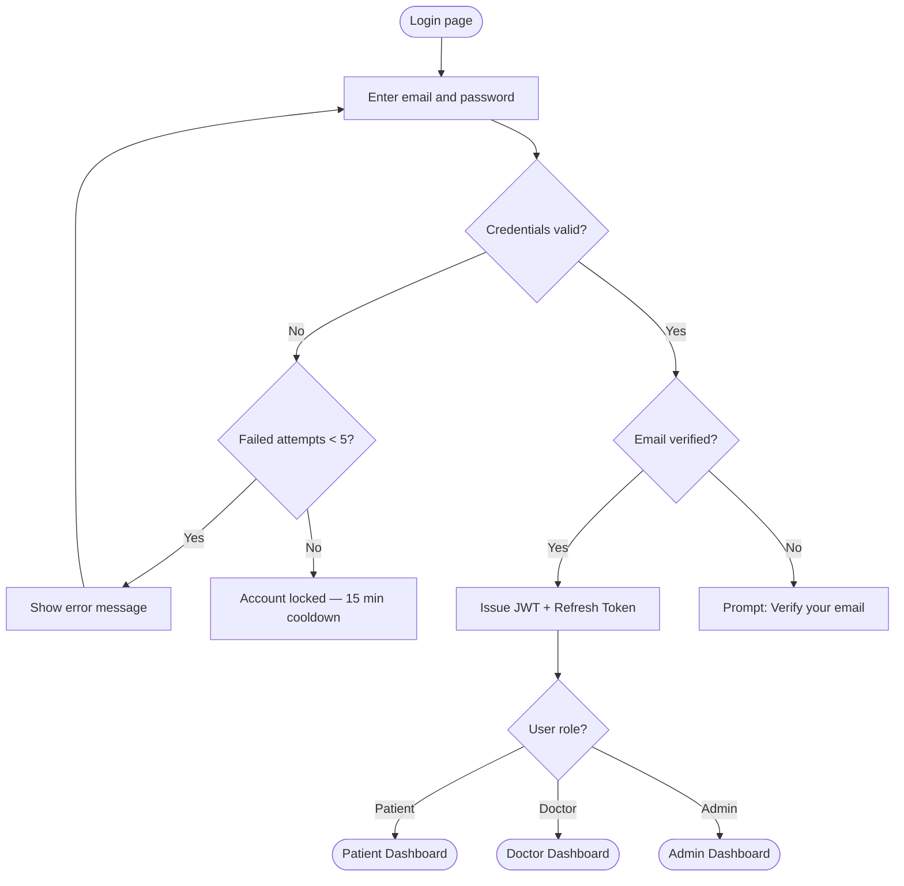
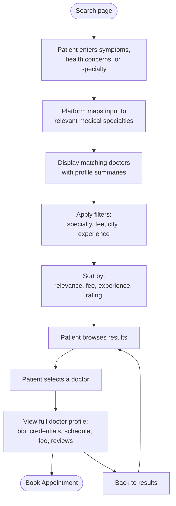
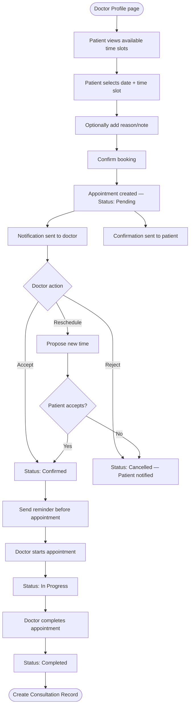
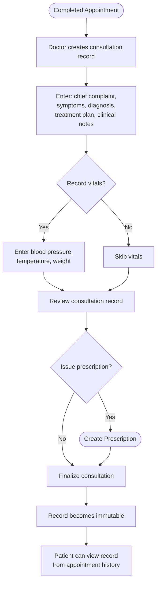
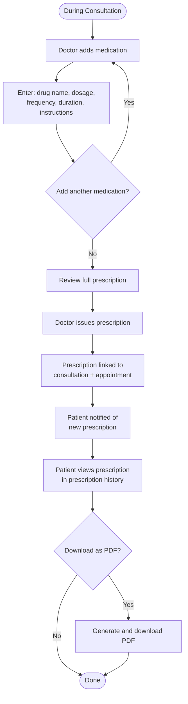
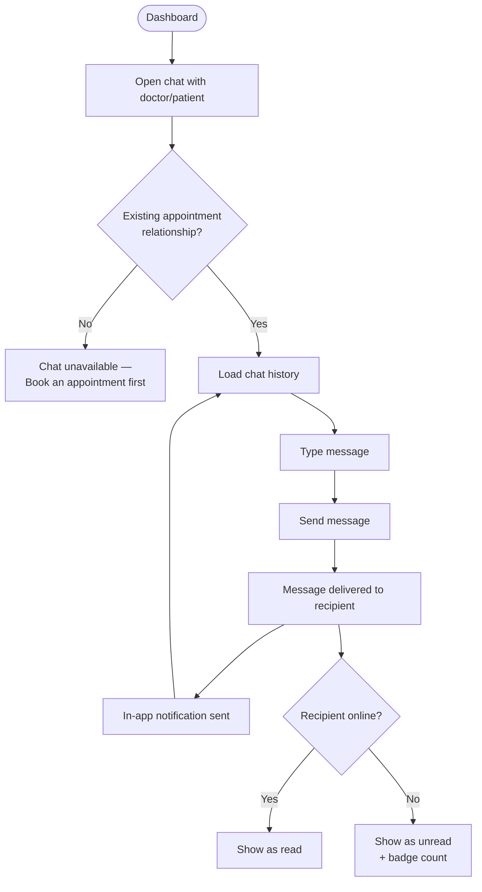

# 📝 Product Requirements Document (PRD) — MedicHp

> **Document Type:** Product Requirements (Authoritative)
> **Version:** 2.0
> **Last Revised:** 2026-08-06
> **Status:** Active
> **Audience:** Development team, AI coding assistants, product stakeholders
> **Scope:** Phase 1 — Independent Doctors + Patients

---

## Table of Contents

- [1. Product Overview](#1-product-overview)
- [2. Target Users](#2-target-users)
- [3. Phase 1 Scope](#3-phase-1-scope)
- [4. Functional Requirements](#4-functional-requirements)
- [5. User Stories](#5-user-stories)
- [6. User Flows](#6-user-flows)
- [7. Acceptance Criteria](#7-acceptance-criteria)
- [8. Non-Functional Requirements](#8-non-functional-requirements)
- [9. Version History](#9-version-history)

---

## 1. Product Overview

MedicHp is an AI-powered Digital Healthcare Ecosystem that connects patients with independent doctors through a unified, secure digital platform. Phase 1 delivers the foundation: a complete patient-doctor interaction loop from discovery through prescription.

### 1.1 Product Positioning

| Attribute          | Description                                                                      |
|--------------------|----------------------------------------------------------------------------------|
| **Product Type**   | Healthcare SaaS Platform (B2C and B2B2C)                                         |
| **Primary Value**  | Patients find the right doctor, book appointments, and receive care — all digitally |
| **Platform**       | Web (Next.js + React), Mobile (React Native + Expo)                               |
| **Backend**        | ASP.NET Core 9 REST API with PostgreSQL                                           |
| **Current Phase**  | Phase 1 — Independent Doctors + Patients                                          |

### 1.2 Problem Statement

Patients face friction in finding appropriate doctors for their health concerns, booking appointments requires phone calls or in-person visits, and clinical records remain fragmented across paper files and disconnected systems. Independent doctors lack affordable digital tools to manage their practice, schedule, and patient relationships.

### 1.3 Solution

MedicHp provides:

1. **Intelligent doctor discovery** — Patients search by symptoms, health concerns, or medical specializations. The platform maps these inputs to the most relevant specialties and displays matching doctors.
2. **Frictionless appointment booking** — Patients book available time slots directly, with automated confirmations and reminders.
3. **Complete consultation workflow** — Doctors conduct consultations, record clinical notes, and issue digital prescriptions within the platform.
4. **Direct communication** — Patients and doctors exchange text messages for follow-up questions and care coordination.
5. **Unified platform management** — Super Admins oversee platform operations, user management, and system health.

---

## 2. Target Users

### 2.1 User Roles — Phase 1

| Role             | Description                                                                                    | Access Level |
|------------------|------------------------------------------------------------------------------------------------|--------------|
| **Super Admin**  | Platform operator responsible for overall system management, user oversight, and configuration  | Full system   |
| **Doctor**       | Independent medical practitioner offering consultations through the platform                    | Own practice  |
| **Patient**      | Individual seeking medical consultations, prescriptions, and health management                  | Own data      |

### 2.2 User Personas

#### Persona 1: Dr. Ayesha — Independent Doctor

| Attribute       | Detail                                                           |
|-----------------|------------------------------------------------------------------|
| Age             | 35                                                               |
| Specialty       | Dermatology                                                      |
| Practice        | Solo private practice, 1 clinic location                         |
| Pain Points     | Managing appointments via phone calls, no digital record-keeping |
| Goal            | Digitize her practice, reach more patients online                |
| Platform Use    | Profile setup, availability management, consultations, prescriptions |

#### Persona 2: Ahmed — Patient

| Attribute       | Detail                                                           |
|-----------------|------------------------------------------------------------------|
| Age             | 28                                                               |
| Condition       | Persistent skin rash, needs dermatologist                        |
| Pain Points     | Doesn't know which specialist to see, no easy way to find and compare doctors |
| Goal            | Find the right doctor quickly, book an appointment without calling |
| Platform Use    | Search by symptoms, browse doctors, book appointment, receive prescription |

#### Persona 3: Admin Haris — Super Admin

| Attribute       | Detail                                                           |
|-----------------|------------------------------------------------------------------|
| Age             | 32                                                               |
| Role            | Platform operations manager                                      |
| Pain Points     | Needs visibility into platform health, user activity, and content quality |
| Goal            | Ensure platform operates smoothly, manage users, monitor KPIs    |
| Platform Use    | User management, system analytics, audit logs, configuration     |

### 2.3 Roles Excluded from Phase 1

The following roles will be introduced in later phases and must **not** be implemented in Phase 1:

| Role               | Planned Phase |
|--------------------|---------------|
| Hospital Admin     | Phase 2       |
| Clinic Admin       | Phase 2       |
| Lab Technician     | Phase 3       |
| Pharmacist         | Phase 3       |
| Insurance Agent    | Phase 3       |

---

## 3. Phase 1 Scope

### 3.1 In Scope (Phase 1)

| Module                     | Included | Notes                                                     |
|----------------------------|----------|-----------------------------------------------------------|
| Authentication (JWT + RBAC)| ✅        | Registration, login, refresh tokens, password reset        |
| Patient Self-Registration  | ✅        | Multi-step progressive flow (ADR-004)                     |
| Doctor Self-Registration   | ✅        | Profile + license info collected, not verified             |
| Patient Health Profile     | ✅        | Demographics, medical history, allergies, medications      |
| Doctor Profile             | ✅        | Specialization, experience, bio, consultation fee, schedule|
| Doctor Search              | ✅        | By symptoms, specialty, experience, fee, city, availability|
| Appointment Booking        | ✅        | Book, reschedule, cancel, status tracking                  |
| Consultation               | ✅        | Clinical notes, diagnosis, treatment plan                  |
| Digital Prescription       | ✅        | Doctor generates, patient views, PDF export                |
| Patient-Doctor Chat        | ✅        | Text messaging only                                        |
| Notifications              | ✅        | In-app + email for key events                              |
| Role Dashboards            | ✅        | Patient, Doctor, and Admin dashboards                      |
| Super Admin Panel          | ✅        | User management, platform analytics, audit logs            |

### 3.2 Explicitly Out of Scope (Phase 1)

These features are planned for future phases and must **not** be implemented, referenced as dependencies, or scaffolded in Phase 1 code.

| Feature                      | Reason                                    | Planned Phase |
|------------------------------|-------------------------------------------|---------------|
| Hospitals / Hospital Admin   | Organizational layer not needed for MVP   | Phase 2       |
| Billing / Invoicing          | Requires payment gateway integration      | Phase 3       |
| Laboratory Integration       | Requires partner ecosystem                | Phase 3       |
| Pharmacy Integration         | Requires e-prescription standards         | Phase 3       |
| Insurance Claims             | Requires insurance provider APIs          | Phase 3       |
| AI Diagnosis / Symptom Checker | Requires ML model training and validation | Phase 4       |
| Payment Processing           | Requires payment gateway and PCI compliance | Phase 3     |
| Doctor Credential Verification | Requires integration with licensing authorities | Phase 2 |
| Video Consultations          | Requires WebRTC / third-party video service | Phase 3     |
| File Sharing in Chat         | Requires secure file storage infrastructure | Phase 2     |
| SMS Notifications            | Requires SMS gateway integration          | Phase 2       |
| Multi-language (i18n)        | Requires translation infrastructure       | Phase 3       |

---

## 4. Functional Requirements

### 4.1 Authentication & Authorization

> **Reference:** [ADR-003: Authentication Strategy](../Decisions/ADR-003-Authentication.md)

| ID      | Requirement                                                                    | Priority |
|---------|--------------------------------------------------------------------------------|----------|
| AUTH-01 | Users register with full name, email, phone number, and password               | Must     |
| AUTH-02 | System sends email verification (OTP) upon registration                        | Must     |
| AUTH-03 | Unverified accounts cannot access protected features                           | Must     |
| AUTH-04 | Login returns a JWT access token (15-min expiry) and a refresh token            | Must     |
| AUTH-05 | Refresh tokens are stored server-side with single-use rotation                 | Must     |
| AUTH-06 | Password reset via email link with time-limited token (1 hour)                 | Must     |
| AUTH-07 | Account locks after 5 consecutive failed login attempts (15-min cooldown)      | Must     |
| AUTH-08 | RBAC enforced at API level: Super Admin, Doctor, Patient                       | Must     |
| AUTH-09 | Users can log out, invalidating their refresh token                            | Must     |
| AUTH-10 | Users can change their password from account settings                          | Should   |
| AUTH-11 | Remember-me functionality extends refresh token lifetime                       | Could    |

### 4.2 Patient Profile

> **Reference:** [ADR-004: Patient Registration](../Decisions/ADR-004-PatientRegistration.md)

| ID      | Requirement                                                                    | Priority |
|---------|--------------------------------------------------------------------------------|----------|
| PAT-01  | Patients self-register via a multi-step progressive flow                       | Must     |
| PAT-02  | Stage 1 (required): name, email, phone, password, email verification           | Must     |
| PAT-03  | Stage 2 (prompted post-login): date of birth, gender, blood type, emergency contact | Must |
| PAT-04  | Stage 3 (optional): allergies, chronic conditions, current medications          | Should   |
| PAT-05  | Patients can view and update their health profile at any time                  | Must     |
| PAT-06  | Patients can upload a profile photo                                            | Should   |
| PAT-07  | Patients can view their appointment history                                    | Must     |
| PAT-08  | Patients can view all prescriptions issued to them                             | Must     |
| PAT-09  | Patients can only access their own data                                        | Must     |
| PAT-10  | Incomplete profiles show completion prompts (non-blocking)                     | Should   |

### 4.3 Doctor Profile

> **Reference:** [ADR-005: Doctor Registration](../Decisions/ADR-005-DoctorRegistration.md)

| ID      | Requirement                                                                    | Priority |
|---------|--------------------------------------------------------------------------------|----------|
| DOC-01  | Doctors self-register with professional information                            | Must     |
| DOC-02  | Registration collects: name, email, phone, password, specialization(s), years of experience | Must |
| DOC-03  | Registration collects license number and issuing authority (stored, not verified in Phase 1) | Must |
| DOC-04  | Doctors can upload profile photo and license document                          | Should   |
| DOC-05  | Doctors can set their consultation fee                                         | Must     |
| DOC-06  | Doctors can write a professional bio and description                           | Must     |
| DOC-07  | Doctors can configure their availability schedule (days, time slots)            | Must     |
| DOC-08  | Doctors can edit all profile fields after registration                         | Must     |
| DOC-09  | Doctors can view their patient list (patients who have had appointments)        | Must     |
| DOC-10  | Doctors can add new patients (invitation-based)                                | Should   |
| DOC-11  | Doctor profiles display average rating and review count (read-only in Phase 1) | Could    |

### 4.4 Doctor Search & Discovery

| ID      | Requirement                                                                    | Priority |
|---------|--------------------------------------------------------------------------------|----------|
| SRC-01  | Patients search by entering symptoms, health concerns, or medical specializations | Must   |
| SRC-02  | Platform maps patient input to the most relevant medical specialties            | Must     |
| SRC-03  | Search results display matching doctors with profile summaries                  | Must     |
| SRC-04  | Results can be filtered by: specialization, experience, fee range, city, availability | Must |
| SRC-05  | Results can be sorted by: relevance, fee (low/high), experience, rating        | Must     |
| SRC-06  | Each search result shows: name, photo, specialization, experience, fee, rating, next availability | Must |
| SRC-07  | Clicking a result opens the full doctor profile page                           | Must     |
| SRC-08  | Search is available without authentication (public)                            | Must     |
| SRC-09  | Search supports pagination with configurable page size                         | Must     |
| SRC-10  | Search input provides autocomplete suggestions for specialties and common symptoms | Should |

### 4.5 Appointment Booking

> **Reference:** [Prompt 07 — Appointment Module](../AI/Prompt_07_Appointment.md)

| ID      | Requirement                                                                    | Priority |
|---------|--------------------------------------------------------------------------------|----------|
| APT-01  | Patients can book an appointment by selecting an available time slot            | Must     |
| APT-02  | Booking requires selecting a doctor, date, and time slot                        | Must     |
| APT-03  | System prevents double-booking the same slot                                   | Must     |
| APT-04  | Appointments follow a status workflow: Pending → Confirmed → In Progress → Completed / Cancelled | Must |
| APT-05  | Patients can cancel an appointment according to the cancellation policy         | Must     |
| APT-06  | Patients can reschedule an appointment to a different available slot            | Must     |
| APT-07  | Doctors can accept, reject, or reschedule pending appointments                 | Must     |
| APT-08  | Doctors can mark an appointment as "In Progress" and then "Completed"          | Must     |
| APT-09  | Both parties receive notifications for booking, confirmation, and cancellation  | Must     |
| APT-10  | Patients can view upcoming and past appointments                               | Must     |
| APT-11  | Doctors can view their daily/weekly appointment schedule                        | Must     |
| APT-12  | Appointment details include: date, time, duration, status, doctor/patient info  | Must     |
| APT-13  | Patients can add a reason/note when booking (free text)                         | Should   |
| APT-14  | System sends reminder notifications before scheduled appointments              | Should   |

### 4.6 Consultation

| ID      | Requirement                                                                    | Priority |
|---------|--------------------------------------------------------------------------------|----------|
| CON-01  | Doctors create a consultation record linked to a completed appointment          | Must     |
| CON-02  | Consultation records include: chief complaint, symptoms, diagnosis, treatment plan | Must  |
| CON-03  | Consultation records include clinical notes (free text)                         | Must     |
| CON-04  | Doctors can update consultation records until they are finalized                | Must     |
| CON-05  | Finalized consultation records are immutable (append-only)                     | Must     |
| CON-06  | Patients can view consultation records from their appointment history          | Must     |
| CON-07  | Each consultation links to the prescribing doctor and the patient               | Must     |
| CON-08  | Consultation records include vital signs if recorded (blood pressure, temperature, weight) | Should |
| CON-09  | Doctors can refer to previous consultations for the same patient               | Should   |

### 4.7 Prescription

| ID      | Requirement                                                                    | Priority |
|---------|--------------------------------------------------------------------------------|----------|
| RX-01   | Doctors generate digital prescriptions linked to a consultation                | Must     |
| RX-02   | Prescriptions include: medication name, dosage, frequency, duration, instructions | Must  |
| RX-03   | A single prescription can contain multiple medications                         | Must     |
| RX-04   | Prescriptions are timestamped and linked to the prescribing doctor             | Must     |
| RX-05   | Patients can view all their prescriptions in chronological order               | Must     |
| RX-06   | Patients can download/export prescriptions as PDF                              | Should   |
| RX-07   | Prescriptions are immutable once issued (append a correction rather than edit) | Must     |
| RX-08   | Doctors can view all prescriptions they have issued                            | Must     |
| RX-09   | Each prescription displays the associated consultation and appointment context | Should   |

### 4.8 Chat (Text Messaging)

| ID      | Requirement                                                                    | Priority |
|---------|--------------------------------------------------------------------------------|----------|
| CHT-01  | Patients and doctors can exchange text messages                                | Must     |
| CHT-02  | Chat is limited to patient-doctor pairs who have an existing appointment relationship | Must |
| CHT-03  | Messages are displayed in chronological order                                  | Must     |
| CHT-04  | Both parties see read receipts (delivered, read)                               | Should   |
| CHT-05  | Chat supports basic text formatting (bold, italic, line breaks)                | Could    |
| CHT-06  | File sharing is not available in Phase 1 (reserved for Phase 2)               | —        |
| CHT-07  | Video calls are not available in Phase 1 (reserved for Phase 3)               | —        |
| CHT-08  | Unread message count is displayed on the chat icon/tab                         | Must     |
| CHT-09  | Chat history is persistent and accessible from both parties' dashboards        | Must     |
| CHT-10  | New message triggers an in-app notification                                    | Must     |

### 4.9 Notifications

| ID      | Requirement                                                                    | Priority |
|---------|--------------------------------------------------------------------------------|----------|
| NTF-01  | In-app notifications for: new appointment, status change, new message, prescription | Must |
| NTF-02  | Email notifications for: registration confirmation, appointment confirmation, password reset | Must |
| NTF-03  | Notifications are displayed in a notification center/panel                      | Must     |
| NTF-04  | Users can mark notifications as read or dismiss them                           | Must     |
| NTF-05  | Unread notification count is displayed on the notification icon                | Must     |
| NTF-06  | Appointment reminder notifications sent 24 hours and 1 hour before scheduled time | Should |
| NTF-07  | SMS notifications are reserved for Phase 2                                     | —        |
| NTF-08  | Push notifications (mobile) are reserved for Phase 2                           | —        |

### 4.10 Dashboard

| ID      | Requirement                                                                    | Priority |
|---------|--------------------------------------------------------------------------------|----------|
| DSH-01  | Patient dashboard shows: upcoming appointments, recent prescriptions, unread messages, profile completion | Must |
| DSH-02  | Doctor dashboard shows: today's appointments, pending requests, patient count, recent consultations | Must |
| DSH-03  | Admin dashboard shows: total users, new registrations, appointment statistics, system health | Must |
| DSH-04  | Dashboards are role-specific — users see only their relevant dashboard          | Must     |
| DSH-05  | Dashboard widgets are responsive and adapt to mobile screens                   | Must     |
| DSH-06  | Dashboard data refreshes on page load (real-time updates in Phase 2)           | Must     |

### 4.11 Super Admin Panel

> **Reference:** [Prompt 04 — Super Admin Module](../AI/Prompt_04_SuperAdmin.md)

| ID      | Requirement                                                                    | Priority |
|---------|--------------------------------------------------------------------------------|----------|
| ADM-01  | Super Admin can view and search all users (patients, doctors, admins)           | Must     |
| ADM-02  | Super Admin can view detailed user profiles                                    | Must     |
| ADM-03  | Super Admin can suspend and reactivate user accounts                           | Must     |
| ADM-04  | Super Admin can view platform statistics (user count, appointment volume, etc.)| Must     |
| ADM-05  | Super Admin can view the audit log with filters (date, user, action type)      | Must     |
| ADM-06  | Super Admin can configure platform-wide settings (appointment policies, etc.)  | Should   |
| ADM-07  | Super Admin can create additional admin accounts                               | Must     |
| ADM-08  | All Super Admin actions are logged to the audit trail                          | Must     |
| ADM-09  | Sensitive admin operations (delete, suspend) require re-authentication         | Should   |

---

## 5. User Stories

### 5.1 Patient User Stories

| ID       | User Story                                                                                   | Priority |
|----------|----------------------------------------------------------------------------------------------|----------|
| US-P01   | As a patient, I want to register an account so that I can access the platform.                | Must     |
| US-P02   | As a patient, I want to verify my email so that my account is activated.                      | Must     |
| US-P03   | As a patient, I want to complete my health profile so that doctors have my medical context.    | Must     |
| US-P04   | As a patient, I want to search for doctors by my symptoms so that I find the right specialist. | Must     |
| US-P05   | As a patient, I want to filter doctors by specialization, fee, and city so that I narrow my options. | Must |
| US-P06   | As a patient, I want to view a doctor's full profile so that I can assess their qualifications. | Must   |
| US-P07   | As a patient, I want to book an appointment from available time slots so that I secure my visit. | Must  |
| US-P08   | As a patient, I want to cancel or reschedule an appointment so that I can adjust my plans.     | Must    |
| US-P09   | As a patient, I want to view my upcoming and past appointments so that I track my care.        | Must    |
| US-P10   | As a patient, I want to view my consultation records so that I have my medical history.        | Must    |
| US-P11   | As a patient, I want to view and download my prescriptions so that I can purchase medications. | Must    |
| US-P12   | As a patient, I want to chat with my doctor so that I can ask follow-up questions.             | Must    |
| US-P13   | As a patient, I want to receive notifications for appointment updates so that I stay informed. | Must    |
| US-P14   | As a patient, I want to update my medical information at any time so that my records are current. | Should |
| US-P15   | As a patient, I want to reset my password if I forget it so that I can regain access.          | Must    |

### 5.2 Doctor User Stories

| ID       | User Story                                                                                   | Priority |
|----------|----------------------------------------------------------------------------------------------|----------|
| US-D01   | As a doctor, I want to register my account with my professional details so that I can join the platform. | Must |
| US-D02   | As a doctor, I want to set up my profile (bio, photo, fee) so that patients can evaluate me.  | Must     |
| US-D03   | As a doctor, I want to configure my availability schedule so that patients can book my open slots. | Must |
| US-D04   | As a doctor, I want to view and manage incoming appointment requests so that I control my schedule. | Must |
| US-D05   | As a doctor, I want to conduct a consultation and record clinical notes so that I document the encounter. | Must |
| US-D06   | As a doctor, I want to issue a digital prescription during a consultation so that the patient receives treatment. | Must |
| US-D07   | As a doctor, I want to view my patient list so that I can see who I've treated.                | Must    |
| US-D08   | As a doctor, I want to add a patient manually so that I can onboard walk-in patients digitally. | Should  |
| US-D09   | As a doctor, I want to chat with my patients so that I can answer their follow-up questions.   | Must    |
| US-D10   | As a doctor, I want to view my consultation history so that I can reference past encounters.   | Must    |
| US-D11   | As a doctor, I want to receive notifications for new bookings and messages so that I respond promptly. | Must |
| US-D12   | As a doctor, I want to view my daily and weekly schedule so that I plan my time.               | Must    |
| US-D13   | As a doctor, I want to edit my profile at any time so that my information stays current.       | Must    |

### 5.3 Super Admin User Stories

| ID       | User Story                                                                                   | Priority |
|----------|----------------------------------------------------------------------------------------------|----------|
| US-A01   | As an admin, I want to view all registered users so that I can monitor platform adoption.     | Must     |
| US-A02   | As an admin, I want to search and filter users by role, status, and date so that I find specific accounts. | Must |
| US-A03   | As an admin, I want to suspend a user account so that I can enforce platform policies.        | Must     |
| US-A04   | As an admin, I want to view platform statistics so that I understand operational health.      | Must     |
| US-A05   | As an admin, I want to view the audit log so that I can investigate security events.          | Must     |
| US-A06   | As an admin, I want to configure appointment policies (advance booking, cancellation) so that I control platform behavior. | Should |
| US-A07   | As an admin, I want to create additional admin accounts so that I can delegate management.    | Must     |
| US-A08   | As an admin, I want to reactivate a suspended account so that the user can resume access.     | Must     |

---

## 6. User Flows

### 6.1 Registration Flow

### 6.2 Login Flow

### 6.3 Doctor Search Flow

### 6.4 Appointment Flow

### 6.5 Consultation Flow

### 6.6 Prescription Flow

### 6.7 Chat Flow

---

## 7. Acceptance Criteria

### 7.1 Authentication & Authorization

| ID      | Criterion                                                                              | Verification |
|---------|----------------------------------------------------------------------------------------|--------------|
| AC-A01  | Registration form validates all required fields and shows inline errors                | Manual test  |
| AC-A02  | OTP email arrives within 60 seconds of registration                                    | Timed test   |
| AC-A03  | Incorrect OTP shows error; 3 failed attempts trigger OTP resend                        | Manual test  |
| AC-A04  | Successful login returns a valid JWT (decodable, correct claims, 15-min expiry)         | API test     |
| AC-A05  | Expired JWT returns 401; refresh token returns new JWT without re-login                | API test     |
| AC-A06  | After 5 failed logins, account returns 423 Locked for 15 minutes                       | API test     |
| AC-A07  | Password reset email contains a one-time link that expires in 1 hour                   | Manual test  |
| AC-A08  | A Patient cannot access Doctor-only endpoints (403 Forbidden)                          | API test     |
| AC-A09  | A Doctor cannot access Admin-only endpoints (403 Forbidden)                            | API test     |
| AC-A10  | Logout invalidates the refresh token; subsequent refresh attempts return 401           | API test     |

### 7.2 Doctor Search & Discovery

| ID      | Criterion                                                                              | Verification |
|---------|----------------------------------------------------------------------------------------|--------------|
| AC-S01  | Searching for "headache" returns doctors in Neurology, General Medicine                | API test     |
| AC-S02  | Searching for "dermatology" returns dermatologists directly                             | API test     |
| AC-S03  | Filter by city returns only doctors in the selected city                                | API test     |
| AC-S04  | Filter by fee range ₹200–₹500 excludes doctors outside that range                      | API test     |
| AC-S05  | Search results load in under 500ms for 1,000 doctor records                            | Perf test    |
| AC-S06  | Pagination returns correct page count and total results                                 | API test     |
| AC-S07  | Search works without authentication (public endpoint)                                  | API test     |
| AC-S08  | Empty search input returns all available doctors (default listing)                      | API test     |

### 7.3 Appointment Booking

| ID      | Criterion                                                                              | Verification |
|---------|----------------------------------------------------------------------------------------|--------------|
| AC-B01  | Booking a taken slot returns 409 Conflict with a clear error message                   | API test     |
| AC-B02  | Booking less than 1 hour in advance returns 422 with policy explanation                | API test     |
| AC-B03  | Cancellation less than 4 hours before returns 422 with policy explanation              | API test     |
| AC-B04  | Booking creates an appointment with status "Pending"                                   | API test     |
| AC-B05  | Doctor accepting changes status from "Pending" to "Confirmed"                          | API test     |
| AC-B06  | Patient receives email notification upon booking confirmation                          | Manual test  |
| AC-B07  | A patient with an active appointment with Doctor X cannot book another with Doctor X    | API test     |
| AC-B08  | Appointment list endpoint returns results sorted by date (newest first)                | API test     |

### 7.4 Consultation & Prescription

| ID      | Criterion                                                                              | Verification |
|---------|----------------------------------------------------------------------------------------|--------------|
| AC-C01  | Consultation can only be created for an appointment with status "Completed"            | API test     |
| AC-C02  | Consultation record includes all required fields (complaint, diagnosis, treatment plan) | API test    |
| AC-C03  | Finalized consultation record cannot be modified (returns 403)                         | API test     |
| AC-C04  | Prescription contains at least 1 medication entry                                      | API test     |
| AC-C05  | Prescription is immutable after issuance (update returns 403)                          | API test     |
| AC-C06  | Patient can view consultation and prescription from appointment history                | E2E test     |
| AC-C07  | PDF export generates a well-formatted document with doctor and patient details          | Manual test  |

### 7.5 Chat

| ID      | Criterion                                                                              | Verification |
|---------|----------------------------------------------------------------------------------------|--------------|
| AC-M01  | Chat is only available between patient-doctor pairs with appointment history            | API test     |
| AC-M02  | Messages appear in chronological order                                                  | E2E test     |
| AC-M03  | Sending a message triggers an in-app notification for the recipient                    | E2E test     |
| AC-M04  | Unread badge count reflects actual unread messages                                      | E2E test     |
| AC-M05  | Chat history persists across sessions and device changes                               | Manual test  |

### 7.6 Admin Panel

| ID      | Criterion                                                                              | Verification |
|---------|----------------------------------------------------------------------------------------|--------------|
| AC-D01  | User list supports search by name, email, and role                                     | E2E test     |
| AC-D02  | Suspending a user prevents them from logging in (401 response)                         | API test     |
| AC-D03  | Reactivating a user allows them to log in again                                        | API test     |
| AC-D04  | Platform statistics page loads accurate counts within 2 seconds                        | Perf test    |
| AC-D05  | Audit log displays timestamped entries with user, action, and resource details          | E2E test     |
| AC-D06  | All admin actions appear in the audit log                                               | API test     |

---

## 8. Non-Functional Requirements

### 8.1 Performance

| Requirement                                   | Target                        | Measurement                    |
|-----------------------------------------------|-------------------------------|-------------------------------|
| API response time (p95)                       | < 100ms                       | APM monitoring                |
| API response time (p99)                       | < 500ms                       | APM monitoring                |
| Website initial page load                     | < 3 seconds                   | Lighthouse                    |
| Dashboard SPA load time                       | < 2 seconds                   | Browser DevTools              |
| Search results return time (1,000 records)    | < 500ms                       | Load testing                  |
| Database query execution (p95)                | < 50ms                        | Query profiling               |
| Image/asset loading                           | CDN-served, < 200ms           | Network tab                   |

### 8.2 Security

| Requirement                                   | Standard                      | Reference                     |
|-----------------------------------------------|-------------------------------|-------------------------------|
| Encryption in transit                         | TLS 1.3                       | SECURITY_GUIDELINES.md §2     |
| Encryption at rest (PHI/PII)                  | AES-256                       | SECURITY_GUIDELINES.md §3     |
| Authentication mechanism                      | JWT + Refresh Token Rotation  | ADR-003                       |
| Authorization model                           | RBAC with claims              | SECURITY_GUIDELINES.md §2     |
| Input validation                              | Server-side on all endpoints  | CODING_STANDARDS.md           |
| Rate limiting                                 | Per-user + per-IP             | SECURITY_GUIDELINES.md §4     |
| Audit logging                                 | All PHI/PII access logged     | SECURITY_GUIDELINES.md §3     |
| Secret management                             | Environment variables only    | No secrets in code            |
| OWASP Top 10 compliance                       | All 10 categories addressed   | SECURITY_GUIDELINES.md        |
| Password policy                               | Min 8 chars, 1 upper, 1 number, 1 special | AUTH requirements  |

### 8.3 Accessibility

| Requirement                                   | Standard                      | Verification                  |
|-----------------------------------------------|-------------------------------|-------------------------------|
| WCAG compliance level                         | 2.1 AA minimum                | Automated audit (axe-core)    |
| Keyboard navigation                           | All interactive elements      | Manual testing                |
| Screen reader compatibility                   | Semantic HTML + ARIA labels   | Screen reader testing         |
| Color contrast ratio                          | ≥ 4.5:1 (normal text)        | Contrast checker              |
| Focus indicators                              | Visible on all interactive elements | Visual inspection         |
| Form labels                                   | All inputs have associated labels | Automated audit            |
| Error announcements                           | Errors announced to assistive tech | Screen reader testing     |

### 8.4 SEO (Public Website)

| Requirement                                   | Implementation                | Target                        |
|-----------------------------------------------|-------------------------------|-------------------------------|
| Server-side rendering                         | Next.js SSR/SSG               | All public pages              |
| Meta tags                                     | Unique title + description per page | All pages                |
| Open Graph tags                               | OG title, description, image  | All shareable pages           |
| Structured data (JSON-LD)                     | Doctor profiles, FAQ, Organization | Doctor listing pages     |
| Sitemap                                       | Dynamic XML sitemap           | Auto-updated                  |
| robots.txt                                    | Configured for public pages   | —                             |
| Core Web Vitals                               | LCP < 2.5s, FID < 100ms, CLS < 0.1 | Lighthouse           |
| URL structure                                 | Clean, semantic URLs          | `/doctors/dermatology/city-name` |

### 8.5 Scalability

| Requirement                                   | Strategy                                         |
|-----------------------------------------------|--------------------------------------------------|
| Concurrent users                              | 10,000+ via horizontal API scaling               |
| Database scaling                              | Read replicas for high-traffic queries            |
| Caching                                       | Redis for frequently-accessed data (profiles, slots) |
| File storage                                  | Object storage (Azure Blob / S3) for unlimited growth |
| Background processing                         | Queue-based workers for email, notifications       |
| API versioning                                | URL-based versioning (`/api/v1/`, `/api/v2/`)      |

### 8.6 Availability & Reliability

| Requirement                                   | Target                        | Strategy                      |
|-----------------------------------------------|-------------------------------|-------------------------------|
| Uptime SLA                                    | 99.9%                         | Health checks, auto-restart   |
| Recovery Time Objective (RTO)                 | < 1 hour                      | Automated restore procedures  |
| Recovery Point Objective (RPO)                | < 15 minutes                  | Point-in-time recovery        |
| Graceful degradation                          | Core flows work if Redis is down | Fallback to DB cache       |
| Health check endpoints                        | `/health` and `/health/ready` | Automated monitoring          |

### 8.7 Logging & Monitoring

| Requirement                                   | Implementation                                   |
|-----------------------------------------------|--------------------------------------------------|
| Application logging                           | Structured JSON logs (Serilog / equivalent)       |
| Log levels                                    | Trace, Debug, Information, Warning, Error, Critical |
| Request logging                               | Correlation ID on every request                   |
| Error tracking                                | Centralized error reporting (Sentry / equivalent) |
| Performance monitoring                        | APM for API response times and throughput          |
| Audit logging                                 | Separate immutable audit log store                 |
| Dashboard monitoring                          | System health dashboard with alerts                |

---

## 9. Version History

| Version | Date       | Author                   | Changes                                                              |
|---------|------------|--------------------------|----------------------------------------------------------------------|
| 1.0     | 2026-08-04 | MedicHp Product Team     | Initial placeholder PRD                                              |
| 2.0     | 2026-08-06 | MedicHp Product Team     | Complete PRD: scope, requirements, user stories, flows, acceptance criteria, NFRs |

### Future Revisions

| Planned Revision                                | Trigger                                           |
|-------------------------------------------------|---------------------------------------------------|
| Add detailed UI wireframe references            | UI/UX design completion                            |
| Update acceptance criteria with test case IDs   | Test plan creation                                 |
| Add performance benchmarks from load testing    | Phase 1 load testing completion                    |
| Phase 2 scope expansion (clinics, hospitals)    | Phase 1 feature freeze                             |
| Add API endpoint mapping per requirement        | API specification v2 completion                    |

---

> **Cross-References:**
> - Technical architecture and coding philosophy → [PROJECT_SPECIFICATION.md](PROJECT_SPECIFICATION.md)
> - Domain-specific business rules → [BUSINESS_RULES.md](BUSINESS_RULES.md)
> - API contracts and response formats → [API_SPECIFICATION.md](API_SPECIFICATION.md)
> - Database schema and entities → [DATABASE_ARCHITECTURE.md](DATABASE_ARCHITECTURE.md)
> - Security policies and compliance → [SECURITY_GUIDELINES.md](SECURITY_GUIDELINES.md)
> - Coding standards and conventions → [CODING_STANDARDS.md](CODING_STANDARDS.md)
> - AI development guide → [README_FOR_AI.md](../README_FOR_AI.md)
