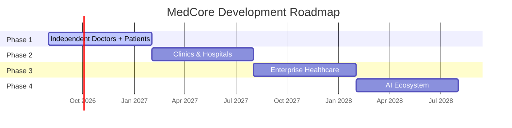
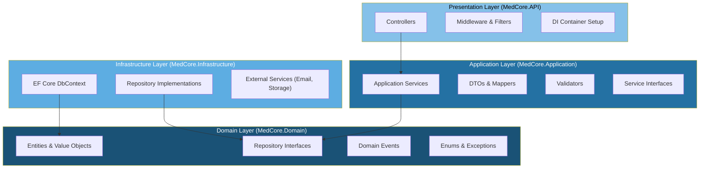
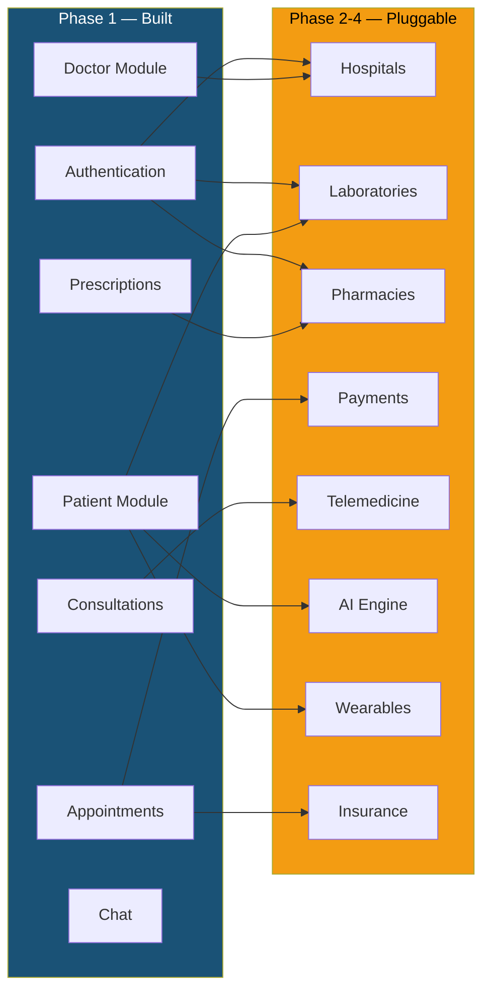

# 📋 Project Specification — MedCore Digital Healthcare Ecosystem

> **Document Type:** Technical Specification (Authoritative)
> **Version:** 2.0
> **Last Revised:** 2026-08-06
> **Status:** Active
> **Audience:** Development team, AI coding assistants, technical stakeholders

---

## Table of Contents

- [1. Executive Summary](#1-executive-summary)
- [2. Mission, Vision & Objectives](#2-mission-vision--objectives)
- [3. Business Goals](#3-business-goals)
- [4. Long-Term Roadmap](#4-long-term-roadmap)
- [5. Technology Stack](#5-technology-stack)
- [6. Monorepo Architecture](#6-monorepo-architecture)
- [7. Clean Architecture](#7-clean-architecture)
- [8. Coding Philosophy](#8-coding-philosophy)
- [9. Future Scalability Blueprint](#9-future-scalability-blueprint)
- [10. Technical Requirements](#10-technical-requirements)
- [11. Version History](#11-version-history)

---

## 1. Executive Summary

**MedCore** is an **AI-powered Digital Healthcare Ecosystem** — not merely a Hospital Management System. It is a comprehensive SaaS platform that reimagines how patients, doctors, clinics, and healthcare organizations interact in a connected, secure, and intelligent digital environment.

MedCore is designed from the ground up as:

- **A commercial product** intended for long-term revenue generation and market deployment.
- **A scalable SaaS platform** capable of serving independent practitioners, multi-location clinics, and enterprise hospital networks.
- **An extensible ecosystem** where each module (appointments, prescriptions, telemedicine, AI diagnostics) can be adopted incrementally.
- **A security-first platform** built with HIPAA and GDPR compliance awareness embedded in every architectural decision.

> MedCore is **not** a university project, proof-of-concept, hackathon prototype, or single-developer experiment. Every line of code, every architectural decision, and every document is written with the expectation that the platform will handle real patient data in production.

### What Makes MedCore an Ecosystem (Not Just an App)

| Traditional HMS              | MedCore Ecosystem                                          |
|------------------------------|------------------------------------------------------------|
| Single hospital focus        | Multi-tenant: independent doctors, clinics, hospital networks |
| Appointment booking only     | Full patient journey: search → book → consult → prescribe → follow up |
| Manual, paper-based records  | Digital medical records, prescriptions, and lab integrations |
| No patient-facing interface  | Patient portal (web + mobile) with self-service capabilities |
| Static, monolithic software  | Modular microservice-ready architecture with API-first design |
| No intelligence layer        | AI-powered symptom mapping, smart recommendations, predictive analytics |

---

## 2. Mission, Vision & Objectives

### 2.1 Mission

To democratize access to quality healthcare by providing a digital platform that connects patients with the right doctors, simplifies clinical workflows, and leverages artificial intelligence to improve health outcomes.

### 2.2 Vision

To become the leading AI-powered healthcare ecosystem in the region, serving as the digital backbone for independent practitioners, clinics, and hospital networks — ultimately enabling every patient to access personalized, intelligent healthcare from anywhere.

### 2.3 Strategic Objectives

| #  | Objective                                          | Measurable Target                                    |
|----|----------------------------------------------------|------------------------------------------------------|
| O1 | Reduce patient-to-doctor connection friction       | Patient books an appointment in under 3 minutes      |
| O2 | Digitize the consultation workflow end-to-end      | 100% of consultations produce digital records        |
| O3 | Provide intelligent doctor discovery               | Symptom-to-specialty mapping with >90% relevance     |
| O4 | Ensure platform security and compliance            | Zero PHI breaches; HIPAA-aware design from day one   |
| O5 | Enable independent doctors to practice digitally   | Doctor sets up a complete digital practice in <1 hour |
| O6 | Build a foundation for AI healthcare features      | Architecture supports ML model integration by Phase 4 |
| O7 | Achieve commercial viability as SaaS               | Platform supports subscription billing by Phase 3    |

---

## 3. Business Goals

### 3.1 Short-Term Goals (Phase 1)

1. Deliver a functional MVP connecting independent doctors and patients.
2. Establish the full technical foundation: monorepo, CI/CD, database, authentication.
3. Validate the core user journey: search → book → consult → prescribe.
4. Onboard initial beta users (doctors and patients) for feedback.

### 3.2 Medium-Term Goals (Phases 2–3)

1. Expand to multi-doctor clinics and hospitals with organizational management.
2. Introduce payment processing for consultations and subscriptions.
3. Launch telemedicine (video consultations) to enable remote healthcare.
4. Build a comprehensive reporting and analytics suite for healthcare providers.
5. Achieve revenue through SaaS subscription tiers and transaction fees.

### 3.3 Long-Term Goals (Phase 4+)

1. Integrate AI-powered diagnostic support and symptom analysis.
2. Build a partner ecosystem: laboratories, pharmacies, insurance providers.
3. Expand into wearable device integration for continuous health monitoring.
4. Offer the platform as a white-label solution for healthcare organizations.
5. Enter new geographic markets with multi-language and multi-currency support.

---

## 4. Long-Term Roadmap

MedCore is developed in four strategic phases. Each phase delivers a self-contained set of value while laying the foundation for the next.

### 4.1 Roadmap Overview



### 4.2 Phase 1 — Independent Doctors + Patients (Foundation)

**Goal:** Build the complete technical foundation and deliver the core patient-doctor interaction loop.

| Module                    | Scope                                                                          |
|---------------------------|--------------------------------------------------------------------------------|
| Monorepo & Infrastructure | Project scaffold, Docker Compose, CI/CD, development environment               |
| Database                  | Schema design, EF Core migrations, seed data                                   |
| Authentication            | JWT + refresh tokens, RBAC, email verification, password reset                 |
| Super Admin Panel         | User management, platform configuration, audit log viewer                      |
| Patient Module            | Self-registration (multi-step), health profile, medical history view           |
| Doctor Module             | Self-registration, profile management, availability configuration              |
| Doctor Search             | Search by symptoms, health concerns, specialization, experience, fee, city     |
| Appointment System        | Booking, rescheduling, cancellation, status tracking                           |
| Consultation              | Consultation creation, clinical notes, diagnosis recording                     |
| Prescription              | Digital prescription generation, prescription history                          |
| Chat (Text)               | Patient-doctor text messaging                                                  |
| Notifications             | In-app and email notifications for key events                                  |
| Dashboard                 | Role-specific dashboards for patients, doctors, and admins                     |

**Phase 1 explicitly excludes:** Hospitals, hospital admin, billing, laboratory integration, pharmacy integration, insurance, AI diagnosis, payment processing, video calls, and doctor credential verification (license data is collected and stored only).

### 4.3 Phase 2 — Clinics & Hospitals

**Goal:** Extend the platform to support multi-doctor organizations with clinic-level management.

| Module                    | Scope                                                                          |
|---------------------------|--------------------------------------------------------------------------------|
| Clinic Management         | Clinic registration, multi-branch support, department structure                |
| Hospital Admin Role       | Staff management, schedule coordination, organizational settings               |
| Doctor Verification       | Automated credential verification against licensing authorities                |
| Medical Records           | Structured, append-only patient medical records                                |
| Notification Engine       | Multi-channel: email, SMS, push notifications, scheduling                      |
| Dashboard Analytics       | Operational metrics, appointment statistics, revenue tracking                  |
| Audit & Compliance        | Comprehensive audit logging, HIPAA compliance tooling                          |

### 4.4 Phase 3 — Enterprise Healthcare

**Goal:** Transform MedCore into a full-featured enterprise healthcare platform with revenue capabilities.

| Module                    | Scope                                                                          |
|---------------------------|--------------------------------------------------------------------------------|
| Telemedicine              | Real-time video consultations, screen sharing, recording                       |
| Payment Gateway           | Consultation fees, subscription billing, refund management                     |
| Insurance Integration     | Claim submission, pre-authorization, coverage verification                     |
| Lab Results               | Laboratory integration, digital result delivery, trend tracking                |
| Multi-language (i18n)     | RTL support, locale-specific formatting, translation management                |
| Advanced Reporting        | Custom reports, data export, business intelligence dashboards                  |
| API Marketplace           | Third-party API access, developer portal, rate-limited public APIs             |

### 4.5 Phase 4 — AI Ecosystem

**Goal:** Layer artificial intelligence across the platform to deliver smarter, personalized healthcare.

| Module                    | Scope                                                                          |
|---------------------------|--------------------------------------------------------------------------------|
| AI Symptom Checker        | NLP-powered symptom analysis with triage recommendations                       |
| Smart Recommendations     | ML-based doctor matching, appointment time optimization                        |
| Predictive Analytics      | Patient outcome prediction, readmission risk scoring                           |
| AI Diagnostic Support     | Clinical decision support (advisory, non-diagnostic)                           |
| Health Chatbot            | Conversational AI for patient inquiries, appointment booking                   |
| Wearable Integration      | Apple Health, Google Fit, continuous vitals monitoring                          |

---

## 5. Technology Stack

Every technology in MedCore's stack was chosen deliberately. This section explains each choice and its rationale.

> **Reference:** [ADR-002: Technology Stack Selection](../Decisions/ADR-002-TechStack.md)

### 5.1 Technology Overview

| Layer               | Technology               | Version    | Purpose                                       |
|----------------------|--------------------------|------------|-----------------------------------------------|
| Public Website       | Next.js                  | Latest LTS | SSR/SSG public site and patient portal         |
| Admin Dashboard      | React + Vite             | Latest LTS | SPA for doctor and admin workflows             |
| Mobile Application   | React Native + Expo      | Latest LTS | Cross-platform iOS and Android app             |
| Backend API          | ASP.NET Core              | 9          | REST API, business logic, authorization        |
| ORM                  | Entity Framework Core     | Latest     | Database abstraction, migrations, LINQ         |
| Database             | PostgreSQL                | 16+        | Primary relational data store                  |
| Cache & Sessions     | Redis                     | 7+         | In-memory cache, session store, rate limiting  |
| Containerization     | Docker + Docker Compose   | Latest     | Development and production environment parity  |
| CI/CD                | GitHub Actions             | —          | Automated build, test, lint, deploy pipelines  |
| Cloud (Future)       | Microsoft Azure            | —          | Production hosting, managed services           |
| Shared Packages      | TypeScript                | 5.x strict | End-to-end type safety across all frontends    |

### 5.2 Technology Rationale

#### Next.js — Public Website

- **Server-Side Rendering (SSR)** delivers fast initial page loads and superior SEO for the public-facing site, critical for doctor discovery and organic patient acquisition.
- **Static Site Generation (SSG)** for marketing pages reduces server costs and improves performance.
- **React ecosystem** enables code sharing with the dashboard and mobile via `packages/`.
- **API routes** provide a lightweight BFF (Backend-for-Frontend) layer when needed.

#### React + Vite — Admin Dashboard

- **Vite's HMR (Hot Module Replacement)** provides near-instant development feedback, essential for the complex dashboard UI.
- **SPA architecture** suits the dashboard's workflow-oriented interactions (forms, tables, modals) where full page reloads are undesirable.
- **No SSR overhead** — the dashboard is an authenticated internal tool with no SEO requirements.

#### React Native + Expo — Mobile Application

- **Cross-platform** — a single codebase produces both iOS and Android applications, reducing development time by approximately 40%.
- **Shared TypeScript knowledge** — the same language and React paradigm used across web and mobile.
- **Expo's managed workflow** simplifies build, deployment, and OTA (over-the-air) updates.

#### ASP.NET Core 9 — Backend API

- **Performance** — consistently ranks among the fastest web frameworks in independent benchmarks (TechEmpower).
- **Type safety** — C#'s static typing with nullable reference types catches errors at compile time.
- **Enterprise-grade** — built-in support for dependency injection, middleware pipelines, authentication, and authorization.
- **Healthcare compliance** — mature data protection APIs, encryption libraries, and audit logging patterns.
- **Entity Framework Core** — first-party ORM with LINQ queries, code-first migrations, and excellent PostgreSQL support.

#### PostgreSQL 16+ — Primary Database

- **Open source** — no licensing costs, active community, proven reliability at scale.
- **JSONB support** — flexible semi-structured data storage for health questionnaires, metadata, and extensible fields.
- **Row-Level Security (RLS)** — native database-level multi-tenant data isolation.
- **Full-text search** — built-in capabilities for doctor discovery and medical record search.
- **Advanced indexing** — GIN, GiST, and BRIN indexes for performant queries across diverse data types.

#### Redis 7+ — Cache & Sessions

- **Sub-millisecond reads** — ideal for caching frequently-accessed data (doctor profiles, appointment slots).
- **Session management** — server-side session storage for refresh tokens with TTL-based expiration.
- **Pub/Sub** — real-time notification delivery and event broadcasting.
- **Rate limiting** — sliding window counters for API rate limiting.

#### Docker + Docker Compose — Containerization

- **Environment parity** — eliminates "works on my machine" issues by standardizing dev, staging, and production environments.
- **Service orchestration** — Docker Compose manages PostgreSQL, Redis, and the API as a unified stack for local development.
- **Cloud-ready** — containerized services deploy to any cloud provider (Azure, AWS, GCP) or Kubernetes cluster.

#### GitHub Actions — CI/CD

- **Native GitHub integration** — triggers on push, PR, and schedule events within the repository.
- **Marketplace ecosystem** — pre-built actions for .NET builds, Node.js testing, Docker publishing, and security scanning.
- **Matrix builds** — parallel execution across OS and framework versions for comprehensive testing.

#### Microsoft Azure — Cloud Hosting (Future)

- **Azure App Service** — managed hosting for the ASP.NET Core API with auto-scaling.
- **Azure Database for PostgreSQL** — managed database with automated backups and high availability.
- **Azure Cache for Redis** — managed Redis with enterprise-grade SLAs.
- **Azure DevOps integration** — seamless CI/CD extension with GitHub Actions.
- **Healthcare compliance** — Azure is HIPAA, HITRUST, and SOC 2 certified.

---

## 6. Monorepo Architecture

> **Reference:** [ADR-001: Monorepo Architecture](../Decisions/ADR-001-Monorepo.md)

### 6.1 Why Monorepo

MedCore uses a monorepo architecture to maximize code sharing, enable atomic cross-cutting changes, and maintain a unified developer experience across all applications.

| Benefit                  | Explanation                                                                                   |
|--------------------------|-----------------------------------------------------------------------------------------------|
| Code Sharing             | Shared TypeScript packages (`types`, `ui`, `utils`, `api-client`, `constants`, `config`) are consumed by all frontends without publishing to npm. |
| Atomic Changes           | API contract changes (backend + types + api-client) can be made in a single pull request.      |
| Unified CI/CD            | One pipeline lints, tests, and deploys all services. No cross-repo coordination required.      |
| Dependency Alignment     | All applications use the same versions of shared dependencies, eliminating version drift.      |
| Developer Experience     | Single `git clone`, single setup script, consistent tooling across the entire project.         |

### 6.2 Repository Structure

```
MedCore/
│
├── apps/                        → Frontend applications
│   ├── website/                 → Next.js — public website + patient portal
│   ├── dashboard/               → React + Vite — admin/doctor dashboard
│   └── mobile/                  → React Native + Expo — mobile app
│
├── backend/                     → ASP.NET Core 9 Web API
│   ├── src/
│   │   ├── MedCore.Domain/      → Core entities, value objects, interfaces
│   │   ├── MedCore.Application/ → Use cases, DTOs, validators, services
│   │   ├── MedCore.Infrastructure/ → EF Core, repositories, external services
│   │   └── MedCore.API/         → Controllers, middleware, DI configuration
│   └── tests/
│       ├── MedCore.Domain.Tests/
│       ├── MedCore.Application.Tests/
│       └── MedCore.API.Tests/
│
├── packages/                    → Shared TypeScript packages
│   ├── ui/                      → Shared React component library (design system)
│   ├── api-client/              → Typed HTTP client for backend communication
│   ├── types/                   → Shared TypeScript type definitions and DTOs
│   ├── config/                  → Shared ESLint, Prettier, TypeScript configs
│   ├── utils/                   → Common utility functions (date, format, validation)
│   └── constants/               → Shared enums, constants, and configuration values
│
├── database/                    → Database assets
│   ├── migrations/              → Versioned EF Core migration scripts
│   ├── seeds/                   → Development and staging seed data
│   ├── schema/                  → ERD diagrams and schema documentation
│   └── backups/                 → Backup and restore procedures
│
├── docker/                      → Dockerfiles for each service
├── scripts/                     → Build, deployment, and maintenance scripts
│
├── tests/                       → Integration and end-to-end test suites
│   ├── backend/                 → API integration tests
│   ├── frontend/                → Component and visual regression tests
│   └── e2e/                     → End-to-end browser tests (Playwright/Cypress)
│
├── docs/                        → All project documentation
│   ├── AI/                      → Structured prompts for AI-assisted development
│   ├── Brand/                   → Brand identity (logos, colors, typography)
│   ├── Decisions/               → Architecture Decision Records (ADRs)
│   ├── Diagrams/                → System, database, and flow diagrams
│   ├── Releases/                → Release notes and changelogs
│   ├── Sources/                 → Research, roadmap, competitor analysis
│   └── Specifications/          → Technical and product specifications
│
├── .github/                     → GitHub Actions CI/CD workflows
├── .vscode/                     → VS Code workspace settings
├── docker-compose.yml           → Local development service orchestration
└── .editorconfig                → Cross-editor formatting consistency
```

### 6.3 Shared Packages

Shared packages in `packages/` are the backbone of MedCore's code reuse strategy. Every frontend application imports from these packages rather than creating local duplicates.

| Package            | Purpose                                                            | Consumers                       |
|--------------------|--------------------------------------------------------------------|---------------------------------|
| `packages/types`   | TypeScript interfaces and DTOs matching backend API contracts      | Website, Dashboard, Mobile       |
| `packages/ui`      | Reusable React component library (buttons, forms, cards, modals)   | Website, Dashboard, Mobile       |
| `packages/api-client` | Typed HTTP client wrapping all backend API calls                | Website, Dashboard, Mobile       |
| `packages/utils`   | Shared utility functions (date formatting, validation, parsing)    | Website, Dashboard, Mobile       |
| `packages/constants` | Enums, role definitions, configuration constants                 | Website, Dashboard, Mobile, Tests |
| `packages/config`  | Shared ESLint, Prettier, and TypeScript configurations             | All frontend projects            |

> **Rule:** Never make raw HTTP calls (`fetch`, `axios`) from any frontend application. All backend communication flows through `packages/api-client`.

### 6.4 Scalability of the Monorepo

The monorepo structure supports MedCore's growth without requiring reorganization:

- **New applications** (e.g., a pharmacy portal) are added as new directories under `apps/`.
- **New shared capabilities** (e.g., a form builder) are added as new packages under `packages/`.
- **Backend modules** are added as new domain entities and application services within the existing Clean Architecture layers.
- **CI/CD** uses path-based triggers to run only affected builds, keeping pipeline duration manageable as the repo grows.

---

## 7. Clean Architecture

The MedCore backend follows **Clean Architecture** (also known as Onion Architecture or Hexagonal Architecture). This ensures the business logic is independent of frameworks, databases, and UI — making it testable, maintainable, and adaptable to change.

### 7.1 Layer Diagram



### 7.2 Layer Responsibilities

#### Domain Layer (`MedCore.Domain`) — Innermost

The domain layer is the heart of the application. It contains the core business entities and rules with **zero external dependencies**.

| Component             | Description                                                      | Example                              |
|-----------------------|------------------------------------------------------------------|--------------------------------------|
| Entities              | Core business objects with identity and behavior                 | `Patient`, `Doctor`, `Appointment`   |
| Value Objects         | Immutable objects defined by their attributes, not identity      | `Address`, `PhoneNumber`, `Money`    |
| Enums                 | Domain-specific enumerations                                     | `AppointmentStatus`, `UserRole`      |
| Exceptions            | Domain-specific exception types                                  | `AppointmentConflictException`       |
| Repository Interfaces | Contracts for data access (implemented in Infrastructure)        | `IPatientRepository`                 |
| Domain Events         | Events raised when significant domain actions occur              | `AppointmentBookedEvent`             |

> **Critical Rule:** The Domain layer has **no references** to EF Core, ASP.NET Core, or any external package. It depends on nothing.

#### Application Layer (`MedCore.Application`)

The application layer orchestrates domain objects to fulfill use cases. It contains the "what" of the system (business operations) without the "how" (database queries, HTTP calls).

| Component             | Description                                                      | Example                              |
|-----------------------|------------------------------------------------------------------|--------------------------------------|
| Application Services  | Use case orchestrators that coordinate domain objects             | `AppointmentService`, `AuthService`  |
| DTOs                  | Data Transfer Objects for API input/output                       | `CreatePatientDto`, `DoctorListDto`  |
| Validators            | Input validation logic (FluentValidation or Data Annotations)    | `CreatePatientValidator`             |
| Mappers               | Entity ↔ DTO transformation logic                                | `PatientMapper`                      |
| Service Interfaces    | Contracts for application services                                | `IAppointmentService`                |

#### Infrastructure Layer (`MedCore.Infrastructure`)

The infrastructure layer implements external concerns: database access, email sending, file storage, caching.

| Component                | Description                                                   | Example                              |
|--------------------------|---------------------------------------------------------------|--------------------------------------|
| EF Core DbContext        | Database context and entity configurations                     | `MedCoreDbContext`                   |
| Repository Implementations | Concrete implementations of domain repository interfaces    | `PatientRepository`                  |
| External Services        | Integrations with third-party services                        | `EmailService`, `StorageService`     |
| Caching                  | Redis cache integration                                        | `RedisCacheService`                  |

#### Presentation Layer (`MedCore.API`) — Outermost

The API layer is the entry point for HTTP requests. It is thin — controllers delegate immediately to application services.

| Component             | Description                                                      | Example                              |
|-----------------------|------------------------------------------------------------------|--------------------------------------|
| Controllers           | Thin HTTP endpoints that delegate to application services        | `PatientsController`                 |
| Middleware             | Cross-cutting concerns (auth, logging, error handling)           | `ExceptionHandlingMiddleware`        |
| Filters               | Action filters for validation, authorization                     | `ValidateModelFilter`                |
| DI Configuration      | Dependency injection container registration                      | `ServiceCollectionExtensions`        |

### 7.3 Dependency Injection (DI)

All services in MedCore are registered in the ASP.NET Core DI container. Dependencies are injected via **constructor injection**.

```
Controller → IApplicationService → IRepository → DbContext
```

- Services are registered with appropriate lifetimes: `Scoped` for request-bound services, `Singleton` for configuration, `Transient` for lightweight stateless services.
- The DI container is the **only place** where concrete implementations are bound to interfaces.
- No service creates its own dependencies via `new`. Everything flows through the container.

### 7.4 Repository Pattern

Repositories abstract data access behind interfaces defined in the Domain layer and implemented in the Infrastructure layer.

| Concept                | Location              | Example                                        |
|------------------------|-----------------------|------------------------------------------------|
| Interface definition   | `MedCore.Domain`      | `IPatientRepository { Task<Patient?> GetByIdAsync(Guid id); }` |
| Implementation         | `MedCore.Infrastructure` | `PatientRepository : IPatientRepository` using EF Core |
| Consumption            | `MedCore.Application` | `PatientService` receives `IPatientRepository` via DI |

> **Rule:** Application services never access `DbContext` directly. All data access flows through repository interfaces.

### 7.5 Service Layer

Application services encapsulate use case logic. They coordinate between repositories, validators, and domain entities to fulfill a business operation.

**Characteristics:**

- Each service maps to a bounded context (e.g., `AppointmentService`, `PatientService`).
- Services return `Result<T>` objects (success/failure) rather than throwing exceptions for expected business rule violations.
- Services are stateless — all state comes from parameters and injected dependencies.

### 7.6 DTOs (Data Transfer Objects)

DTOs are simple objects that carry data between the API layer and the Application layer.

| DTO Type         | Naming Convention       | Purpose                                     |
|------------------|-------------------------|---------------------------------------------|
| Input DTOs       | `Create{Entity}Dto`     | Data received from API requests              |
| Update DTOs      | `Update{Entity}Dto`     | Data for partial updates                     |
| Output DTOs      | `{Entity}ResponseDto`   | Data returned to API consumers               |
| List DTOs        | `{Entity}ListDto`       | Lightweight DTOs for list/search results     |
| Filter DTOs      | `{Entity}FilterDto`     | Query parameters for filtering and pagination |

> **Rule:** Never expose Domain entities directly in API responses. Always map to DTOs.

### 7.7 Validation

Input validation occurs at the Application layer using FluentValidation or Data Annotations.

- **Client-side validation** provides immediate user feedback but is never trusted.
- **Server-side validation** at the Application layer is the authoritative validation point.
- **Domain validation** (invariants) is enforced within entity constructors and methods.

---

## 8. Coding Philosophy

These principles govern every design and implementation decision in MedCore.

### 8.1 SOLID Principles

| Principle                       | Application in MedCore                                                          |
|---------------------------------|---------------------------------------------------------------------------------|
| **S** — Single Responsibility   | Each class, service, and component has exactly one reason to change.            |
| **O** — Open/Closed             | Extend behavior via new implementations, not by modifying existing code.        |
| **L** — Liskov Substitution     | Any implementation of an interface can replace another without breaking behavior.|
| **I** — Interface Segregation   | Interfaces are small and focused. No client depends on methods it doesn't use.  |
| **D** — Dependency Inversion    | High-level modules depend on abstractions (interfaces), not concrete implementations. |

### 8.2 DRY (Don't Repeat Yourself)

- Shared logic lives in `packages/utils` (frontend) or shared services (backend).
- Common UI patterns live in `packages/ui`.
- Type definitions live in `packages/types` — never redefined locally.
- Database queries for common patterns are encapsulated in repository methods.

### 8.3 KISS (Keep It Simple, Stupid)

- Prefer straightforward solutions over clever abstractions.
- Avoid over-engineering for hypothetical future requirements (see YAGNI).
- Code should be readable by a junior developer joining the team.

### 8.4 YAGNI (You Aren't Gonna Need It)

- Do not implement features that are not in the current phase scope.
- Do not create abstractions for extensibility that has no concrete use case yet.
- Design interfaces to be extensible; implement only what is needed now.

### 8.5 Clean Code

- **Meaningful names** — variables, functions, and classes clearly express their intent.
- **Small functions** — each function does one thing and does it well.
- **No side effects** — functions should be predictable and not modify hidden state.
- **Comments explain why, not what** — if code needs a comment to explain what it does, refactor it.
- **Consistent formatting** — enforced by `.editorconfig`, ESLint, and Prettier.

### 8.6 Security First

- Every feature is designed with security as a primary requirement, not an afterthought.
- PHI/PII data is encrypted at rest and in transit.
- Authentication and authorization are enforced at every layer.
- All data access is audit-logged.
- See `docs/Specifications/SECURITY_GUIDELINES.md` for comprehensive security policies.

### 8.7 Documentation First

- Specifications and ADRs are written **before** implementation begins.
- API contracts are defined **before** controllers are coded.
- Database schemas are designed **before** migrations are created.
- Code documents itself through meaningful names; comments supplement only where necessary.

### 8.8 AI-Assisted Development

MedCore embraces AI coding assistants as part of the development workflow:

- Structured prompts in `docs/AI/` guide AI agents through specific implementation tasks.
- The `docs/README_FOR_AI.md` serves as the mandatory pre-read for all AI tools.
- Specifications are written in a format that AI agents can parse and follow.
- AI-generated code is held to the **same standards** as human-written code — no shortcuts.

---

## 9. Future Scalability Blueprint

MedCore's architecture is designed so that the following capabilities can be added **without requiring a major redesign** of the existing codebase.

### 9.1 Scalability Matrix

| Future Capability        | Architectural Support                                                               | Phase |
|--------------------------|-------------------------------------------------------------------------------------|-------|
| **Hospitals**            | Multi-tenant entity model with `OrganizationId` FK. RLS for data isolation.         | 2     |
| **Laboratories**         | New domain entity (`LabOrder`, `LabResult`). API endpoints. Integration interface.  | 3     |
| **Pharmacies**           | New domain entity (`PharmacyOrder`). E-prescription integration interface.          | 3     |
| **AI / ML Models**       | Service interfaces for ML model invocation. Pluggable via DI.                       | 4     |
| **Telemedicine**         | WebRTC integration via a `TelemedicineService` interface. No core changes needed.    | 3     |
| **Payments**             | `PaymentService` interface with gateway-agnostic abstraction. Strategy pattern.     | 3     |
| **Video Calls**          | Signaling server as a new containerized service. Connected via API and WebSocket.    | 3     |
| **Wearables**            | `HealthDataIngestion` service with device-specific adapters. Adapter pattern.       | 4     |
| **Insurance**            | New domain entities (`InsuranceClaim`, `Coverage`). Integration interfaces.          | 3     |
| **Multi-language**       | i18n framework in frontend. Locale-aware formatting in `packages/utils`.             | 3     |
| **Multi-currency**       | `Money` value object with currency code. Formatting via locale utilities.             | 3     |

### 9.2 How the Architecture Supports Extensibility



**Key architectural decisions enabling extensibility:**

1. **Interface-based design** — New capabilities are integrated by implementing existing interfaces (e.g., `INotificationService` supports email today, SMS tomorrow).
2. **Domain events** — Business events (e.g., `AppointmentBooked`) allow new modules to react without modifying existing code.
3. **Repository pattern** — Data access is abstracted, allowing schema extensions without changing business logic.
4. **DI container** — New services are registered without modifying existing service configurations.
5. **API versioning** — New endpoints are added under `/api/v2/` without breaking existing clients.

---

## 10. Technical Requirements

### 10.1 Performance

| Metric                    | Target                   | Measurement Method                      |
|---------------------------|--------------------------|----------------------------------------|
| API response time (p95)   | < 100ms                  | Application Performance Monitoring      |
| API response time (p99)   | < 500ms                  | Application Performance Monitoring      |
| Page load time (initial)  | < 3 seconds              | Lighthouse / Web Vitals                 |
| Real-time updates         | < 500ms latency          | WebSocket round-trip measurement        |
| Database query time (p95) | < 50ms                   | EF Core query logging                   |

### 10.2 Scalability

| Metric                    | Target                   | Strategy                                |
|---------------------------|--------------------------|----------------------------------------|
| Concurrent users          | 10,000+                  | Horizontal API scaling, read replicas   |
| Daily appointments        | 50,000+                  | Optimized queries, caching              |
| Data retention            | 7+ years                 | Archival strategy, partitioned tables   |
| File storage              | Unlimited (object store) | Azure Blob Storage / S3                 |

### 10.3 Reliability

| Metric                    | Target                   | Strategy                                |
|---------------------------|--------------------------|----------------------------------------|
| Uptime                    | 99.9%                    | Health checks, failover, auto-restart   |
| Recovery Time Objective   | < 1 hour                 | Automated backup restore procedures     |
| Recovery Point Objective  | < 15 minutes             | Point-in-time database recovery         |
| Zero data loss            | Guaranteed               | Write-ahead logging, replication        |

### 10.4 Security

| Requirement               | Implementation                                                  |
|---------------------------|-----------------------------------------------------------------|
| Encryption in transit     | TLS 1.3 for all communications                                  |
| Encryption at rest        | AES-256 for PHI/PII in database                                 |
| Authentication            | JWT (15 min expiry) + refresh token rotation                     |
| Authorization             | RBAC with claims-based policies                                  |
| Audit logging             | Immutable append-only audit trail for all data access            |
| Input validation          | Server-side validation on all endpoints                          |
| Rate limiting             | Sliding window per-user and per-IP                               |
| Dependency scanning       | Automated vulnerability scanning in CI                           |

---

## 11. Version History

| Version | Date       | Author                   | Changes                                                  |
|---------|------------|--------------------------|----------------------------------------------------------|
| 1.0     | 2026-08-04 | MedCore Architecture Team | Initial placeholder specification                        |
| 2.0     | 2026-08-06 | MedCore Architecture Team | Complete specification: vision, roadmap, architecture, tech stack, scalability |

### Future Revisions

| Planned Revision                                | Trigger                                         |
|-------------------------------------------------|-------------------------------------------------|
| Add detailed backend architecture diagrams      | Backend scaffolding begins (Phase 1, Sprint 1)  |
| Update Phase 2 scope with detailed requirements | Phase 1 completion                              |
| Add Azure deployment architecture               | Cloud infrastructure provisioning               |
| Document microservice extraction strategy       | Scale beyond single-service backend              |

---

> **Cross-References:**
> - Product requirements and user stories → [PRODUCT_REQUIREMENTS.md](PRODUCT_REQUIREMENTS.md)
> - Domain-specific business rules → [BUSINESS_RULES.md](BUSINESS_RULES.md)
> - API contracts → [API_SPECIFICATION.md](API_SPECIFICATION.md)
> - Database schema → [DATABASE_ARCHITECTURE.md](DATABASE_ARCHITECTURE.md)
> - Security policies → [SECURITY_GUIDELINES.md](SECURITY_GUIDELINES.md)
> - AI development guide → [README_FOR_AI.md](../README_FOR_AI.md)
